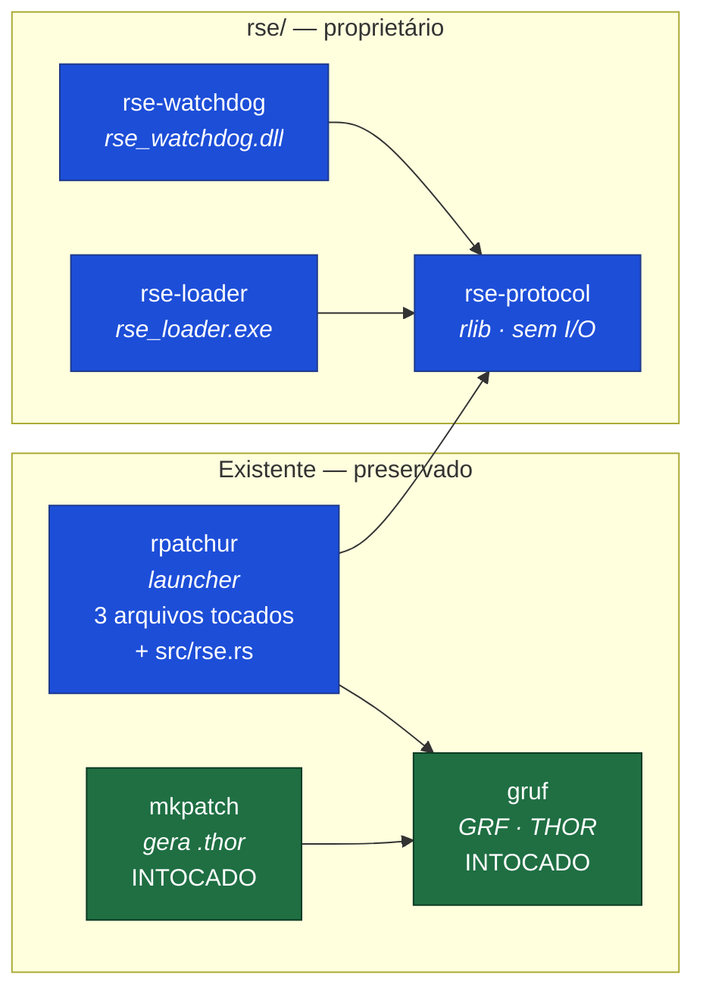
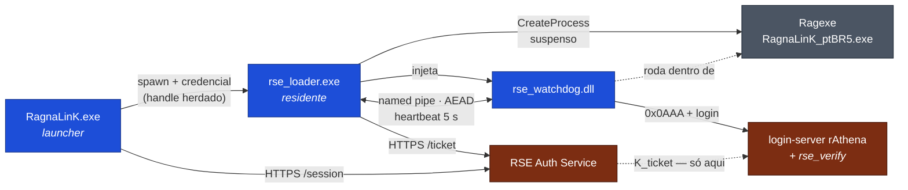
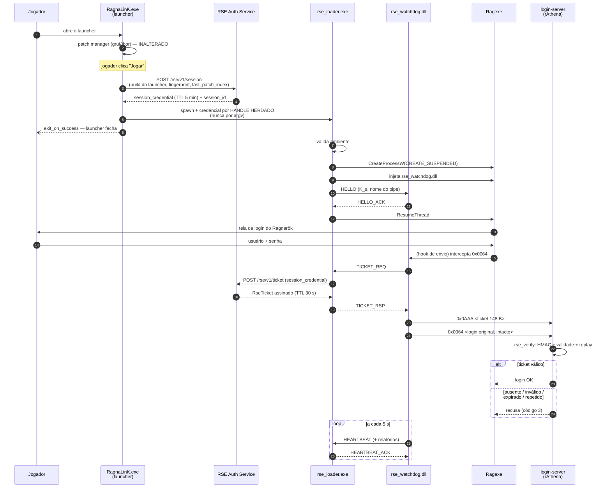

# RagnaShield Engine (RSE) — Arquitetura

**Projeto:** RagnaLinK
**Repositório:** `ragnalink-patcher` (fork de [L1nkZ/rpatchur](https://github.com/L1nkZ/rpatchur))
**Documento:** Fase 1 — engenharia reversa do launcher + arquitetura alvo
**Versão:** 1.1 — 21/08/2026
**Status:** Fase 1 concluída; Fase 2 (crate `rse-protocol`) implementada. Nenhum arquivo
existente do launcher foi alterado até aqui — a única mudança em arquivo pré-existente é
uma linha em `Cargo.toml` (raiz), registrando `rse/protocol` no workspace.

---

## Sumário executivo

O `ragnalink-patcher` é um fork **muito bem comportado** do rpatchur v0.3.0. A comparação
arquivo a arquivo contra o upstream mostra que o fork tocou **4 arquivos de código** e
adicionou assets — o motor de patch (`gruf`, `mkpatch`, `patcher/core.rs`,
`patcher/patching.rs`) está **byte a byte idêntico** ao original. Isso é excelente
notícia para o RSE: significa que dá para adicionar a camada de proteção sem mexer em
nada do que já funciona.

Três constatações mudam o desenho do RSE e precisam ser lidas antes de qualquer coisa:

1. **O launcher hoje não faz login.** Não existe formulário de usuário/senha na
   interface do RagnaLinK. O botão *Jogar* chama `play`, que abre o `RagnaLinK_ptBR5.exe`
   e o jogador digita as credenciais **dentro do cliente**. O fluxo do briefing
   (`Login → Recebe Token`) não existe no código atual. → ver §3.6 e ADR-002.
2. **O launcher morre quando o jogo abre.** `exit_on_success: true` no
   `RagnaLinK.yml`. Um heartbeat hospedado no launcher morreria junto. → o heartbeat
   tem que morar no **RSE Loader**. Ver ADR-003.
3. **O jeito atual de abrir o jogo é incompatível com injeção.** `ShellExecuteExW` com
   verbo `runas` não sabe criar processo suspenso e não devolve `PROCESS_INFORMATION`
   utilizável. Carregar DLL exige `CreateProcessW` + `CREATE_SUSPENDED`. É exatamente
   por isso que o **RSE Loader existe como processo separado** — e não como mais uma
   função dentro do `process.rs`. Ver §3.7 e ADR-001.

A recomendação de arquitetura do briefing — *"o launcher nunca precisa conhecer a lógica
do anti-cheat"* — é a decisão certa e está integralmente respeitada aqui. O launcher
ganha **um único ponto de decisão** (`start_game_client`) e uma seção opcional no YAML.
Tudo o mais vive em `rse/`.

---

## Parte 0 — Metodologia

O relatório abaixo não é leitura por cima. O procedimento foi:

1. Clonar o upstream `L1nkZ/rpatchur` no commit `21a5482` (v0.3.0, último da linha).
2. Fazer `diff --strip-trailing-cr` de **todos** os arquivos de código do fork contra o
   upstream. (O `--strip-trailing-cr` importa: o fork está com finais de linha CRLF, e
   um diff ingênuo acusa 100% dos arquivos como alterados.)
3. Ler integralmente os arquivos divergentes.
4. Ler o `RagnaLinK.yml`, o `index.html` de produção e o `plist.txt.exemplo`.
5. Ler o login-server do rAthena **da sua instalação** (`D:\DEV Ragnarok\Emulador\
   Rathena\rathena\src\login\`, versão de dez/2023, `PACKETVER 20220330`) — e não a
   versão atual do rAthena — para que os pontos de integração sejam reais.

Tudo que está afirmado neste documento sobre o código atual foi verificado nos arquivos.
Onde há suposição, está escrito **[A CONFIRMAR]**.

---

# Parte I — Engenharia reversa do launcher atual

## 1.1 Workspace

```
ragnalink-patcher/
├── Cargo.toml                 workspace: members = ["gruf", "rpatchur", "mkpatch"]
├── rust-toolchain.toml        channel = "1.68.2", profile = "minimal"   ← NOVO no fork
├── .cargo/config.toml         +crt-static para x86_64 e i686 msvc       ← NOVO no fork
├── gruf/                      biblioteca GRF/THOR      (intocada)
├── mkpatch/                   gerador de .thor         (intocada)
├── rpatchur/                  o launcher               (4 arquivos alterados)
└── ragnalink/                 assets do servidor       ← NOVO no fork (não é crate)
```

Ponto importante que pode passar despercebido: **`ragnalink/` não é um crate Rust.**
É uma pasta de assets e ferramentas do servidor — `index.html` (a interface),
`RagnaLinK.yml` (configuração de produção), `patch.yml`, `plist.txt.exemplo`,
`mkpatch.exe` já compilado, artes (`fundo.png`, `logo.png`, `arte.jpg`) e o manual
`COMO-LANCAR-UMA-ATUALIZACAO.md`. Ela **não aparece** em `[workspace] members`.

Isso muda a leitura do desenho proposto no briefing: na árvore alvo, `ragnalink/` está
ao lado de `gruf/`, `mkpatch/` e `rpatchur/` como se fosse mais um crate. Não é. Vale
manter como está (é uma pasta de conteúdo, e funciona), mas o `rse/` **sim** vai ser
composto de crates de verdade e precisa entrar em `[workspace] members`.

### Perfil de compilação (herdado, relevante para o RSE)

```toml
# Cargo.toml (raiz) — inalterado em relação ao upstream
[profile.release]
lto = true
panic = 'abort'
```

`panic = 'abort'` vale para o workspace inteiro. Para a DLL do RSE isso é, na prática,
**desejável** — pânico atravessando fronteira FFI é comportamento indefinido, e abortar
é mais previsível. Mas tem consequência: dentro da DLL, um `unwrap()` infeliz derruba o
processo do jogo, não só a thread do shield. A regra de codificação da Fase 5 é
`Result` em tudo, `unwrap`/`expect` proibidos fora de testes.

## 1.2 Cadeia de inicialização

Passo a passo, com arquivo e linha, do duplo-clique até o jogo abrir:

| # | Onde | O que acontece |
|---|------|----------------|
| 1 | `rpatchur/src/main.rs:35` | `main()`. `#![windows_subsystem = "windows"]` — sem console. |
| 2 | `main.rs:44` | `Opt::from_args()`; `--working-directory` opcional muda o CWD. |
| 3 | `main.rs:49` → `patcher/config.rs:85` | `retrieve_patcher_configuration(None)`. Deriva o nome do YAML **do nome do executável** (`get_patcher_name()` em `patcher/mod.rs:22`) → `RagnaLinK.exe` ⇒ `RagnaLinK.yml`. Falha aqui abre um `tinyfiledialogs` e encerra. |
| 4 | `config.rs:118` | `resolver_index_url()` — adição do fork. Converte caminho relativo em `file:///` absoluto a partir da pasta do executável; cai para `index_url_remoto` se o arquivo local sumir. |
| 5 | `main.rs:63` | `flume::bounded(32)` — canal UI → thread de patch. |
| 6 | `main.rs:65` → `ui.rs:98` | `build_webview()`. Cria a janela MSHTML, aplica `.frameless(...)` (adição do fork) e registra o `invoke_handler`. |
| 7 | `main.rs:72` → `main.rs:86` | Thread separada com runtime Tokio *current-thread* rodando `patcher_thread_routine`. |
| 8 | `main.rs:74` | `webview.run()` — bloqueia na thread da UI até a janela fechar. |
| 9 | `ui.rs:114` | Jogador clica *Jogar* → `"play"` → `handle_play` (`ui.rs:135`). |
| 10 | `ui.rs:552` | `start_game_client()` lê `play.path` + `play.arguments`. |
| 11 | `process.rs:7` → `process.rs:61` | `start_executable()` → `win32_spawn_process_runas()`. |
| 12 | `process.rs:99` | `ShellExecuteExW` com `lpVerb = "runas"`, `lpClass = "exefile"`. **O jogo nasce aqui.** |
| 13 | `ui.rs:560` | Se `exit_on_success` (hoje `true`), `webview.exit()` — o launcher fecha. |

**Este é o ponto exato onde o RSE entra: passo 10/11.** Um único `if` em
`start_game_client` decide entre o caminho atual e o caminho RSE.

## 1.3 Interface (UI)

- **Motor:** `web-view 0.7.3` → **MSHTML (Internet Explorer)** no Windows. Não é
  Chromium, não é WebView2. Isso limita muito o que a página pode fazer.
- **Página:** `ragnalink/index.html` (24 KB), hospedada em
  `https://ragnalink.com.br/patcher/index.html`.
- **Ponte JS → Rust:** `external.invoke(...)`, tratada em `ui.rs:112-126`.
  - Comandos simples (string crua): `play`, `setup`, `exit`, `start_update`,
    `cancel_update`, `reset_cache`, `manual_patch`, `ajustar_janela`, `moldar_janela`,
    `minimize`, `drag`.
  - Comandos com parâmetros (JSON): `{"function": "...", "parameters": {...}}` →
    `handle_json_request` (`ui.rs:471`). Hoje aceita `login` e `open_url`.
- **Ponte Rust → JS:** `UiController::dispatch_patching_status` (`ui.rs:25`) faz
  `webview.eval("nomeDaFuncao(args)")`. As funções esperadas na página são
  `patchingStatusReady`, `patchingStatusError`, `patchingStatusDownloading`,
  `patchingStatusInstalling`, `patchingStatusPatchApplied` e `notificationInProgress`
  — todas presentes no `index.html`.

> **Armadilha do MSHTML que afeta o RSE:** a própria configuração de vocês documenta que
> por `file://` o IE bloqueia XHR entre origens, e por isso as faixas ao vivo só
> aparecem na versão hospedada. **Consequência direta:** o status do RSE **não pode**
> ser buscado pela página via `fetch`/XHR. Tem que chegar pelo mesmo caminho do
> patching — `webview.eval()` a partir do Rust. Já está previsto em §3.1.

## 1.4 Configuração YAML

`patcher/config.rs`. Estruturas `serde::Deserialize`, arquivo derivado do nome do exe.

| Seção | Campos | Observação |
|---|---|---|
| `window` | `title`, `width`, `height`, `resizable`, **`frameless: Option<bool>`** | `frameless` é adição do fork |
| `play` | `path`, `arguments`, `exit_on_success` | hoje: `RagnaLinK_ptBR5.exe`, `["1sak1"]`, `true` |
| `setup` | `path`, `arguments`, `exit_on_success` | `opensetup.exe` |
| `web` | `index_url`, **`index_url_remoto: Option<String>`**, `preferred_patch_server`, `patch_servers[]` | `index_url_remoto` é adição do fork |
| `client` | `default_grf_name` | `ragnalink.grf` |
| `patching` | `in_place`, `check_integrity`, `create_grf` | todos `true` |

**O padrão que o RSE vai seguir:** repare que `frameless` e `index_url_remoto` foram
introduzidos como `Option<T>`. É exatamente por isso que YAMLs antigos continuam
carregando. A seção `rse:` vai entrar do mesmo jeito — `Option<RseConfiguration>` — e
um `RagnaLinK.yml` sem ela continua abrindo normalmente, com o RSE desligado.

`arguments: ["1sak1"]` é a chave que o cliente *hexed* exige para não abrir o launcher
oficial. **O Loader tem que repassar esse argumento intacto** para o Ragexe.

## 1.5 Patch Manager

Totalmente intocado pelo fork. Vale mapear para saber o que **não** encostar:

- `patcher/core.rs:40` `patcher_thread_routine` — laço de comandos.
- `core.rs:179` `interruptible_update_routine` — acha servidor → baixa → aplica.
- Lock de instância: `<nome>.lock` via `advisory-lock`.
- Cache: `<nome>.dat`, JSON com `last_patch_index` (`patcher/cache.rs`).
- Download: 32 concorrentes, `reqwest`, checagem de integridade opcional do `.thor`.
- Aplicação: `patching.rs` → `apply_patch_to_grf` (in-place/out-of-place) ou
  `apply_patch_to_disk`.
- Cancelamento: `cancellation.rs`, cooperativo via `flume`.

**Gancho útil para o RSE, sem alterar nada disso:** o `last_patch_index` do `.dat` é
exatamente a versão de conteúdo que o cliente está rodando. É um dado barato de mandar
na atestação (§4.5) e permite ao servidor recusar quem está com patch antigo — sem
tocar em uma linha do patch manager.

## 1.6 Login — **onde o briefing e o código divergem**

O briefing descreve `Launcher → Verifica patches → Login → Recebe Token`. No código:

- `ui.rs:501` `handle_login` **existe** (herdado do upstream) e monta
  `["-t:<senha>", "<login>", "server", ...play.arguments]`.
- **Mas o `index.html` do RagnaLinK nunca chama `login`.** A varredura dos
  `external.invoke` da página encontra `play`, `drag`, `minimize`, `exit` e
  `open_url` — e nenhum `login`. Não há campo de usuário nem de senha no HTML.
- Portanto: **hoje o jogador autentica dentro do Ragexe**, na tela de login clássica do
  Ragnarök. O launcher nunca vê a senha.

Isso não é um defeito — é, na verdade, a postura mais segura das duas. O caminho
`handle_login` do upstream coloca a senha em **argv**, e argv de qualquer processo é
legível por qualquer processo do mesmo usuário (Process Explorer, `wmic process get
commandline`, WMI). Ativar aquele caminho hoje seria expor senha em texto claro.

**Consequência arquitetural (a mais importante deste documento):** o RSE **não pode**
depender de o launcher conhecer a conta do jogador. O token não é emitido "para uma
conta"; é emitido **para uma sessão de cliente** — e a amarração conta ↔ sessão acontece
no login-server, no momento em que a credencial chega. Ver ADR-002 e §4.5.

## 1.7 Como o Ragexe é iniciado — e por que isso obriga um Loader

`process.rs:61-100`:

```rust
let operation = to_u16s("runas")?;   // eleva (UAC)
let class     = to_u16s("exefile")?; // força tratar como executável
ShellExecuteExW(&mut execute_info);
```

Três propriedades desse mecanismo brigam com o que a Fase 4 precisa:

| Propriedade | Efeito |
|---|---|
| `ShellExecuteExW` não cria processo suspenso | Sem `CREATE_SUSPENDED` não dá para carregar a DLL antes do `main` do cliente. Injetar depois abre uma janela de corrida em que o cliente já está rodando desprotegido. |
| `SEE_MASK_NOCLOSEPROCESS` não está setado | `hProcess` volta nulo. O launcher **não tem handle** do jogo: não consegue esperar, monitorar nem encerrar. |
| Verbo `runas` | O jogo nasce **elevado**. Quem injetar nele precisa de privilégio compatível. |

Daí a conclusão de projeto: **não adianta "melhorar" o `process.rs`.** O caminho certo é
um executável dedicado — o **RSE Loader** — que usa `CreateProcessW` com
`CREATE_SUSPENDED`, mantém o `PROCESS_INFORMATION`, injeta a DLL e só então dá
`ResumeThread`. O `process.rs` continua **intocado** e segue servindo ao botão
*Configurar* e ao modo sem RSE.

## 1.8 Delta do fork × upstream (verificado por diff)

### Arquivos de código alterados — apenas 4

| Arquivo | Linhas alteradas | O que mudou |
|---|---|---|
| `rpatchur/src/ui.rs` | 230 | `.frameless(...)`; comandos `ajustar_janela`, `moldar_janela`, `minimize`, `drag`; `janela_principal()` via `EnumThreadWindows`; recorte da janela por região GDI a partir de `forma.txt` |
| `rpatchur/src/patcher/config.rs` | 89 | campo `frameless`; campo `index_url_remoto`; função `resolver_index_url()` |
| `rpatchur/Cargo.toml` | 22 | metadados winres (RagnaLinK); features do `winapi`: `winuser`, `windef`, `minwindef`, `processthreadsapi`, `wingdi` |
| `rpatchur/build.rs` | 4 | ícone `ragnalink.ico` |

### Arquivos novos

`rust-toolchain.toml`, `.cargo/config.toml`, `rpatchur/resources/forma.txt`,
`rpatchur/resources/ragnalink.ico`, `rpatchur/resources/msg_box.html`, e toda a pasta
`ragnalink/`.

### Confirmadamente **idênticos** ao upstream

`Cargo.toml` (raiz) · `gruf/**` (100%) · `mkpatch/**` (100%) ·
`rpatchur/src/main.rs` · `rpatchur/src/process.rs` ·
`rpatchur/src/patcher/{mod,core,cache,cancellation,patching}.rs` ·
`examples/**` · `README.md` · `CHANGELOG.md`

> Traduzindo: **todo o fork é branding + janela sem moldura.** A lógica de patch é
> upstream puro. Isso é um ativo — dá para acompanhar upstream se um dia quiserem — e o
> RSE foi desenhado para preservar essa propriedade.

## 1.9 Toolchain travada em 1.68.2 — restrição real para o RSE

O `rust-toolchain.toml` fixa **Rust 1.68.2** (abril/2023) com uma justificativa correta:
`ntapi 0.3` (via `mio 0.7` via `tokio 1.8`) usa referência a campo de struct `packed`,
que virou **erro** a partir da 1.69 (`E0793`).

**Impacto direto no RSE — não subestimem isto:** todo crate do `rse/` precisa compilar
em **1.68.2**. Isso elimina de cara boa parte do ecossistema moderno de Windows/cripto:

| Candidato | Situação em 1.68.2 |
|---|---|
| `windows` / `windows-sys` recentes | MSRV geralmente ≥ 1.70 → **fora**. Usar `winapi 0.3`, que o projeto já usa. |
| `aes-gcm` 0.10, `hmac` 0.12, `sha2` 0.10, `hkdf` 0.12 (RustCrypto) | MSRV 1.56–1.60 → **ok** [A CONFIRMAR na build] |
| `ring` / `rustls` recentes | MSRV alto e build C → **evitar** |
| `zeroize` 1.6 | ok |
| `rand` 0.8 | ok |

Existem dois caminhos, e a escolha vale ser feita **agora**, na Fase 2, não depois:

- **(a) Conviver com a trava.** Crates do RSE com MSRV ≤ 1.68. Custo zero hoje, teto
  baixo depois.
- **(b) Destravar antes da Fase 2.** Subir `tokio` para ≥ 1.38 (já sem `ntapi`),
  revalidar a árvore, apagar o `rust-toolchain.toml`. Custo de 1–2 dias, e o RSE nasce
  em toolchain moderna.

**Recomendação: (b), e antes da Fase 2.** A única coisa que muda em (b) é a árvore de
dependências do launcher — que já está coberta por um patcher que vocês compilam e
testam manualmente. Fazer isso *depois* de escrever o `rse-protocol` significa reescrever
escolhas de cripto com o código já pronto. Está no ROADMAP como **Fase 1.5**.

### Arquitetura de CPU

`.cargo/config.toml` já contempla `i686-pc-windows-msvc` com `+crt-static`. O Ragexe é
**32 bits**. Portanto:

- `rse_watchdog.dll` → **obrigatoriamente i686**.
- `rse_loader.exe` → **i686 também** (injetar de 64 para 32 bits é possível mas
  desnecessariamente complicado; mesma arquitetura evita a classe inteira de problema).
- `RagnaLinK.exe` → pode continuar como está; convém padronizar em i686.

---

# Parte II — Arquitetura alvo do RSE

## 2.1 Princípio de projeto

> **O launcher não conhece anti-cheat.** Ele obtém uma credencial opaca e entrega ao
> Loader. Se o RSE mudar inteiro amanhã, `rpatchur/` não recompila diferente.

Esse princípio, que veio na sua proposta, é o que sustenta as três propriedades que
importam:

1. **Atualização independente** — o shield sobe sem redistribuir o launcher.
2. **Superfície de manutenção mínima** — o diff permanente no `rpatchur/` cabe em uma
   tela.
3. **Degradação previsível** — `rse.enabled: false` no YAML devolve o comportamento
   atual, sem recompilar.

## 2.2 Componentes

| Componente | Crate | Artefato | Vive onde | Responsabilidade |
|---|---|---|---|---|
| **RSE Protocol** ✅ | `rse-protocol` | rlib | biblioteca | Tipos de pacote, ticket, AES-256-GCM, HMAC-SHA256, HKDF, versionamento. Sem I/O, sem Windows API. **Implementado na Fase 2** — 61 testes, 96,8% de cobertura, zero `unsafe`. |
| **RSE Loader** | `rse-loader` | `rse_loader.exe` (i686) | processo residente | Valida ambiente, obtém ticket, `CreateProcessW` suspenso, injeta DLL, dono do named pipe, heartbeat, encerra o cliente em violação. |
| **RSE DLL** | `rse-watchdog` | `rse_watchdog.dll` (i686, cdylib) | dentro do Ragexe | Integridade (CRC32 + SHA-256), detecções, injeta o ticket no fluxo de login, heartbeat. |
| **RSE Auth Service** | fora deste repo | HTTPS | servidor | Emite tickets assinados. **Único lugar do mundo que tem `K_ticket` junto do login-server.** |
| **RSE Verify** | `src/login/rse_verify.*` | C++ | login-server | Valida o ticket offline (HMAC + validade + replay). |

> **Nota de nomenclatura.** O briefing lista `rse/watchdog/` e, separadamente, uma
> "RSE DLL". São a mesma coisa: `rse/watchdog/` **é** o crate que produz a DLL
> in-process. Se preferirem o nome literal, renomear para `rse/dll/` custa uma linha no
> `Cargo.toml` — mas *watchdog* descreve melhor o papel. Ver ADR-006.

## 2.3 Árvore de diretórios alvo

```
ragnalink-patcher/
├── Cargo.toml                    [MODIFICADO] + 3 members
├── rust-toolchain.toml           [MODIFICADO na Fase 1.5, ou intocado]
├── gruf/                         [INTOCADO]
├── mkpatch/                      [INTOCADO]
├── ragnalink/                    [MODIFICADO] index.html + RagnaLinK.yml
├── rpatchur/                     [MODIFICADO] 3 arquivos + 1 novo
│   └── src/rse.rs                [NOVO] fachada fina do RSE
│
├── rse/                          [NOVO — 100% proprietário]
│   ├── protocol/                 rse-protocol   (rlib)
│   │   ├── src/{lib,ticket,frame,crypto,version,error}.rs
│   │   └── tests/vectors.rs
│   ├── loader/                   rse-loader     (bin, i686)
│   │   └── src/{main,spawn,inject,pipe,session,env_check}.rs
│   ├── watchdog/                 rse-watchdog   (cdylib, i686)  ← a "RSE DLL"
│   │   └── src/{lib,integrity,detect,pipe,netgate}.rs
│   └── docs/                     docs por módulo, a partir da Fase 2
│
└── docs/                         [NOVO]
    ├── ARCHITECTURE.md           este arquivo
    ├── RSE_SPEC.md
    └── ROADMAP.md
```

## 2.4 Diagrama de módulos

São duas vistas diferentes, e confundi-las é fonte comum de mal-entendido: **quem
depende de quem na compilação** não é a mesma coisa que **quem fala com quem em
execução**.

### 2.4.1 Dependências de compilação (workspace)



`rse-protocol` é o único ponto em comum entre os três — e é justamente por ele não ter
I/O nem Windows API que dá para testá-lo inteiro em CI.

### 2.4.2 Topologia em execução



Repare que **`K_ticket` só aparece entre o Auth Service e o login-server** — nenhuma
seta dela toca nada que rode na máquina do jogador. Essa é a propriedade central do
desenho (ADR-005).

## 2.5 Fluxo completo



## 2.6 Decisões de arquitetura (ADR)

### ADR-001 — Loader como processo separado, não função no launcher

**Contexto:** carregar a DLL antes do `main` do cliente exige `CREATE_SUSPENDED`;
`ShellExecuteExW` não faz isso (§1.7).
**Alternativas:** (a) reescrever `process.rs` para `CreateProcessW`; (b) injetar depois
que o processo já subiu; (c) processo Loader dedicado.
**Decisão: (c).**
**Por quê:** (a) faria o `rpatchur` carregar código de injeção — quebra o princípio de
§2.1 e obriga a redistribuir o launcher a cada mudança do shield. (b) deixa uma janela
de corrida em que o cliente roda sem proteção. (c) mantém `process.rs` intocado e
permite atualizar o shield sozinho.
**Custo:** um executável a mais no pacote; um salto de processo no `Jogar`.

### ADR-002 — Ticket é de **sessão**, não de conta

**Contexto:** o launcher não tem as credenciais (§1.6).
**Decisão:** o Auth Service emite ticket para uma **sessão de cliente**, identificada por
`session_id` + `machine_fp`. O login-server valida o ticket e **então** amarra ao
`account_id` que veio no 0x0064.
**Por quê:** preserva a UX atual (login dentro do cliente), evita senha em argv, e não
exige formulário no launcher.
**Consequência:** o ticket sozinho não prova *quem* é o jogador — prova que *aquele
cliente* passou pelo RSE. Que é exatamente a propriedade que se quer.
**Alternativa descartada:** colocar login no launcher. Muda a UX de todo mundo e faz o
launcher passar a manipular senha. Se um dia quiserem SSO/lançamento sem tela de login,
o desenho comporta — mas não é requisito hoje.

### ADR-003 — Heartbeat mora no Loader, não no launcher

**Contexto:** `exit_on_success: true` fecha o launcher quando o jogo abre (§1.2).
**Alternativas:** (a) virar `exit_on_success: false` e deixar o launcher residente;
(b) Loader residente.
**Decisão: (b).**
**Por quê:** (a) muda a experiência de todo jogador (janela do patcher aberta o tempo
todo) e amarra a proteção a um processo com WebView e MSHTML carregados — muito mais
superfície de ataque e consumo. O Loader é pequeno, sem UI, e é quem já tem o handle do
processo do jogo.

### ADR-004 — Credencial via handle herdado, jamais por argv

**Contexto:** argv é legível por qualquer processo do mesmo usuário.
**Decisão:** `CreatePipe` com handles herdáveis; o Loader lê a credencial do próprio
`stdin`/handle herdado nos primeiros milissegundos e o launcher fecha a ponta de escrita.
**Alternativas descartadas:** argv (vazamento trivial); arquivo temporário (fica no
disco, corrida de leitura); variável de ambiente (legível via
`NtQueryInformationProcess`).

### ADR-005 — Validação **offline** do ticket no login-server

**Contexto:** o login-server não pode fazer round-trip HTTP no caminho de login sem
arriscar travar sob carga.
**Decisão:** ticket auto-contido e assinado com HMAC-SHA256 usando `K_ticket`,
compartilhada **apenas** entre Auth Service e login-server. Validação é HMAC + janela de
tempo + cache de replay em memória. Zero I/O.
**Por que isso importa:** é o que impede alguém de trocar o launcher. A chave **nunca**
está no cliente, no launcher, nem na DLL — quem assina é o servidor. Um launcher
substituído não consegue forjar ticket porque não tem com o que assinar.

> Este ponto merece destaque porque afina a sua colocação de que "o protocolo impede que
> alguém substitua o launcher". Ele impede — **desde que a assinatura seja do lado
> servidor e o login-server verifique**. Um protocolo bonito com a chave embutida no
> `.exe` é extraível com um editor hexadecimal em uma tarde. Por isso, no ROADMAP, a
> Fase 2 (protocolo) e a Fase 3 (Auth Service + `rse_verify`) andam **coladas**: a Fase 2
> sozinha ainda não protege nada.

### ADR-006 — `rse/watchdog/` produz a "RSE DLL"

**Decisão:** o crate `rse-watchdog` compila como `cdylib` e gera `rse_watchdog.dll`.
Não existe um quarto diretório para a DLL.
**Por quê:** o papel da DLL *é* ser o watchdog in-process. Dois diretórios para um
artefato só confunde e duplica `Cargo.toml`.

### ADR-007 — Packet customizado `0x0AAA`, não o `0x0825`

**Contexto:** o `0x0825` (`CA_SSO_LOGIN_REQ`) tem campo de token de tamanho variável e
existe na sua build. Seria o caminho "oficial".
**Descoberta ao ler o seu `loginclif.cpp`:**

```c
size_t uTokenLen = RFIFOREST(fd) - 0x5C;
if (uAccLen > NAME_LENGTH - 1 || uAccLen == 0
 || uTokenLen > NAME_LENGTH - 1 || uTokenLen == 0) {
    logclif_auth_failed(sd, 3);
    return 0;
}
safestrncpy(password, token, uTokenLen + 1);   // o token VIRA a senha
```

O rAthena limita o token a `NAME_LENGTH - 1` = **23 bytes** e o trata como senha
(`// Shinryo: For the time being, just use token as password.`). Um ticket com HMAC-256
não cabe em 23 bytes — nem perto. Reaproveitar o 0x0825 exigiria alterar a semântica de
um packet oficial e quebraria a autenticação normal.
**Decisão:** packet próprio `0x0AAA`, enviado **antes** do login. Verificado: `0x0AAA`
não é usado em nenhum lugar do rAthena (nem na sua build de dez/2023, nem no master
atual). O `switch` do `logclif_parse` cai em `default` e derruba a conexão para packets
desconhecidos — ou seja, adicionar um `case` é a mudança mínima possível e não conflita
com nada.

---

# Parte III — Pontos de integração

## 3.1 No launcher (`rpatchur/`)

| # | Arquivo | Local | Mudança | Impacto se der errado |
|---|---|---|---|---|
| **L1** | `src/patcher/config.rs` | após `PatchingConfiguration` (~l.83) | `pub struct RseConfiguration` + campo `pub rse: Option<RseConfiguration>` em `PatcherConfiguration` | Nenhum para YAML antigo — `Option` mantém compatibilidade, mesmo padrão de `frameless` |
| **L2** | `src/rse.rs` | **arquivo novo** | Fachada: `pub fn launch_protected(cfg, args) -> Result<()>`. Fala com o Auth Service, cria o pipe, faz spawn do Loader | Isolado; nenhum código existente depende dele |
| **L3** | `src/main.rs` | l.4 | `mod rse;` | Uma linha |
| **L4** | `src/ui.rs` | `start_game_client`, l.552 | `if cfg.rse.enabled { rse::launch_protected(..) } else { start_executable(..) }` | **Único ponto de decisão do runtime.** Bug aqui = jogo não abre. Precisa de fallback explícito por política |
| **L5** | `src/ui.rs` | `enum PatchingStatus`, l.65 | `+ RseStatus(RsePhase)` e um `webview.eval("rseStatus(...)")` no `dispatch_patching_status` | Aditivo; nenhum `match` existente quebra |
| **L6** | `src/ui.rs` | `invoke_handler`, l.112 | `+ "rse_diag" => handle_rse_diag(webview)` (relatório de diagnóstico para suporte) | Aditivo |
| **L7** | `rpatchur/Cargo.toml` | `[dependencies]` | `rse-protocol = { path = "../rse/protocol" }` | Nova aresta no grafo do workspace |
| **L8** | `Cargo.toml` (raiz) | `[workspace] members` | `+ "rse/protocol", "rse/loader", "rse/watchdog"` | `cargo build` passa a construir os três |

**Total do diff permanente no `rpatchur/`: ~40 linhas somadas + 1 arquivo novo.** É o
tamanho que o princípio de §2.1 exige.

### Contrato exato do L4 (para a Fase 4 não improvisar)

```rust
// ui.rs — start_game_client, forma alvo
fn start_game_client(webview: &mut WebView<WebViewUserData>, client_arguments: &[String]) {
    let cfg = &webview.user_data().patcher_config;
    let started = match cfg.rse.as_ref().filter(|r| r.enabled) {
        Some(rse_cfg) => crate::rse::launch_protected(rse_cfg, &cfg.play, client_arguments),
        None          => start_executable(&cfg.play.path, client_arguments),
    };
    // ... tratamento de erro e exit_on_success permanecem como estão
}
```

Note que `client_arguments` (que carrega o `"1sak1"`) atravessa **intacto** até o
Ragexe — o Loader repassa, não reinterpreta.

## 3.2 Na configuração (`ragnalink/RagnaLinK.yml`)

```yaml
# Bloco NOVO — opcional. Sem ele, o patcher se comporta exatamente como hoje.
rse:
  enabled: true
  loader_path: rse\rse_loader.exe   # relativo à pasta do executável
  auth_url: https://ragnalink.com.br/rse/v1
  # O que fazer se o Auth Service não responder:
  #   block  = não abre o jogo (padrão em produção)
  #   allow  = abre sem proteção e registra (use só em piloto)
  on_service_unavailable: block
  timeout_ms: 8000
```

`play.path` **continua** apontando para `RagnaLinK_ptBR5.exe`. Quem troca o alvo é o
Loader, não a configuração — assim, desligar o RSE é uma linha e nada mais.

## 3.3 Na interface (`ragnalink/index.html`)

Aditivo, três funções novas que o Rust chama por `eval`:

```js
function rseStatus(fase, detalhe) { /* "Verificando ambiente...", "Protegido" */ }
function rseErro(codigo, msg)      { /* mensagem clara + link de suporte */ }
function rseBloqueado(motivo)      { /* ex.: "Cliente modificado detectado" */ }
```

Lembrete de §1.3: **nada de XHR para o RSE.** O status desce por `eval`, igual ao
patching.

## 3.4 No login-server (rAthena de vocês, dez/2023, `PACKETVER 20220330`)

| # | Arquivo | Local | Mudança |
|---|---|---|---|
| **S1** | `src/login/rse_verify.hpp/.cpp` | **novos** | `bool rse_verify_ticket(const uint8*, size_t, rse_ticket_info*)` — HMAC-SHA256, janela de validade, cache de replay. Autocontido, sem dependência do resto do login |
| **S2** | `src/login/login.hpp` | `struct login_session_data` (l.40–62) | `+ uint8 rse_ticket[148]; + int has_rse_ticket;` |
| **S3** | `src/login/login.hpp` | `struct Login_Config` (l.83–128) | `+ bool rse_enforce; + char rse_key[65]; + int rse_grace_seconds;` |
| **S4** | `src/login/loginclif.cpp` | `logclif_parse`, switch da l.526 | `+ case 0x0AAA: next = logclif_parse_rse_ticket(fd, sd); break;` |
| **S5** | `src/login/loginclif.cpp` | junto de `logclif_parse_updclhash` (l.261) | `logclif_parse_rse_ticket()` — mesmo formato daquele: confere `RFIFOREST`, copia, `RFIFOSKIP` |
| **S6** | `src/login/login.cpp` | `login_mmo_auth()` | Antes de validar a senha: se `rse_enforce` e (`!has_rse_ticket` ou `!rse_verify_ticket(...)`) → retorna `3` (*Rejected from Server*) |
| **S7** | `src/login/login.cpp` | `login_config_read()` | Lê `rse_enforce`, `rse_key`, `rse_grace_seconds` |
| **S8** | `conf/login_athena.conf` | fim | As três chaves acima |
| **S9** | `src/login/CMakeLists.txt` / `Makefile.in` / `login-server.vcxproj` | — | Registrar `rse_verify.cpp` |

**Por que S1 é arquivo separado:** o diff em arquivos core do rAthena fica em ~15 linhas.
Quando vocês forem atualizar o emulador, o conflito de merge é trivial. Toda a lógica
mora em arquivo que o upstream não conhece.

### Modo de implantação gradual (evita derrubar o servidor no dia do lançamento)

`rse_enforce` deve ser **tri-estado**, não booleano:

| Valor | Comportamento | Quando usar |
|---|---|---|
| `off` | ignora tickets | desenvolvimento |
| `log` | valida e **registra** quem falharia, mas deixa entrar | piloto — mede o falso-positivo real antes de bloquear |
| `on` | recusa sem ticket válido | produção |

Sem o estágio `log`, o primeiro dia de `on` vira suporte para milhares de jogadores ao
mesmo tempo. Recomendação: mínimo duas semanas em `log`.

## 3.5 No cliente (Ragexe) — sem hexed adicional

O RSE **não** exige rehexar o cliente. A DLL intercepta o envio de rede
(`send`/`WSASend`) e antepõe o `0x0AAA` na primeira conexão com o login-server. O packet
de login original segue **byte a byte intacto**.

Nota verificada: `PACKET_OBFUSCATION` está ligado no `packets.hpp` de vocês
(`PACKETVER 20220330 ≥ 20110817`), mas isso vale para o **map-server**. Os packets do
login-server não passam por essa ofuscação — o `logclif_parse` lê `RFIFOW(fd,0)` cru.
Portanto o `0x0AAA` não precisa de tratamento especial. **[A CONFIRMAR em teste de
integração — é uma afirmação de leitura de código, e vale um tcpdump antes de fechar a
Fase 3.]**

---

# Parte IV — Inventário de arquivos

## 4.1 Serão modificados

| Arquivo | Tipo | Tamanho estimado do diff | Reversível? |
|---|---|---|---|
| `Cargo.toml` (raiz) | workspace | +3 linhas | trivial |
| `rpatchur/Cargo.toml` | manifesto | +1 linha | trivial |
| `rpatchur/src/main.rs` | código | +1 linha (`mod rse;`) | trivial |
| `rpatchur/src/ui.rs` | código | ~+25 linhas em 3 pontos | sim |
| `rpatchur/src/patcher/config.rs` | código | ~+15 linhas | sim |
| `ragnalink/RagnaLinK.yml` | config | +8 linhas | sim, é só apagar o bloco |
| `ragnalink/index.html` | UI | ~+40 linhas | sim |
| `rust-toolchain.toml` | toolchain | apagado **se** Fase 1.5 for aprovada | — |

## 4.2 Arquivos novos

**No launcher:** `rpatchur/src/rse.rs`.
**No RSE:** tudo sob `rse/` (`protocol/`, `loader/`, `watchdog/`, `docs/`).
**Na documentação:** `docs/ARCHITECTURE.md`, `docs/RSE_SPEC.md`, `docs/ROADMAP.md`.
**No servidor (outro repositório):** `src/login/rse_verify.{hpp,cpp}`.

## 4.3 Permanecem **intocados** — garantia de projeto

```
gruf/**                              todos os 12 arquivos .rs
mkpatch/**                           main.rs, patch_definition.rs
rpatchur/src/process.rs              ← inclusive: o RSE não altera o spawn atual
rpatchur/src/patcher/core.rs         691 linhas de patch manager
rpatchur/src/patcher/patching.rs
rpatchur/src/patcher/cache.rs
rpatchur/src/patcher/cancellation.rs
rpatchur/src/patcher/mod.rs
rpatchur/build.rs
rpatchur/resources/**                forma.txt, ícones, msg_box.html
.cargo/config.toml
ragnalink/patch.yml, plist.txt.exemplo, COMO-LANCAR-UMA-ATUALIZACAO.md, artes
examples/**, ci/**, docker/**, LICENSE-*, README.md, CHANGELOG.md
```

Sugestão operacional: um teste de CI que roda `git diff --name-only origin/main` e
**falha** se qualquer caminho dessa lista aparecer. Assim a garantia deixa de ser uma
promessa neste documento e vira uma regra que o repositório aplica sozinho.

---

# Parte V — Riscos e restrições

| # | Risco | Severidade | Mitigação |
|---|---|---|---|
| R1 | Toolchain 1.68.2 barra crates de cripto | **Alta** | Fase 1.5 destrava antes da Fase 2 (§1.9) |
| R2 | Falso-positivo bloqueia jogador legítimo | **Alta** | `rse_enforce: log` por 2+ semanas; telemetria antes de bloquear |
| R3 | Antivírus marca o Loader (injeção de DLL é comportamento suspeito por definição) | **Alta** | Assinatura de código; submissão prévia aos principais fornecedores; `winres` já preenchido com identidade RagnaLinK |
| R4 | Cliente elevado (`runas`) e Loader não elevado → injeção falha | Média | Loader herda a elevação; manifesto com `requireAdministrator` ou repensar a necessidade do `runas` |
| R5 | Auth Service cai e ninguém joga | Média | `on_service_unavailable`, cache de ticket de emergência, kill-switch documentado no ROADMAP |
| R6 | `K_ticket` vazar | **Crítica** | Nunca no cliente. Rotação documentada. `key_id` no ticket permite girar sem parar o servidor |
| R7 | Ragexe 32 bits + Loader 64 bits | Média | Padronizar tudo em i686 (§1.9) |
| R8 | `panic = 'abort'` derruba o jogo por um bug do shield | Média | `Result` obrigatório na DLL; proibição de `unwrap`; lint no CI |
| R9 | MSHTML não renderiza a UI nova do RSE | Baixa | Restringir a JS ES5; a página já é escrita assim |
| R10 | Emulador atualizado perde o patch do `rse_verify` | Baixa | Lógica em arquivo separado (S1); diff em arquivo core ≈ 15 linhas |

---

## Anexo A — Ponte `external.invoke` hoje

| Comando | Tipo | Handler | Linha |
|---|---|---|---|
| `play` | string | `handle_play` | `ui.rs:135` |
| `setup` | string | `handle_setup` | `ui.rs:143` |
| `exit` | string | `handle_exit` | `ui.rs:168` |
| `start_update` | string | `handle_start_update` | `ui.rs:117` |
| `cancel_update` | string | `handle_cancel_update` | `ui.rs:118` |
| `reset_cache` | string | `handle_reset_cache` | `ui.rs:119` |
| `manual_patch` | string | `handle_manual_patch` | `ui.rs:120` |
| `ajustar_janela` | string | `handle_ajustar_janela` | `ui.rs:316` |
| `moldar_janela` | string | `handle_moldar_janela` | `ui.rs:365` |
| `minimize` | string | `handle_minimize` | `ui.rs:~420` |
| `drag` | string | `handle_drag` | `ui.rs:~440` |
| `login` | JSON | `handle_login` | `ui.rs:501` — **existe mas a página não usa** |
| `open_url` | JSON | `handle_open_url` | `ui.rs:~520` |

## Anexo B — Callbacks Rust → JS hoje

`patchingStatusReady()` · `patchingStatusError(msg)` ·
`patchingStatusDownloading(baixados, total, bytesPorSeg)` ·
`patchingStatusInstalling(instalados, total)` · `patchingStatusPatchApplied(nome)` ·
`notificationInProgress()`

---

*Documento da Fase 1. Nenhuma alteração de código foi realizada. Especificação técnica
do protocolo em `docs/RSE_SPEC.md`; plano de execução em `docs/ROADMAP.md`.*
