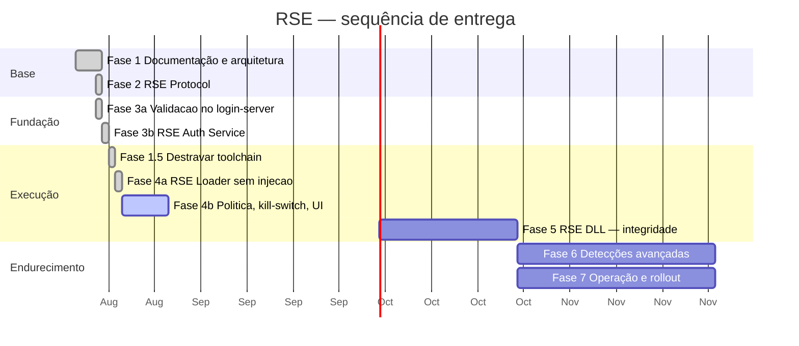

# RagnaShield Engine — Roadmap

**Versão:** 2.2 — 22/08/2026 (Fase 5b + TTL fresco provados; telinha do produto)

---

## Visão geral



Durações são ordem de grandeza para um desenvolvedor, não compromisso de data.

---

## Fase 0 — Já existe *(concluída antes deste trabalho)*

O fork já entrega: janela sem moldura recortada na forma da arte, identidade RagnaLinK no
executável, resolução robusta do `index_url`, pipeline de patch documentado
(`COMO-LANCAR-UMA-ATUALIZACAO.md`) e toolchain fixada e justificada.

Vale registrar: a qualidade dos comentários do fork é acima da média. Cada decisão
esquisita tem o *porquê* escrito ao lado — e foi isso que permitiu esta análise de
arquitetura ser precisa em vez de especulativa.

---

## Fase 1 — Documentação e arquitetura ✅ *(esta entrega)*

**Entregáveis:** `docs/ARCHITECTURE.md`, `docs/RSE_SPEC.md`, `docs/ROADMAP.md`,
diagramas de módulos e de fluxo, pontos de integração no launcher e no rAthena,
inventário de arquivos modificados × intactos.

**Critério de aceite:** nenhuma linha de código alterada. ✅

---

## Fase 1.5 — Destravar a toolchain ✅ *Passo A concluído em 21/08/2026*

> ✅ **Passo A concluído e validado em 21/08/2026.** O `ntapi` saiu da árvore com um único
> `cargo update -p tokio@1.8.4 --precise 1.26.0` — **nenhum `Cargo.toml` alterado**, 8 crates
> movidos, e a toolchain **continua** em 1.68.2. O launcher recompilou em 1m15s e os testes
> manuais passaram todos: patch completo, janela sem moldura e recortada, minimizar,
> arrastar, e o jogo abrindo até a tela de login. Detalhes em `docs/FASE_1_5.md`.
>
> 🚨 **Pré-requisito que apareceu no caminho, e vale para as Fases 4 e 5.** O build parou em
> `error: linker link.exe not found`: o workload **"Desenvolvimento para desktop com C++"**
> do Visual Studio Build Tools não estava instalado. O `rustup` traz o compilador Rust, mas
> o alvo `*-pc-windows-msvc` linka com o `link.exe` da Microsoft. Instalado agora, junto com
> `rustup target add i686-pc-windows-msvc` — o Loader e a DLL das Fases 4 e 5 são i686 e
> precisariam dele de qualquer forma. Era também a causa real do `cl` não reconhecido no
> teste de vetores do emulador.
>
> **Passo B — trocar de compilador — fica para o começo da Fase 4**, quando se souber qual
> API do Windows o Loader vai usar e, portanto, qual MSRV é mesmo necessária. Medindo:
> `windows-sys` 0.48 declara MSRV 1.48 e a 0.52 declara 1.56, então dá para escrever o
> Loader sem destravar. A trava não é um bloqueio absoluto — é um teto.

**Atualização de 21/08/2026 — a Fase 2 foi feita SEM destravar, e funcionou.**
O `rse-protocol` compila e passa nos 61 testes com a toolchain travada:

```
cargo +1.68.2 test   →  52 + 8 + 1 testes, todos verdes
```

Foi possível porque as primitivas do RustCrypto (`aes-gcm 0.10`, `hmac 0.12`,
`sha2 0.10`, `hkdf 0.12`) têm MSRV baixa, e porque o crate não depende de
`windows-sys`. Custou **um** teto de versão, documentado no `Cargo.toml` do crate:

```toml
# zeroize 1.9.0 passou a usar a edicao 2024; o cargo da 1.68.2 nem le o manifesto
zeroize = { version = ">=1.5, <1.9", default-features = false }
```

**Onde a trava ainda vai doer:** Fases 4 e 5. O Loader e a DLL falam com a API do
Windows, e o ecossistema moderno ali é o `windows`/`windows-sys` — MSRV ≥ 1.70. Dá para
usar `winapi 0.3` (o launcher já usa), mas é uma API mais crua e sem manutenção ativa.

**Recomendação revisada: destravar antes da Fase 4, não antes da Fase 2.** O risco de
mexer agora não se paga — o protocolo já está pronto e testado nas duas toolchains.

**Tarefas**

1. Subir `tokio` para ≥ 1.38 (já usa `mio 0.8+`, sem `ntapi`).
2. `cargo update`; revalidar `reqwest`, `web-view 0.7.3`, `winapi 0.3`.
3. Compilar em `i686-pc-windows-msvc` e `x86_64-pc-windows-msvc`.
4. **Teste manual obrigatório:** patch completo do zero + `frameless` + recorte da janela
   + minimizar + arrastar + abrir o jogo. É a única forma de validar `web-view` e MSHTML.
5. Remover `rust-toolchain.toml` **ou** fixar em uma versão recente e escrever o novo
   porquê.

**Critério de aceite:** patcher compila em toolchain estável recente e passa no teste
manual acima, sem regressão visual.

**Se for reprovada:** documentar em `rse/docs/MSRV.md` o teto de 1.68 e escolher crates
compatíveis. É um caminho viável — só é um teto mais baixo.

---

## Fase 2 — RSE Protocol ✅ *concluída em 21/08/2026*

**O que foi entregue**

```
rse/protocol/
├── Cargo.toml                          rse-protocol 0.1.0, rust-version 1.68.2
├── src/version.rs                      constantes e regras de compatibilidade
├── src/error.rs                        erros tipados, códigos congelados
├── src/crypto.rs                       Key (zeroize + Debug redigido), HMAC ct, HKDF
├── src/ticket.rs                       RseTicket 148 B, verify(), packet 0x0AAA
├── src/frame.rs                        AES-256-GCM, opcodes, anti-replay por seq
├── src/replay.rs                       cache de nonce com expiração e teto
├── examples/gen_vectors.rs             gerador determinístico dos vetores
├── tests/vectors.rs                    conferência contra os vetores congelados
└── tests/vectors/v1/vectors.txt        16 casos de ticket + 5 frames
rse/docs/PROTOCOL_V1.md                 referência de bytes
```

**Resultados medidos**

| Critério de aceite | Alvo | Obtido |
|---|---|---|
| Testes verdes | — | **61** (52 unidade + 8 vetores + 1 doc) |
| Zero `unsafe` | sim | `#![forbid(unsafe_code)]` |
| Cobertura em `ticket.rs` | ≥ 90% | **96,7%** |
| Cobertura em `frame.rs` | ≥ 90% | **96,1%** |
| Cobertura total | — | **96,8%** |
| Códigos de erro com teste dedicado | 8 | **10** (os 9 do ticket + as bordas) |
| `cargo clippy -- -D warnings` | limpo | limpo |
| Compila na toolchain travada | sim | `cargo +1.68.2 test` verde |
| Workspace continua construindo | sim | `gruf`, `mkpatch`, `rpatchur` intocados |

**Duas decisões tomadas durante a implementação, que fogem do plano original**

1. **Vetores em texto simples, não JSON.** Quem vai lê-los na Fase 3 é o login-server do
   rAthena, em C++, e ele não tem parser JSON à mão — traria dependência nova só para ler
   arquivo de teste. O formato é `@registro chave=valor`, uma linha por caso: `istringstream`
   e pronto. De quebra, saiu o `serde_json` das dev-dependencies.
2. **Sem ABI em C neste crate.** Expor ponteiro cru exigiria `unsafe`, e o
   `#![forbid(unsafe_code)]` vale mais. Se a Fase 3 decidir ligar Rust no login-server em
   vez de reimplementar em C++, isso vira um crate `rse/capi/` separado, com todo o
   `unsafe` concentrado num arquivo pequeno e revisável.

<details>
<summary>Escopo original da fase (mantido para referência)</summary>

> Concordo com a sua leitura de que o protocolo vem antes de detectar Cheat Engine.
> Detecção sem protocolo é enfeite: o sujeito troca o launcher e a detecção nem carrega.
> **Um ajuste na formulação, e ele é importante:** o protocolo só impede a troca do
> launcher **junto com a Fase 3** — porque quem impede é a *assinatura do lado servidor*.
> Se a chave morar no cliente, sai com um editor hexadecimal em uma tarde. Por isso
> Fase 2 e Fase 3 são planejadas como um bloco; entregar a 2 sozinha ainda não protege
> ninguém.

**Escopo:** crate `rse/protocol` (`rse-protocol`), rlib, **sem I/O e sem Windows API** —
roda inteiro em CI Linux.

**Entregáveis**

- `ticket.rs` — `RseTicket`, serialização de 148 bytes, `sign()`, `verify()`, `TicketError`
- `frame.rs` — `RseFrame`, opcodes, `seal()`/`open()` AES-256-GCM, controle de `seq`
- `crypto.rs` — HKDF, HMAC constante, wrapper de CSPRNG, `zeroize`
- `version.rs` — `RSE_PROTOCOL`, regras de compatibilidade
- `error.rs` — erros tipados, sem `String`
- `tests/vectors/v1/` — vetores congelados (§10 de `RSE_SPEC.md`)
- `rse/docs/PROTOCOL_V1.md` — o layout de bytes em formato de referência rápida
- Um **gerador de vetores** que exporta JSON para o lado C++ consumir na Fase 3

**Critérios de aceite**

- [ ] `cargo test` verde em Linux e Windows
- [ ] Zero `unsafe`
- [ ] Cobertura ≥ 90% em `ticket.rs` e `frame.rs`
- [ ] Todos os 8 códigos de erro de §4.5 com teste dedicado
- [ ] `cargo build` do workspace continua funcionando (nada quebrado no launcher)
- [ ] `cargo clippy -- -D warnings`

**Riscos**

| Risco | Mitigação |
|---|---|
| Crate de cripto incompatível com a MSRV | Resolvido pela Fase 1.5; senão, RustCrypto puro |
| Layout do ticket mudar depois | Vetores congelados + `key_id`/`reserved` já previstos |

**Não fazer nesta fase:** nada de rede, nada de processo, nada de Windows.

</details>

---

## Fase 3a — Validação no login-server ✅ *concluída em 21/08/2026*

A Fase 3 foi partida em duas. Esta metade — a do login-server — não depende do Auth
Service existir: com uma chave estática no `login_athena.conf`, ela já valida tickets
contra os vetores congelados.

**Emulador alvo:** `D:\RagnaLinK\Emulador\ragnalink-rathena` — rAthena de **abr/2026**,
`PACKETVER 20211103`, build por Docker.

> Registro honesto: a primeira tentativa foi aplicada em
> `D:\DEV Ragnarok\Emulador\Rathena\rathena`, que é um snapshot de dez/2023 e **não** é
> o emulador em uso. Aquela árvore foi revertida ao estado original. A lição prática:
> confirmar qual árvore está viva antes de mexer — as duas parecem iguais de fora, e a
> antiga ainda tem os `.exe` compilados na raiz.

| Arquivo | Estado |
|---|---|
| `src/login/rse_verify.hpp` · `.cpp` | **novos** — SHA-256, HMAC, verificação, cache de replay, struct do packet |
| `src/login/login.hpp` | +17 linhas — campos na sessão e na config |
| `src/login/loginclif.cpp` | +40 linhas — handler + **uma linha** no `PacketDatabase` |
| `src/login/login.cpp` | +69 linhas — defaults, leitura da config, exigência |
| `conf/login_athena.conf` | +40 linhas — `rse_enforce` e `rse_key`, **antes** dos `import:` |
| `src/login/login-server.vcxproj` + `.filters` | +8 linhas — só o Visual Studio precisa |
| `tools/rse/` | **novo** — teste de conformidade, `rse.mk`, `build.bat`, `README.md`, `vectors.txt` |

**Resultados medidos**

| Critério de aceite | Obtido |
|---|---|
| Vetores da Fase 2 passam byte a byte em C++ | **40/40** |
| SHA-256 contra FIPS 180-4 | 4/4 (incluindo 1.000.000 × `'a'`) |
| HMAC-SHA256 contra RFC 4231 | 4/4 (incluindo chave > 64 B) |
| Compila com os headers reais do emulador em uso | `login.cpp`, `loginclif.cpp`, `rse_verify.cpp` limpos (C++17) |
| `sizeof(s_rse_packet_ticket)` = 152, offsets 0/2/4 | conferido — o `PacketDatabase` usa esse tamanho para o `RFIFOSKIP` |
| Avisos do compilador no código do RSE | **zero** (`-Wall -Wextra -Wsign-compare`) |
| Round-trip ao vivo: Rust emite agora → C++ valida | OK, e o reenvio dá `REPLAY` |
| Diff em arquivos do core do rAthena | ~126 linhas, todas em blocos delimitados |

**Descobertas que mudaram o plano**

1. **O rAthena não linka OpenSSL.** `src/common/` tem `md5calc.cpp` e `des.cpp` e mais
   nada de hash. O `rse_verify.cpp` ficou autocontido, com SHA-256 e HMAC próprios
   (~180 linhas, algoritmo publicado, conferido contra os vetores oficiais antes de
   qualquer outra coisa). Saiu melhor: zero dependência nova em três sistemas
   operacionais.
2. **CMake e Makefile não precisam de mudança.** O CMake faz `file(GLOB *.cpp)` e o
   Makefile faz `ls *.cpp` em `src/login/` — os arquivos novos entram sozinhos. Só o
   `.vcxproj` do Visual Studio precisou de duas linhas.
3. **O teste de conformidade não pode morar em `src/login/`** pelo mesmo motivo: o glob
   o compilaria dentro do login-server e daria erro de `main` duplicado. Foi para
   `tools/rse/`.
3b. **O emulador em uso já usa o `PacketDatabase` do rAthena moderno** — dispatch por
   tabela tipada, não `switch`. Registrar o packet virou literalmente uma linha:
   `this->add( RSE_LOGIN_PACKET_ID, true, sizeof(s_rse_packet_ticket), logclif_parse_rse_ticket );`
   Registrado como **tamanho fixo** de propósito: em packet dinâmico quem manda no
   `RFIFOSKIP` é o `packetLength` que o cliente enviou — ou seja, o atacante.
3c. **A struct do packet mora em `rse_verify.hpp`**, não em `common/packets.hpp`. O
   `0x0AAA` é nosso, não da Gravity; assim atualizar o rAthena nunca gera conflito de
   merge por causa dele.
4. **A validação acontece depois da conferência de senha**, e não antes. Assim um ticket
   válido nunca é "gasto" — com o nonce queimado no cache de replay — por uma tentativa
   de login que ia falhar de qualquer jeito.

**Como testar agora, antes do Auth Service existir**

```
cd tools\rse
build.bat  &&  rse_test.exe vectors.txt      # espera 40/40
```

Depois, no `login_athena.conf`, `rse_enforce: log` e uma `rse_key`. O servidor passa a
registrar quem entraria sem ticket, sem barrar ninguém.

---

## Fase 3b — RSE Auth Service ✅ *concluída em 21/08/2026*

**Por que vem imediatamente depois:** é aqui que o RSE **passa a valer alguma coisa**. Ao
fim da Fase 3, abrir o Ragexe direto já não conecta — e isso acontece **antes** de existir
qualquer código de detecção.

**Entregáveis — servidor**

- RSE Auth Service: `POST /session`, `POST /ticket`, `POST /report`, `GET /policy`
- Armazenamento de sessões, banimento por `machine_fp`, lista de builds aceitos
- Rotação de `K_ticket` com `key_id`
- Publicação do manifesto de integridade (§7 de `RSE_SPEC.md`)

**Entregáveis — login-server:** ✅ feitos na Fase 3a.

**O que já está no ar** *(21/08/2026)*

O Auth Service subiu no host do Portal e responde. O `GET /rse/v1/policy` devolvendo
`{"protocol":1,"enforce":"log","policy_epoch":1,"heartbeat_interval_ms":5000,"ticket_ttl_ms":30000}`
prova três coisas de uma vez: a configuração chegou ao container, o **auto-teste contra os
vetores congelados passou na subida** (se divergisse, o site não subia — ver
`RseConfiguration.AddRseConfiguration`), e a política corrente é a esperada.

```
PortalRagnarok.Rse/          projeto sem NENHUMA referência ao site — mover para
                             container próprio depois é refactor pequeno
PortalRagnarok.App/Controllers/RseController.cs      rota /rse/v1
PortalRagnarok.App/Configuration/RseConfiguration.cs auto-teste na subida
rse/tools/smoke/             rse-smoke — prova o circuito sem Loader nem DLL
```

**Critérios de aceite**

- [x] Vetores da Fase 2 passam **byte a byte** na implementação C++
- [x] Vetores da Fase 2 passam **byte a byte** na implementação C# (auto-teste na subida)
- [x] Auth Service no ar e respondendo `/policy` em produção
- [x] Ticket emitido pelo Auth Service real → login normal **(provado em produção)**
- [x] Ticket expirado / repetido / assinatura errada → recusa código 3, com log
- [x] `rse_enforce: log` deixa entrar e registra
- [ ] Teste de carga: 500 logins/min sem crescimento do cache de replay
- [x] Chaveiro aceita mais de uma chave (rotação sem derrubar o servidor)

**A prova de ponta a ponta** *(21/08/2026, `ro-core-01`)*

Rodado contra o servidor de produção, em `rse_enforce: log`, com a `K_ticket` real. O que
importa não é o login ter sido aceito — em modo `log` ele seria aceito de qualquer jeito.
O que prova é o **contraste** entre as duas execuções:

| | `rse-smoke` | console do login-server |
|---|---|---|
| **com** ticket | `0x0AC4 AC_ACCEPT_LOGIN`, `account_id=2000000` | `Authentication accepted` — **nenhuma linha `RSE:`** |
| **sem** ticket (`--sem-ticket`) | `0x0AC4 AC_ACCEPT_LOGIN` (idêntico) | `RSE: cliente nao enviou ticket` + `RSE: em modo 'log' - entrou SEM ticket valido (INVALID_LENGTH)` |

O bloco de verificação tem três saídas e **todas escrevem no log**; a única que passa em
silêncio é `rse_verify_ticket() == RSE_OK`. Silêncio na primeira linha e as duas mensagens
na segunda só é possível se a checagem estiver rodando **e discriminando**.

Com isso, um ticket assinado pelo **C#** foi validado pelo **C++** com a chave de produção:
HMAC conferiu, TTL dentro da janela, nonce inédito. As três implementações concordam byte a
byte fora do laboratório.

> Nota de ferramenta: a primeira execução reportou `packet 0x0AC4 inesperado` e mesmo assim
> imprimiu *"Nenhuma falha"*. O `rse-smoke` só conhecia o `0x0069` — o rAthena troca para
> `0x0AC4` a partir da PACKETVER 20170621, e a daqui é 20211103. Corrigido: reconhece os
> dois, mostra o `account_id` para casar com o log, e **packet desconhecido agora conta como
> falha**. Rodapé verde sobre resultado que a ferramenta não soube ler é pior que erro — dá
> confiança que não existe.

**Três descobertas na implantação**

**1. 🚨 `rse_verify_init()` apagava a chave recém-lida da configuração.** Bug próprio,
encontrado antes de chegar em produção, mas por pouco. O rAthena lê a configuração
**antes** de chamar os `do_init_*` dos módulos:

```
login_config_read(...)   ->  rse_set_key() enche o chaveiro
do_init_loginclif()      ->  rse_verify_init() -> memset(g_keys, 0)   <-- apagava tudo
```

O efeito seria silencioso e apontaria para o lugar errado: em `log`, todo login viraria
"ticket recusado" e entraria mesmo assim; em `on`, **ninguém entraria** — com o
`login_conf.txt` aparentemente correto. Dias de depuração perseguindo uma chave que
estava certa o tempo todo.

*A regra que sai disso:* **chave é configuração, cache de replay é estado de execução — e
os dois têm ciclos de vida diferentes.** `rse_verify_init()` agora só zera o cache; quem
quiser mesmo esvaziar o chaveiro chama `rse_clear_keys()`, que é explícito e raro. O
chaveiro nem precisa ser zerado no arranque: é estático de escopo de arquivo, e o C++ já
garante que nasce zerado. Há um teste de regressão travando isto (`rse_verify_init
preserva o chaveiro`), e a suíte foi de 40 para **41 casos**.

*Consequência de projeto:* o login-server agora **declara no arranque** o que carregou —
`RagnaShield Engine: modo log, 1 chave(s) carregada(s), protocolo 1` — e em `rse_enforce:
on` com o chaveiro vazio ele **se recusa a subir**. Um servidor de pé recusando 100% dos
logins é pior do que um servidor que não sobe: o segundo você percebe na hora.

**2. `UseHttpsRedirection` responde 307 a quem bate direto na porta interna.** Não é bug:
o Portal fica atrás do nginx, que termina o TLS e sinaliza via `X-Forwarded-Proto`. Quem
chama a porta do container pulando o proxy leva um redirecionamento para a 443 — e com
`curl -s` o sintoma é **saída vazia**, que não sugere nada. O `rse-smoke` passou a mandar
o mesmo header que o nginx poria, e a explicar qualquer 3xx em vez de devolver corpo
vazio. Para conferir à mão:

```bash
curl -s -H "X-Forwarded-Proto: https" http://127.0.0.1:8081/rse/v1/policy
```

O Loader da Fase 4 fala HTTPS pelo nome público e não precisa disto.

**Riscos**

| Risco | Mitigação |
|---|---|
| HMAC do C++ divergir do Rust | Vetores compartilhados são critério de aceite, não sugestão |
| `0x0AAA` colidir com packet futuro | Verificado livre hoje; documentado em `rse/docs/` |
| Login-server ficar lento | Validação é offline por projeto — medir e provar |
| Merge com upstream do rAthena | Lógica isolada em `rse_verify.cpp`; diff em core ≈ 15 linhas |

---

## Fase 4a — RSE Loader (sem injeção) ✅ *concluída em 22/08/2026*

O jogo passou a abrir **através do Loader**, com credencial e ticket reais. A injeção da
DLL é Fase 5; esta metade prova o encanamento.

```
launcher ──(POST /session)──► Auth Service
   │  cria pipe \\.\pipe\rse-<128 bits aleatorios>
   │  ShellExecuteExW("runas", rse_loader.exe, "--pipe … -- 1sak1")
   │  escreve a credencial e ESPERA a leitura (FlushFileBuffers)
   ▼
Loader (elevado) ──(POST /ticket)──► Auth Service    [148 bytes, 30 s]
   │  CreateProcessW(CREATE_SUSPENDED) + lpCurrentDirectory explicito
   ▼
Ragexe (elevado) — igual a antes
```

**Duas mudanças no plano original, decididas em 21/08 e documentadas em
`docs/FASE_4_ANALISE.md`:**

1. **ADR-004 revisto: a credencial vai por named pipe, não por handle herdado.** Herdar
   handle exige `CreateProcess`, e o Loader precisa nascer elevado (`ShellExecuteExW` +
   `runas`) para poder injetar no Ragexe elevado na Fase 5. As duas coisas são mutuamente
   exclusivas nessas APIs. O pipe atende os dois objetivos: some da linha de comando **e**
   atravessa a fronteira de elevação (política *no-write-up* do Windows).
2. **O Loader é i686.** A DLL da Fase 5 tem que ter a arquitetura do Ragexe, e uma
   diferença gratuita entre Loader e DLL no ponto mais delicado do projeto não se paga.

**Resultados medidos**

| Critério de aceite | Alvo | Obtido |
|---|---|---|
| Jogo abre pelo Loader, em produção | — | ✅ |
| `"1sak1"` chega intacto ao Ragexe | — | ✅ `"…\RagnaLinK_ptBR5.exe" 1sak1`, lido do `Win32_Process` |
| Credencial fora da linha de comando | — | ✅ por construção — o pipe |
| `gruf/`, `mkpatch/`, `process.rs`, `core.rs`, `patching.rs` intocados | byte a byte | ✅ **8 arquivos conferidos, todos idênticos** |
| Testes do `rse-protocol` + Loader | — | **82** (64 + 18) |
| `clippy -- -D warnings` | limpo | limpo |
| Compila para Windows na toolchain travada | sim | ✅ 1.68.2, i686 e x86_64 |
| **Diff no `rpatchur/`** | ≤ 50 linhas | **47 de código** ⚠️ *ver nota* |

> ⚠️ **Nota honesta sobre o diff.** O `git diff` do `rpatchur/` mostra **128 linhas**. Delas,
> **47 são código executável** — dentro do teto de 50. As outras 81 são 58 linhas de
> comentário e 11 em branco. O critério não dizia qual das duas contagens valia. Registrando
> as duas para você decidir: se o teto for de diff bruto, ele estourou 2,5×; se for de
> código, passou raspando. O comentário segue o padrão do próprio fork, cuja qualidade a
> `ARCHITECTURE.md` §0 destacou — mas isso é justificativa, não medição.

**Três armadilhas do Windows que o código trata, e que teriam custado caro**

1. **Diretório de trabalho.** Processo elevado criado pelo AppInfo nasce em `System32`. O
   Ragexe carrega `data.grf` por caminho relativo. `lpCurrentDirectory` e `lpDirectory` são
   passados explícitos nos dois pontos.
2. **Citação da linha de comando.** `C:\Pasta Com Espaco\` citado ingenuamente vira
   `"C:\Pasta Com Espaco"`, com a aspa final escapada engolindo o argumento seguinte. Tem
   teste dedicado; é do que depende o `1sak1`.
3. **A corrida com `exit_on_success`.** O launcher fecha assim que dispara o jogo. Sem o
   `FlushFileBuffers` — que num pipe bloqueia até o cliente ter lido — o launcher poderia
   morrer antes de o Loader ler a credencial. Bug intermitente, só em máquina lenta.

**Um susto que não era bug:** *"Cannot init d3d OR grf file has problem"*. O mesmo comando
falhava **na mão**, sem Loader nenhum — era um Ragexe pendurado de um teste anterior
segurando o dispositivo D3D. Virou o passo 0 do `SOCORRO.md` §3, antes de qualquer mexida
em registro, porque a mensagem é idêntica à do problema de resolução e dá para perder uma
noite no lugar errado.

---

## Fase 4b — Política, kill-switch e UI 🎯 *próxima*

O que ficou de fora da 4a e ainda pertence à Fase 4:

- Consulta ao kill-switch a cada 60 s (o Loader hoje sai depois do `ResumeThread`)
- `PatchingStatus::RseStatus(RsePhase)` e `rseStatus()` na interface (pontos L5 e L6)
- Comando `rse_diag` para suporte
- Testar `rse.enabled: false` e YAML **sem** o bloco `rse:` — os dois critérios de
  compatibilidade ainda não exercitados
- Teste com UAC ligado em conta padrão (só foi testado em conta de administrador)

---

## Fase 4 — RSE Loader + integração no launcher *(escopo original, para referência)*

**Entregáveis**

- `rse/loader/` → `rse_loader.exe` (i686)
  - leitura da credencial pelo **handle herdado** (ADR-004)
  - validação de ambiente
  - `CreateProcessW(CREATE_SUSPENDED)` + injeção + `ResumeThread` só após `HELLO_ACK`
  - named pipe com DACL restrita, heartbeat, `TerminateProcess` em violação
  - consulta ao kill-switch a cada 60 s
- `rpatchur/src/rse.rs` — fachada (~120 linhas)
- Alterações L1, L3, L4, L5, L6, L7, L8 (`ARCHITECTURE.md` §3.1)
- Bloco `rse:` no `RagnaLinK.yml`; `rseStatus`/`rseErro`/`rseBloqueado` no `index.html`

**Critérios de aceite**

- [ ] `rse.enabled: false` → comportamento **idêntico** ao de hoje
- [ ] YAML **sem** o bloco `rse:` → carrega normal (compatibilidade)
- [ ] Diff permanente no `rpatchur/` ≤ 50 linhas
- [ ] `gruf/`, `mkpatch/`, `process.rs`, `patcher/core.rs`, `patching.rs` intocados —
      **verificado por teste de CI**, não por confiança
- [x] Matar o Loader encerra o cliente em ≤ 20 s **(testado na 5a: ~15 s)**
- [ ] Credencial não aparece em `wmic process get commandline`
- [ ] `"1sak1"` chega intacto ao Ragexe
- [ ] Testado com UAC ligado, conta padrão e conta administrador

**Riscos**

| Risco | Mitigação |
|---|---|
| Antivírus bloqueia o Loader | Assinatura de código + submissão prévia. Começar agora — a fila leva semanas |
| Elevação incompatível (§R4) | Testar as quatro combinações de UAC antes de fechar a fase |
| Jogo não abre em produção | `on_service_unavailable` + kill-switch + botão de suporte na UI |

---

## Fase 5a — DLL injetável + canal cifrado ✅ *provada em 22/08/2026, na primeira tentativa*

A DLL passou a existir, a ser injetável, e a conversar com o Loader por um canal
AES-256-GCM. O que ela **ainda não faz** é o que fecha o circuito de verdade — isso é 5b/5c
(ver abaixo). Esta metade prova a parte mais arriscada de tudo: **injetar código no Ragexe e
falar com ele em segurança**.

```
rse/watchdog/                       novo crate, cdylib -> rse_watchdog.dll (i686)
├── src/lib.rs                       DllMain minimo + rse_configure (export) + thread
├── src/canal.rs                     handshake HELLO/HELLO_ACK + heartbeat (Rust seguro)
├── src/sys.rs                       TODO o unsafe da DLL, concentrado
└── src/mensagens.rs                 payloads (puro, testavel em qualquer maquina)

rse/protocol/src/dll_config.rs       novo — o blob {pipe, K_s, session_id} da injecao
rse/loader/src/injecao.rs            novo — LoadLibrary remoto + handshake + vigilancia
```

**O que foi construído**

- **Injeção clássica, comentada passo a passo.** O Loader escreve o caminho da DLL na
  memória do Ragexe suspenso, chama `LoadLibraryW` por `CreateRemoteThread`, lê a base do
  módulo do código de saída da thread, escreve o blob de config numa segunda região, e chama
  `rse_configure` apontando para o endereço remoto — calculado por RVA a partir da própria
  cópia da DLL.
- **A `K_s` nunca toca linha de comando, ambiente ou seção nomeada.** Vai por memória anônima
  escrita no alvo, cujo endereço só o Loader conhece. Isto **revisa a metade-DLL do
  ADR-004** (a metade-launcher já tinha virado pipe na Fase 4), e o `dll_config.rs` documenta
  por que — inclusive a honestidade de que, contra quem já controla o processo, isto é defesa
  em profundidade, não garantia. A garantia forte continua sendo a validação do ticket no
  servidor.
- **A ordem inegociável, agora real:** injetar → esperar `HELLO_ACK` → só então
  `ResumeThread`. Um cliente retomado antes do HELLO_ACK roda sem vigilância, e é a janela que
  o RSE existe para fechar.
- **Heartbeat nos dois sentidos.** A DLL bate a cada 5 s; 3 batimentos sem `HEARTBEAT_ACK` e
  ela derruba o próprio processo (perder o Loader é evento de segurança). O Loader responde
  os batimentos até o jogo fechar; se a DLL some, ele encerra.
- **Tolerância no rollout:** `--exigir-dll` desligado por padrão. Enquanto o login-server
  está em `log`, uma falha de injeção **abre o jogo assim mesmo** e grita no
  `rse_loader.log`, em vez de trancar o jogador fora. Vira `--exigir-dll` na passagem para
  `on`.

**Resultados medidos**

| Critério | Obtido |
|---|---|
| A DLL compila como cdylib i686 na toolchain travada | ✅ `rse_watchdog.dll`, 1.68.2 |
| A DLL exporta `rse_configure` (nome limpo) | ✅ conferido no `objdump` |
| Loader + DLL cross-compilam para Windows | ✅ i686-pc-windows-gnu, release com LTO |
| Testes do protocolo + DLL | **87** (74 protocolo + 8 vetores + 4 mensagens + 1 doc) |
| `clippy -- -D warnings` (protocolo + DLL) | limpo |
| `unsafe` concentrado num arquivo por crate | ✅ `sys.rs` / `injecao.rs` |
| Injeção testada num processo real | ✅ **provada no cliente real, de primeira** |
| Matar o Loader encerra o cliente | ✅ **testado:** Loader morto → jogo caiu em ~15 s (3 batimentos) |

**A prova, do `rse_loader.log` real (22/08/2026):**

```
credencial recebida (124 bytes)
ticket recebido: 148 bytes, key_id=1, vale por 30000 ms
injetando ...\rse\rse_watchdog.dll
rse_watchdog.dll carregada no alvo, base=0x5f0d0000
HELLO_ACK recebido — a DLL esta viva e o canal cifrado funciona
Ragexe retomado
```

Injeção num processo de 32 bits real, handshake AES-256-GCM, e o jogo abrindo na tela de
login — tudo na primeira execução, sem uma rodada de depuração. Para injeção de DLL, que
falha por antivírus, ASLR ou arquitetura, isso é notável, não rotineiro.

**Pendência de acabamento (não bloqueia nada):** o `rse_loader.exe` é um app de console, então
uma janela preta fica visível enquanto o jogo roda (é onde o log aparece — ótimo para testar,
feio para o jogador). Antes do rollout, compilar o Loader com `#![windows_subsystem =
"windows"]` para ele não abrir console; o log em arquivo continua valendo.

---

## Fase 5b — netgate ✅ *PROVADA em 22/08/2026 — o circuito fechou*

**O circuito inteiro fechou com um cliente REAL.** Um ticket gerado pelo Auth Service,
carregado por uma DLL injetada, entregue por um hook de rede, validado pelo login-server:

```
launcher → sessão → Loader (elevado) → /ticket
   → injeta a rse_watchdog.dll → handshake AES-256-GCM
   → netgate intercepta o login no WSASend/send
   → antepõe o 0x0AAA com o ticket → login-server valida → aceita em SILÊNCIO
```

**A prova (`ro-core-01`, 22/08/2026):**

```
# rse_watchdog.log
inline_hook: WSASend desviado (trampolim em 0x1310000)
envio socket=16bc opcode=0x0064 len=55
netgate: login detectado, antepondo 0x0AAA
netgate: 0x0AAA enviado por send, ret=152

# login-server, com rse_enforce: log
Authentication accepted (account: Phillipe, id: 2000000)     <- SEM linha "RSE:"
```

Silêncio do RSE no `log` = ticket **válido** (o C++ só loga em falha). Antes, toda entrada
tinha `RSE: entrou SEM ticket`; agora não tem. Ticket real, aceito.

**O caminho até aqui, e o que cada tropeço ensinou** — três iterações, cada uma diagnosticada
pelo log da própria DLL em vez de adivinhação:

1. **Hook de IAT instalou mas nunca disparou.** O cliente resolve o Winsock por
   `GetProcAddress` e guarda o ponteiro — não passa pela tabela de imports. Trocado por
   **inline hook** (detour de 5 bytes sobre o prólogo hotpatch `mov edi,edi`, verificado antes
   de tocar para não arriscar crash).
2. **`send` enganchado por ordinal, não por nome.** O log disse; o hook passou a casar pelos
   dois. E o cliente usa **`WSASend`**, não `send` — enganchamos os dois.
3. **O `0x0AAA` saía por WSASend assíncrono e chegava DEPOIS do login.** Trocado por `send`
   síncrono: quando retorna, os bytes já estão no buffer do socket, garantidamente antes.

**Duas pendências honestas antes de `rse_enforce: on` em produção:**

- ✅ **TTL do ticket — RESOLVIDO e provado (22/08).** A DLL mantém um ticket fresco: a cada
  15 s, até o login sair, ela pede um novo pelo canal (`TICKET_REQ`), o Loader renova falando
  com o Auth Service (`TICKET_RSP`), e o netgate sempre tem um ticket com ≤ 15 s de idade.
  Provado com login deliberadamente lento: o log da DLL mostrou `ticket renovado` antes do
  login, e o servidor aceitou limpo. Sem mais `EXPIRED` para jogador lento.
- **Janela de console do Loader.** O `rse_loader.exe` é app de console; compilar com
  `#![windows_subsystem = "windows"]` antes do rollout.

**Como virar proteção de verdade:** com o TTL resolvido, `rse_enforce: on` no login-server, e
abrir o Ragexe direto (sem launcher) para de conectar — recusa código 3. É o objetivo do
projeto desde a primeira mensagem, agora a um ajuste de distância.

---

## Fase 5b — netgate *(escopo original, para referência)*

É aqui que o RSE **passa a impedir** cliente sem launcher. A DLL intercepta o envio de rede
do Ragexe e antepõe o packet `0x0AAA` com o ticket (que já chega a ela no HELLO). Quando isto
funcionar, `rse_enforce: on` no login-server e um Ragexe aberto direto **não conecta**.

- hook de `send`/`WSASend` (IAT ou inline), antepondo o `0x0AAA` uma vez, na conexão de login
- o ticket já vem no HELLO — sem round-trip no caminho quente
- confirmar em captura de rede que o packet de login segue **byte a byte** inalterado

## Fase 5c — integridade

- CRC-32 para triagem, SHA-256 para decisão; modos `full`/`header_only`/`sampled`
- GRF adulterada → `INTEGRITY_GRF_MISMATCH` e recusa
- violações viajam à DLL→Loader→Auth Service (`/report`), que a Fase 3b já sabe receber

---

## Fase 5 — RSE DLL: integridade e heartbeat *(escopo original, para referência)*

**Entregáveis**

- `rse/watchdog/` → `rse_watchdog.dll` (i686, cdylib)
- `DllMain` mínimo + thread própria
- Cliente do pipe, `HELLO_ACK`, heartbeat de 5 s
- Verificação de integridade: CRC-32 para triagem, SHA-256 para decisão, modos
  `full`/`header_only`/`sampled`
- `netgate`: intercepta o envio de login e antepõe o `0x0AAA`
- Auto-encerramento ao perder o Loader

**Critérios de aceite**

- [ ] GRF adulterada → `INTEGRITY_GRF_MISMATCH` e recusa
- [ ] Verificação de integridade completa em < 3 s para GRF de 4 GB (modo `sampled`)
- [ ] Login funciona com a DLL carregada; packet original inalterado (confirmar em
      captura de rede)
- [ ] Zero `unwrap` no crate — lint no CI
- [ ] Jogo abre e fecha 50 vezes seguidas sem vazamento de handle

---

## Fase 6 — Detecções avançadas

Só depois que integridade e heartbeat estiverem estáveis em produção.

**Escopo:** módulos não reconhecidos carregados, hooks IAT e inline em funções
sensíveis, depurador anexado, escrita remota de memória, processos proibidos por
assinatura, ambiente virtualizado (informativo).

**Regra de implantação:** **toda** detecção nova entra em `report` — nunca em `kill`.
Promoção para `kill` exige 30 dias de telemetria mostrando falso-positivo abaixo do
limite acordado. Isto não é excesso de cautela: um falso-positivo em `kill` derruba
jogador legítimo, e a conta se paga em reputação.

**Entregáveis:** motor de regras dirigido por política do servidor, painel de telemetria,
processo de revisão de banimento com apelação.

---

## Fase 7 — Operação e rollout

Roda em paralelo com a Fase 6.

- Rollout: `off` → `log` (≥ 2 semanas) → `on` para staff → `on` para todos
- Runbook: o que fazer quando o Auth Service cai; quem aciona o kill-switch; SLA
- Rotação de chaves documentada e ensaiada
- Aviso de privacidade publicado (§8 de `RSE_SPEC.md`) **antes** do modo `on`
- Fluxo de suporte: código de diagnóstico visível na UI (comando `rse_diag`, ponto L6)
- Métricas: taxa de emissão de ticket, taxa de recusa, top violações, latência do login

---

## Decisões que precisam de você

| # | Decisão | Recomendação | Bloqueia |
|---|---|---|---|
| ~~**D1**~~ | ~~Destravar a toolchain antes da Fase 2?~~ | **Resolvido:** não foi preciso. Reavaliar antes da **Fase 4** | — |
| ~~**D2**~~ | ~~`rse/watchdog/` ou `rse/dll/`?~~ | **Mantido `watchdog`** (ADR-006) | — |
| ~~**D7**~~ | ~~`rse/` no mesmo repositório?~~ | **Mesmo repositório** — workspace único, build atômico | — |
| **D3** | Confirmar `0x0AAA` como packet do RSE | Verificado livre no rAthena de vocês e no master; congelado em `version.rs` | Fase 3 |
| **D4** | O Auth Service fica no mesmo host do site? | Separado, com TLS próprio | Fase 3 |
| **D8** | Login-server valida em **C++ reimplementado** ou **linkando Rust** (`rse/capi/`)? | C++ reimplementado, conferido contra os vetores — não obriga toolchain Rust na máquina de build do servidor | Fase 3 |
| **D5** | `on_service_unavailable`: `block` ou `allow`? | `allow` no piloto, `block` na produção | Fase 4 |
| **D6** | Comprar certificado de assinatura de código? | **Sim, começar já** — a emissão leva semanas e sem ele o Loader vira alerta de antivírus | Fase 4 |

---

## O que **não** está no roadmap, e por quê

| Item | Motivo |
|---|---|
| Proteção contra bot externo (leitura de tela) | Nada roda dentro do processo; exigiria análise de comportamento no servidor — outro projeto |
| Driver de kernel | Custo, risco de tela azul e exigência de assinatura WHQL. Desproporcional para o porte do servidor |
| Ofuscação pesada da DLL | Atrasa engenharia reversa, não impede; e piora muito o diagnóstico de problema real. Reavaliar se e quando houver evidência de bypass |
| Login dentro do launcher | Muda a UX de todos e faz o launcher manipular senha. O desenho comporta, mas não é requisito (ADR-002) |

---

*Atualizado ao fim da Fase 3b. **O circuito do servidor está fechado e provado em produção:** o Auth Service emite, o login-server valida, e quem não apresenta ticket é detectado e registrado. Tudo o que falta para o RSE passar a barrar de verdade é virar `rse_enforce` para `on` — e isso só depois das Fases 4 e 5, quando existir um cliente capaz de apresentar o ticket. Próximo passo: **Fase 1.5**, destravar a toolchain, que agora sim bloqueia a Fase 4.*
