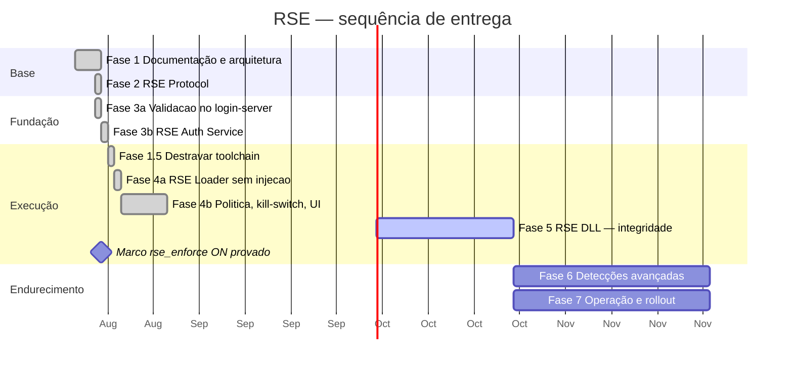

# RagnaShield Engine — Roadmap

**Versão:** 3.0 — 23/08/2026 — **a Fase 6 fechou o ciclo**: seis detecções provadas em campo, detecção virou **ação**, e a ação virou **consequência** (sessão revogada + espera por máquina). No caminho, o `machine_hint` zerado foi achado antes de ir para produção.

---

## Visão geral



Durações são ordem de grandeza para um desenvolvedor, não compromisso de data.

---

## 🛡️ O marco — `rse_enforce: on`, provado em 22/08/2026

**O objetivo escrito na primeira mensagem do projeto — *"o Login Server deve rejeitar
clientes sem token válido"* — está cumprido.** Com o login-server em `on`:

| Como o cliente foi aberto | Resultado |
|---|---|
| **Pelo launcher** (Loader → ticket → DLL → netgate) | entra normal ✅ |
| **Direto no `RagnaLinK_ptBR5.exe`** (sem ticket) | **`Recusado pelo servidor.(3)`** 🛑 |

Antes do `on`, a mesma abertura direta **entrava** e só era registrada (modo `log`). O
contraste entre as duas execuções é a prova de que a checagem roda **e discrimina**.

O `on` foi ligado com o servidor ainda em construção — **nenhum jogador além do próprio
dono** — que é exatamente a janela certa para fazer isso: o risco de trancar legítimo para
fora, que domina a decisão em servidor povoado, aqui é zero.

### 🚨 O kill-switch INVERTEU de papel — leia antes de mexer

Com o login-server em `on`, o `RSE_ENFORCE` do Portal deixou de ser um freio e virou uma
tranca:

| | login-server em `log` | login-server em **`on`** |
|---|---|---|
| `RSE_ENFORCE=off` no Portal | Loader não injeta → **todos entram** sem proteção | Loader não injeta → ninguém tem ticket → **TODOS SÃO RECUSADOS**, inclusive pelo launcher |

**Alavanca de recuo correta a partir de agora:** voltar `rse_enforce: log` no
`conf/import/login_conf.txt` do **login-server** + reiniciar o container. **Nunca** usar o
`RSE_ENFORCE=off` do Portal como recuo — ele agora tranca todo mundo em vez de liberar.

### O que ainda deve ser feito ANTES de abrir para jogadores

1. **D6 — certificado de assinatura de código.** O `rse_loader.exe` e a `rse_watchdog.dll`
   não estão assinados. Um Loader não assinado que injeta código é bandeira vermelha
   clássica de antivírus; em `on`, um AV que bloqueie o Loader **tranca aquele jogador para
   fora** — e, se o bloqueio for do Loader inteiro, **nem aparece no log do servidor**. É o
   maior risco individual da abertura. A emissão leva semanas: começar já.
2. **5c-2c** — ✅ lista de manifestos FEITA. Falta só o modo `sampled` (pega alteração no
   corpo de um arquivo da GRF sem mexer na tabela).
3. **Testes de compatibilidade da 4b** — `rse.enabled: false`, YAML sem o bloco `rse:`, e
   UAC em conta padrão.
4. **Aviso de privacidade publicado** (§8 do `RSE_SPEC.md`) — requisito do modo `on` com
   jogadores reais.
5. **Rotacionar a `K_ticket`** — *pendente, decidido em 22/08 fazer depois*. A chave apareceu
   num print durante o desenvolvimento; o risco concreto é baixo (conversa privada), mas a
   disciplina com segredo é: **apareceu onde não devia, troca-se**. Vale fazer enquanto não há
   jogadores, quando custa zero — e serve de **ensaio do mecanismo de rotação**, que foi
   construído (o `key_id` no ticket, o `ChaveAnteriorHex` no Auth Service, o chaveiro de
   várias chaves no login-server) e **nunca foi exercitado**. Descobrir que a rotação funciona
   é melhor hoje do que no dia em que ela for obrigatória.
   Caminho: gerar 32 bytes; no Portal `RSE_KEY_ID=2` + chave nova, e a atual vira
   `RSE_CHAVE_ANTERIOR_HEX` com `RSE_KEY_ID_ANTERIOR=1`; no login-server acrescentar
   `rse_key: 2, <hex>` **mantendo** a linha do `1`; reiniciar os dois; dias depois remover a 1.

---

## Fase 0 — Já existe *(concluída antes deste trabalho)*

O fork já entrega: janela sem moldura recortada na forma da arte, identidade RagnaLinK no
executável, resolução robusta do `index_url`, pipeline de patch documentado
(`COMO-LANCAR-UMA-ATUALIZACAO.md`) e toolchain fixada e justificada.

Vale registrar: a qualidade dos comentários do fork é acima da média. Cada decisão
esquisita tem o *porquê* escrito ao lado — e foi isso que permitiu esta análise de
arquitetura ser precisa em vez de especulativa.

---

## Fase 1 — Documentação e arquitetura ✅ *(esta entrega)*

**Entregáveis:** `docs/ARCHITECTURE.md`, `docs/RSE_SPEC.md`, `docs/ROADMAP.md`,
diagramas de módulos e de fluxo, pontos de integração no launcher e no rAthena,
inventário de arquivos modificados × intactos.

**Critério de aceite:** nenhuma linha de código alterada. ✅

---

## Fase 1.5 — Destravar a toolchain ✅ *Passo A concluído em 21/08/2026*

> ✅ **Passo A concluído e validado em 21/08/2026.** O `ntapi` saiu da árvore com um único
> `cargo update -p tokio@1.8.4 --precise 1.26.0` — **nenhum `Cargo.toml` alterado**, 8 crates
> movidos, e a toolchain **continua** em 1.68.2. O launcher recompilou em 1m15s e os testes
> manuais passaram todos: patch completo, janela sem moldura e recortada, minimizar,
> arrastar, e o jogo abrindo até a tela de login. Detalhes em `docs/FASE_1_5.md`.
>
> 🚨 **Pré-requisito que apareceu no caminho, e vale para as Fases 4 e 5.** O build parou em
> `error: linker link.exe not found`: o workload **"Desenvolvimento para desktop com C++"**
> do Visual Studio Build Tools não estava instalado. O `rustup` traz o compilador Rust, mas
> o alvo `*-pc-windows-msvc` linka com o `link.exe` da Microsoft. Instalado agora, junto com
> `rustup target add i686-pc-windows-msvc` — o Loader e a DLL das Fases 4 e 5 são i686 e
> precisariam dele de qualquer forma. Era também a causa real do `cl` não reconhecido no
> teste de vetores do emulador.
>
> **Passo B — trocar de compilador — fica para o começo da Fase 4**, quando se souber qual
> API do Windows o Loader vai usar e, portanto, qual MSRV é mesmo necessária. Medindo:
> `windows-sys` 0.48 declara MSRV 1.48 e a 0.52 declara 1.56, então dá para escrever o
> Loader sem destravar. A trava não é um bloqueio absoluto — é um teto.

**Atualização de 21/08/2026 — a Fase 2 foi feita SEM destravar, e funcionou.**
O `rse-protocol` compila e passa nos 61 testes com a toolchain travada:

```
cargo +1.68.2 test   →  52 + 8 + 1 testes, todos verdes
```

Foi possível porque as primitivas do RustCrypto (`aes-gcm 0.10`, `hmac 0.12`,
`sha2 0.10`, `hkdf 0.12`) têm MSRV baixa, e porque o crate não depende de
`windows-sys`. Custou **um** teto de versão, documentado no `Cargo.toml` do crate:

```toml
# zeroize 1.9.0 passou a usar a edicao 2024; o cargo da 1.68.2 nem le o manifesto
zeroize = { version = ">=1.5, <1.9", default-features = false }
```

**Onde a trava ainda vai doer:** Fases 4 e 5. O Loader e a DLL falam com a API do
Windows, e o ecossistema moderno ali é o `windows`/`windows-sys` — MSRV ≥ 1.70. Dá para
usar `winapi 0.3` (o launcher já usa), mas é uma API mais crua e sem manutenção ativa.

> **Registro da Fase 4b (22/08):** a trava de 1.68.2 **valeu a pena manter** — Loader,
> DLL, netgate, kill-switch e o launcher inteiro compilam nela com `winapi 0.3`. O único
> custo é disciplina de `Cargo.lock`: estreitar a workspace re-resolve o grafo e puxa
> crates que exigem rustc novo (`unicode-segmentation 1.13.3` pede 1.85). O antídoto é o
> `Cargo.lock` known-good + build com `--locked`. Passo B **não foi necessário**.

**Recomendação revisada: destravar antes da Fase 4, não antes da Fase 2.** O risco de
mexer agora não se paga — o protocolo já está pronto e testado nas duas toolchains.

**Tarefas**

1. Subir `tokio` para ≥ 1.38 (já usa `mio 0.8+`, sem `ntapi`).
2. `cargo update`; revalidar `reqwest`, `web-view 0.7.3`, `winapi 0.3`.
3. Compilar em `i686-pc-windows-msvc` e `x86_64-pc-windows-msvc`.
4. **Teste manual obrigatório:** patch completo do zero + `frameless` + recorte da janela
   + minimizar + arrastar + abrir o jogo. É a única forma de validar `web-view` e MSHTML.
5. Remover `rust-toolchain.toml` **ou** fixar em uma versão recente e escrever o novo
   porquê.

**Critério de aceite:** patcher compila em toolchain estável recente e passa no teste
manual acima, sem regressão visual.

**Se for reprovada:** documentar em `rse/docs/MSRV.md` o teto de 1.68 e escolher crates
compatíveis. É um caminho viável — só é um teto mais baixo.

---

## Fase 2 — RSE Protocol ✅ *concluída em 21/08/2026*

**O que foi entregue**

```
rse/protocol/
├── Cargo.toml                          rse-protocol 0.1.0, rust-version 1.68.2
├── src/version.rs                      constantes e regras de compatibilidade
├── src/error.rs                        erros tipados, códigos congelados
├── src/crypto.rs                       Key (zeroize + Debug redigido), HMAC ct, HKDF
├── src/ticket.rs                       RseTicket 148 B, verify(), packet 0x0AAA
├── src/frame.rs                        AES-256-GCM, opcodes, anti-replay por seq
├── src/replay.rs                       cache de nonce com expiração e teto
├── examples/gen_vectors.rs             gerador determinístico dos vetores
├── tests/vectors.rs                    conferência contra os vetores congelados
└── tests/vectors/v1/vectors.txt        16 casos de ticket + 5 frames
rse/docs/PROTOCOL_V1.md                 referência de bytes
```

**Resultados medidos**

| Critério de aceite | Alvo | Obtido |
|---|---|---|
| Testes verdes | — | **61** (52 unidade + 8 vetores + 1 doc) |
| Zero `unsafe` | sim | `#![forbid(unsafe_code)]` |
| Cobertura em `ticket.rs` | ≥ 90% | **96,7%** |
| Cobertura em `frame.rs` | ≥ 90% | **96,1%** |
| Cobertura total | — | **96,8%** |
| Códigos de erro com teste dedicado | 8 | **10** (os 9 do ticket + as bordas) |
| `cargo clippy -- -D warnings` | limpo | limpo |
| Compila na toolchain travada | sim | `cargo +1.68.2 test` verde |
| Workspace continua construindo | sim | `gruf`, `mkpatch`, `rpatchur` intocados |

**Duas decisões tomadas durante a implementação, que fogem do plano original**

1. **Vetores em texto simples, não JSON.** Quem vai lê-los na Fase 3 é o login-server do
   rAthena, em C++, e ele não tem parser JSON à mão — traria dependência nova só para ler
   arquivo de teste. O formato é `@registro chave=valor`, uma linha por caso: `istringstream`
   e pronto. De quebra, saiu o `serde_json` das dev-dependencies.
2. **Sem ABI em C neste crate.** Expor ponteiro cru exigiria `unsafe`, e o
   `#![forbid(unsafe_code)]` vale mais. Se a Fase 3 decidir ligar Rust no login-server em
   vez de reimplementar em C++, isso vira um crate `rse/capi/` separado, com todo o
   `unsafe` concentrado num arquivo pequeno e revisável.

<details>
<summary>Escopo original da fase (mantido para referência)</summary>

> Concordo com a sua leitura de que o protocolo vem antes de detectar Cheat Engine.
> Detecção sem protocolo é enfeite: o sujeito troca o launcher e a detecção nem carrega.
> **Um ajuste na formulação, e ele é importante:** o protocolo só impede a troca do
> launcher **junto com a Fase 3** — porque quem impede é a *assinatura do lado servidor*.
> Se a chave morar no cliente, sai com um editor hexadecimal em uma tarde. Por isso
> Fase 2 e Fase 3 são planejadas como um bloco; entregar a 2 sozinha ainda não protege
> ninguém.

**Escopo:** crate `rse/protocol` (`rse-protocol`), rlib, **sem I/O e sem Windows API** —
roda inteiro em CI Linux.

**Entregáveis**

- `ticket.rs` — `RseTicket`, serialização de 148 bytes, `sign()`, `verify()`, `TicketError`
- `frame.rs` — `RseFrame`, opcodes, `seal()`/`open()` AES-256-GCM, controle de `seq`
- `crypto.rs` — HKDF, HMAC constante, wrapper de CSPRNG, `zeroize`
- `version.rs` — `RSE_PROTOCOL`, regras de compatibilidade
- `error.rs` — erros tipados, sem `String`
- `tests/vectors/v1/` — vetores congelados (§10 de `RSE_SPEC.md`)
- `rse/docs/PROTOCOL_V1.md` — o layout de bytes em formato de referência rápida
- Um **gerador de vetores** que exporta JSON para o lado C++ consumir na Fase 3

**Critérios de aceite**

- [ ] `cargo test` verde em Linux e Windows
- [ ] Zero `unsafe`
- [ ] Cobertura ≥ 90% em `ticket.rs` e `frame.rs`
- [ ] Todos os 8 códigos de erro de §4.5 com teste dedicado
- [ ] `cargo build` do workspace continua funcionando (nada quebrado no launcher)
- [ ] `cargo clippy -- -D warnings`

**Riscos**

| Risco | Mitigação |
|---|---|
| Crate de cripto incompatível com a MSRV | Resolvido pela Fase 1.5; senão, RustCrypto puro |
| Layout do ticket mudar depois | Vetores congelados + `key_id`/`reserved` já previstos |

**Não fazer nesta fase:** nada de rede, nada de processo, nada de Windows.

</details>

---

## Fase 3a — Validação no login-server ✅ *concluída em 21/08/2026*

A Fase 3 foi partida em duas. Esta metade — a do login-server — não depende do Auth
Service existir: com uma chave estática no `login_athena.conf`, ela já valida tickets
contra os vetores congelados.

**Emulador alvo:** `D:\RagnaLinK\Emulador\ragnalink-rathena` — rAthena de **abr/2026**,
`PACKETVER 20211103`, build por Docker.

> Registro honesto: a primeira tentativa foi aplicada em
> `D:\DEV Ragnarok\Emulador\Rathena\rathena`, que é um snapshot de dez/2023 e **não** é
> o emulador em uso. Aquela árvore foi revertida ao estado original. A lição prática:
> confirmar qual árvore está viva antes de mexer — as duas parecem iguais de fora, e a
> antiga ainda tem os `.exe` compilados na raiz.

| Arquivo | Estado |
|---|---|
| `src/login/rse_verify.hpp` · `.cpp` | **novos** — SHA-256, HMAC, verificação, cache de replay, struct do packet |
| `src/login/login.hpp` | +17 linhas — campos na sessão e na config |
| `src/login/loginclif.cpp` | +40 linhas — handler + **uma linha** no `PacketDatabase` |
| `src/login/login.cpp` | +69 linhas — defaults, leitura da config, exigência |
| `conf/login_athena.conf` | +40 linhas — `rse_enforce` e `rse_key`, **antes** dos `import:` |
| `src/login/login-server.vcxproj` + `.filters` | +8 linhas — só o Visual Studio precisa |
| `tools/rse/` | **novo** — teste de conformidade, `rse.mk`, `build.bat`, `README.md`, `vectors.txt` |

**Resultados medidos**

| Critério de aceite | Obtido |
|---|---|
| Vetores da Fase 2 passam byte a byte em C++ | **40/40** |
| SHA-256 contra FIPS 180-4 | 4/4 (incluindo 1.000.000 × `'a'`) |
| HMAC-SHA256 contra RFC 4231 | 4/4 (incluindo chave > 64 B) |
| Compila com os headers reais do emulador em uso | `login.cpp`, `loginclif.cpp`, `rse_verify.cpp` limpos (C++17) |
| `sizeof(s_rse_packet_ticket)` = 152, offsets 0/2/4 | conferido — o `PacketDatabase` usa esse tamanho para o `RFIFOSKIP` |
| Avisos do compilador no código do RSE | **zero** (`-Wall -Wextra -Wsign-compare`) |
| Round-trip ao vivo: Rust emite agora → C++ valida | OK, e o reenvio dá `REPLAY` |
| Diff em arquivos do core do rAthena | ~126 linhas, todas em blocos delimitados |

**Descobertas que mudaram o plano**

1. **O rAthena não linka OpenSSL.** `src/common/` tem `md5calc.cpp` e `des.cpp` e mais
   nada de hash. O `rse_verify.cpp` ficou autocontido, com SHA-256 e HMAC próprios
   (~180 linhas, algoritmo publicado, conferido contra os vetores oficiais antes de
   qualquer outra coisa). Saiu melhor: zero dependência nova em três sistemas
   operacionais.
2. **CMake e Makefile não precisam de mudança.** O CMake faz `file(GLOB *.cpp)` e o
   Makefile faz `ls *.cpp` em `src/login/` — os arquivos novos entram sozinhos. Só o
   `.vcxproj` do Visual Studio precisou de duas linhas.
3. **O teste de conformidade não pode morar em `src/login/`** pelo mesmo motivo: o glob
   o compilaria dentro do login-server e daria erro de `main` duplicado. Foi para
   `tools/rse/`.
3b. **O emulador em uso já usa o `PacketDatabase` do rAthena moderno** — dispatch por
   tabela tipada, não `switch`. Registrar o packet virou literalmente uma linha:
   `this->add( RSE_LOGIN_PACKET_ID, true, sizeof(s_rse_packet_ticket), logclif_parse_rse_ticket );`
   Registrado como **tamanho fixo** de propósito: em packet dinâmico quem manda no
   `RFIFOSKIP` é o `packetLength` que o cliente enviou — ou seja, o atacante.
3c. **A struct do packet mora em `rse_verify.hpp`**, não em `common/packets.hpp`. O
   `0x0AAA` é nosso, não da Gravity; assim atualizar o rAthena nunca gera conflito de
   merge por causa dele.
4. **A validação acontece depois da conferência de senha**, e não antes. Assim um ticket
   válido nunca é "gasto" — com o nonce queimado no cache de replay — por uma tentativa
   de login que ia falhar de qualquer jeito.

**Como testar agora, antes do Auth Service existir**

```
cd tools\rse
build.bat  &&  rse_test.exe vectors.txt      # espera 40/40
```

Depois, no `login_athena.conf`, `rse_enforce: log` e uma `rse_key`. O servidor passa a
registrar quem entraria sem ticket, sem barrar ninguém.

---

## Fase 3b — RSE Auth Service ✅ *concluída em 21/08/2026*

**Por que vem imediatamente depois:** é aqui que o RSE **passa a valer alguma coisa**. Ao
fim da Fase 3, abrir o Ragexe direto já não conecta — e isso acontece **antes** de existir
qualquer código de detecção.

**Entregáveis — servidor**

- RSE Auth Service: `POST /session`, `POST /ticket`, `POST /report`, `GET /policy`
- Armazenamento de sessões, banimento por `machine_fp`, lista de builds aceitos
- Rotação de `K_ticket` com `key_id`
- Publicação do manifesto de integridade (§7 de `RSE_SPEC.md`)

**Entregáveis — login-server:** ✅ feitos na Fase 3a.

**O que já está no ar** *(21/08/2026)*

O Auth Service subiu no host do Portal e responde. O `GET /rse/v1/policy` devolvendo
`{"protocol":1,"enforce":"log","policy_epoch":1,"heartbeat_interval_ms":5000,"ticket_ttl_ms":30000}`
prova três coisas de uma vez: a configuração chegou ao container, o **auto-teste contra os
vetores congelados passou na subida** (se divergisse, o site não subia — ver
`RseConfiguration.AddRseConfiguration`), e a política corrente é a esperada.

```
PortalRagnarok.Rse/          projeto sem NENHUMA referência ao site — mover para
                             container próprio depois é refactor pequeno
PortalRagnarok.App/Controllers/RseController.cs      rota /rse/v1
PortalRagnarok.App/Configuration/RseConfiguration.cs auto-teste na subida
rse/tools/smoke/             rse-smoke — prova o circuito sem Loader nem DLL
```

> **Nota da Fase 4b (22/08):** o `enforce` da política (`RseSettings__Enforce`, env
> `RSE_ENFORCE` no Portal) é **o que o Auth Service recomenda ao cliente**, e é
> **independente** do `rse_enforce` do login-server (quem barra de verdade). O kill-switch
> do Loader lê justamente esse campo. Trocar `RSE_ENFORCE=off` desliga só o lado cliente.

**Critérios de aceite**

- [x] Vetores da Fase 2 passam **byte a byte** na implementação C++
- [x] Vetores da Fase 2 passam **byte a byte** na implementação C# (auto-teste na subida)
- [x] Auth Service no ar e respondendo `/policy` em produção
- [x] Ticket emitido pelo Auth Service real → login normal **(provado em produção)**
- [x] Ticket expirado / repetido / assinatura errada → recusa código 3, com log
- [x] `rse_enforce: log` deixa entrar e registra
- [ ] Teste de carga: 500 logins/min sem crescimento do cache de replay
- [x] Chaveiro aceita mais de uma chave (rotação sem derrubar o servidor)

**A prova de ponta a ponta** *(21/08/2026, `ro-core-01`)*

Rodado contra o servidor de produção, em `rse_enforce: log`, com a `K_ticket` real. O que
importa não é o login ter sido aceito — em modo `log` ele seria aceito de qualquer jeito.
O que prova é o **contraste** entre as duas execuções:

| | `rse-smoke` | console do login-server |
|---|---|---|
| **com** ticket | `0x0AC4 AC_ACCEPT_LOGIN`, `account_id=2000000` | `Authentication accepted` — **nenhuma linha `RSE:`** |
| **sem** ticket (`--sem-ticket`) | `0x0AC4 AC_ACCEPT_LOGIN` (idêntico) | `RSE: cliente nao enviou ticket` + `RSE: em modo 'log' - entrou SEM ticket valido (INVALID_LENGTH)` |

O bloco de verificação tem três saídas e **todas escrevem no log**; a única que passa em
silêncio é `rse_verify_ticket() == RSE_OK`. Silêncio na primeira linha e as duas mensagens
na segunda só é possível se a checagem estiver rodando **e discriminando**.

Com isso, um ticket assinado pelo **C#** foi validado pelo **C++** com a chave de produção:
HMAC conferiu, TTL dentro da janela, nonce inédito. As três implementações concordam byte a
byte fora do laboratório.

> Nota de ferramenta: a primeira execução reportou `packet 0x0AC4 inesperado` e mesmo assim
> imprimiu *"Nenhuma falha"*. O `rse-smoke` só conhecia o `0x0069` — o rAthena troca para
> `0x0AC4` a partir da PACKETVER 20170621, e a daqui é 20211103. Corrigido: reconhece os
> dois, mostra o `account_id` para casar com o log, e **packet desconhecido agora conta como
> falha**. Rodapé verde sobre resultado que a ferramenta não soube ler é pior que erro — dá
> confiança que não existe.

**Três descobertas na implantação**

**1. 🚨 `rse_verify_init()` apagava a chave recém-lida da configuração.** Bug próprio,
encontrado antes de chegar em produção, mas por pouco. O rAthena lê a configuração
**antes** de chamar os `do_init_*` dos módulos:

```
login_config_read(...)   ->  rse_set_key() enche o chaveiro
do_init_loginclif()      ->  rse_verify_init() -> memset(g_keys, 0)   <-- apagava tudo
```

O efeito seria silencioso e apontaria para o lugar errado: em `log`, todo login viraria
"ticket recusado" e entraria mesmo assim; em `on`, **ninguém entraria** — com o
`login_conf.txt` aparentemente correto. Dias de depuração perseguindo uma chave que
estava certa o tempo todo.

*A regra que sai disso:* **chave é configuração, cache de replay é estado de execução — e
os dois têm ciclos de vida diferentes.** `rse_verify_init()` agora só zera o cache; quem
quiser mesmo esvaziar o chaveiro chama `rse_clear_keys()`, que é explícito e raro. O
chaveiro nem precisa ser zerado no arranque: é estático de escopo de arquivo, e o C++ já
garante que nasce zerado. Há um teste de regressão travando isto (`rse_verify_init
preserva o chaveiro`), e a suíte foi de 40 para **41 casos**.

*Consequência de projeto:* o login-server agora **declara no arranque** o que carregou —
`RagnaShield Engine: modo log, 1 chave(s) carregada(s), protocolo 1` — e em `rse_enforce:
on` com o chaveiro vazio ele **se recusa a subir**. Um servidor de pé recusando 100% dos
logins é pior do que um servidor que não sobe: o segundo você percebe na hora.

**2. `UseHttpsRedirection` responde 307 a quem bate direto na porta interna.** Não é bug:
o Portal fica atrás do nginx, que termina o TLS e sinaliza via `X-Forwarded-Proto`. Quem
chama a porta do container pulando o proxy leva um redirecionamento para a 443 — e com
`curl -s` o sintoma é **saída vazia**, que não sugere nada. O `rse-smoke` passou a mandar
o mesmo header que o nginx poria, e a explicar qualquer 3xx em vez de devolver corpo
vazio. Para conferir à mão:

```bash
curl -s -H "X-Forwarded-Proto: https" http://127.0.0.1:8081/rse/v1/policy
```

O Loader da Fase 4 fala HTTPS pelo nome público e não precisa disto.

**Riscos**

| Risco | Mitigação |
|---|---|
| HMAC do C++ divergir do Rust | Vetores compartilhados são critério de aceite, não sugestão |
| `0x0AAA` colidir com packet futuro | Verificado livre hoje; documentado em `rse/docs/` |
| Login-server ficar lento | Validação é offline por projeto — medir e provar |
| Merge com upstream do rAthena | Lógica isolada em `rse_verify.cpp`; diff em core ≈ 15 linhas |

---

## Fase 4a — RSE Loader (sem injeção) ✅ *concluída em 22/08/2026*

O jogo passou a abrir **através do Loader**, com credencial e ticket reais. A injeção da
DLL é Fase 5; esta metade prova o encanamento.

```
launcher ──(POST /session)──► Auth Service
   │  cria pipe \\.\pipe\rse-<128 bits aleatorios>
   │  ShellExecuteExW("runas", rse_loader.exe, "--pipe … -- 1sak1")
   │  escreve a credencial e ESPERA a leitura (FlushFileBuffers)
   ▼
Loader (elevado) ──(POST /ticket)──► Auth Service    [148 bytes, 30 s]
   │  CreateProcessW(CREATE_SUSPENDED) + lpCurrentDirectory explicito
   ▼
Ragexe (elevado) — igual a antes
```

**Duas mudanças no plano original, decididas em 21/08 e documentadas em
`docs/FASE_4_ANALISE.md`:**

1. **ADR-004 revisto: a credencial vai por named pipe, não por handle herdado.** Herdar
   handle exige `CreateProcess`, e o Loader precisa nascer elevado (`ShellExecuteExW` +
   `runas`) para poder injetar no Ragexe elevado na Fase 5. As duas coisas são mutuamente
   exclusivas nessas APIs. O pipe atende os dois objetivos: some da linha de comando **e**
   atravessa a fronteira de elevação (política *no-write-up* do Windows).
2. **O Loader é i686.** A DLL da Fase 5 tem que ter a arquitetura do Ragexe, e uma
   diferença gratuita entre Loader e DLL no ponto mais delicado do projeto não se paga.

**Resultados medidos**

| Critério de aceite | Alvo | Obtido |
|---|---|---|
| Jogo abre pelo Loader, em produção | — | ✅ |
| `"1sak1"` chega intacto ao Ragexe | — | ✅ `"…\RagnaLinK_ptBR5.exe" 1sak1`, lido do `Win32_Process` |
| Credencial fora da linha de comando | — | ✅ por construção — o pipe |
| `gruf/`, `mkpatch/`, `process.rs`, `core.rs`, `patching.rs` intocados | byte a byte | ✅ **8 arquivos conferidos, todos idênticos** |
| Testes do `rse-protocol` + Loader | — | **82** (64 + 18) |
| `clippy -- -D warnings` | limpo | limpo |
| Compila para Windows na toolchain travada | sim | ✅ 1.68.2, i686 e x86_64 |
| **Diff no `rpatchur/`** | ≤ 50 linhas | **47 de código** ⚠️ *ver nota* |

> ⚠️ **Nota honesta sobre o diff.** O `git diff` do `rpatchur/` mostra **128 linhas**. Delas,
> **47 são código executável** — dentro do teto de 50. As outras 81 são 58 linhas de
> comentário e 11 em branco. O critério não dizia qual das duas contagens valia. Registrando
> as duas para você decidir: se o teto for de diff bruto, ele estourou 2,5×; se for de
> código, passou raspando. O comentário segue o padrão do próprio fork, cuja qualidade a
> `ARCHITECTURE.md` §0 destacou — mas isso é justificativa, não medição.

**Três armadilhas do Windows que o código trata, e que teriam custado caro**

1. **Diretório de trabalho.** Processo elevado criado pelo AppInfo nasce em `System32`. O
   Ragexe carrega `data.grf` por caminho relativo. `lpCurrentDirectory` e `lpDirectory` são
   passados explícitos nos dois pontos.
2. **Citação da linha de comando.** `C:\Pasta Com Espaco\` citado ingenuamente vira
   `"C:\Pasta Com Espaco"`, com a aspa final escapada engolindo o argumento seguinte. Tem
   teste dedicado; é do que depende o `1sak1`.
3. **A corrida com `exit_on_success`.** O launcher fecha assim que dispara o jogo. Sem o
   `FlushFileBuffers` — que num pipe bloqueia até o cliente ter lido — o launcher poderia
   morrer antes de o Loader ler a credencial. Bug intermitente, só em máquina lenta.

**Um susto que não era bug:** *"Cannot init d3d OR grf file has problem"*. O mesmo comando
falhava **na mão**, sem Loader nenhum — era um Ragexe pendurado de um teste anterior
segurando o dispositivo D3D. Virou o passo 0 do `SOCORRO.md` §3, antes de qualquer mexida
em registro, porque a mensagem é idêntica à do problema de resolução e dá para perder uma
noite no lugar errado.

---

## Fase 4b — Política, kill-switch e UI ✅ *fechada em 22/08/2026*

O que faltava da Fase 4, mais o polimento de produto. Tudo provado no cliente real.

### Kill-switch — o freio remoto ✅ *provado (log/on injeta, off passa direto)*

O Loader consulta `GET /policy` e obedece o campo `enforce`:

- **No arranque:** antes de injetar, lê a política. Em `off`, abre o jogo **sem injetar a
  DLL** — e ignora o `--exigir-dll` de propósito (o freio ganha do modo estrito). RSE
  quebrado em produção vira um ajuste no Auth Service; os lançamentos novos abrem limpos,
  sem redistribuir cliente.
- **Sessão aberta (a cada 60 s):** uma thread separada consulta a política sem travar os
  heartbeats. Virando `off` no meio do jogo, o Loader manda a DLL **recuar limpo**
  (SHUTDOWN) — ela encerra sozinha **sem derrubar o jogo**.
- **À prova de susto:** falha de rede na consulta **não** desliga o RSE (segue com
  proteção). O kill-switch é um `off` explícito de um serviço no ar, nunca uma inferência
  de queda.

**Prova (`ro-core-01`, 22/08):** com `RSE_ENFORCE=off`, o `rse_loader.log` mostrou
`enforce=off` → `KILL-SWITCH ATIVO — abrindo SEM injetar`, sem `injetando`, sem `HELLO_ACK`,
e o `rse_watchdog.log` **não** ganhou linha. Com `log`, injeta normal. Os dois caminhos
provados. Reverter é trocar `RSE_ENFORCE` de volta e `docker compose up -d ragnalink`.

### Status e diagnóstico na UI ✅ *provados*

- **`rseStatus`** — "Iniciando proteção RagnaShield…" ao clicar JOGAR (durante UAC/handover).
- **`rseErro` × `rseBloqueado`** — separados: erro técnico (Auth Service fora, Loader sumido,
  UAC recusado) vs bloqueio deliberado (o Auth Service recusa a sessão com **403** = banido /
  build barrado). O `abrir_sessao` distingue os dois; mensagens diferentes.
- **`rse_diag`** (ponto L6, atalho **Ctrl+Shift+D**) — grava `rse_diag.txt` ao lado do jogo
  (config, versões, fim dos dois logs) e mostra um **código de suporte** na tela. Na falha, o
  código já vem junto do `rseErro`. **Provado:** o código na telinha (`RSE-F763`) bateu com o
  gravado no arquivo, e o diagnóstico trouxe o `rse_watchdog.log` com o netgate antepondo o
  `0x0AAA` num login real.
- `index.html`: as funções `rseStatus`/`rseErro`/`rseBloqueado`/`rseDiag` + o atalho, com a
  guarda `typeof` (página antiga não quebra). Carrega de `patcher/index.html` (local).

### Polimento de produto (fora do escopo original, mas pedido) ✅

- **Console do Loader removido** — `#![cfg_attr(all(windows, not(debug_assertions)),
  windows_subsystem = "windows")]`: em release o CMD sumiu; o log continua no `rse_loader.log`.
  (Resolve a pendência de acabamento das Fases 5a e 5b.)
- **Telinha do RagnaShield** — card branco moderno com o emblema num medalhão escuro, sombra
  suave, cantos arredondados e uma **barra de progresso animada** (janela em camadas via
  `UpdateLayeredWindow`, redesenhada ~50×/s). Roda em thread própria: se falhar, o jogo abre
  do mesmo jeito — cosmético nunca segura funcional. Tamanho 352×371.
- **TTL do ticket fresco** (herdado da 5b) segue provado.

### Nota honesta sobre o diff

A 4b somou ~80 linhas executáveis no `rse.rs` (arquivo novo, **zero risco de conflito com o
upstream do rpatchur**) e ~38 no `ui.rs` (concentradas no `start_game_client` + o handler
novo `handle_rse_diag`). Passou do teto de 50 do escopo original — mas o grosso é o relatório
de diagnóstico, que é ferramenta de suporte, não lógica de anti-cheat. O ponto de decisão do
RSE no launcher segue **único**, e `gruf`/`mkpatch`/`process.rs`/`patcher/` seguem intocados.

### Percalço de build registrado

A workspace raiz tinha sido estreitada só para as crates do `rse/` (sem `rpatchur`/`gruf`/
`mkpatch`), então `cargo build -p rpatchur` não achava o pacote; e readicioná-lo re-resolveu
o `Cargo.lock` para versões que exigem rustc 1.85 (`unicode-segmentation 1.13.3`). Corrigido:
membros de volta na raiz + `Cargo.lock` known-good restaurado (builda em 1.68.2) + build com
`--locked`. Fica a regra: **launcher só builda com `--locked`.**

### Ainda em aberto na 4b (testes, não código)

- `rse.enabled: false` → comportamento idêntico ao de hoje.
- YAML **sem** o bloco `rse:` → carrega normal (compatibilidade).
- Teste com UAC ligado em **conta padrão** (só foi testado em administrador).

---

## Fase 4 — RSE Loader + integração no launcher *(escopo original, para referência)*

**Entregáveis**

- `rse/loader/` → `rse_loader.exe` (i686)
  - leitura da credencial pelo **handle herdado** (ADR-004)
  - validação de ambiente
  - `CreateProcessW(CREATE_SUSPENDED)` + injeção + `ResumeThread` só após `HELLO_ACK`
  - named pipe com DACL restrita, heartbeat, `TerminateProcess` em violação
  - consulta ao kill-switch a cada 60 s
- `rpatchur/src/rse.rs` — fachada (~120 linhas)
- Alterações L1, L3, L4, L5, L6, L7, L8 (`ARCHITECTURE.md` §3.1)
- Bloco `rse:` no `RagnaLinK.yml`; `rseStatus`/`rseErro`/`rseBloqueado` no `index.html`

**Critérios de aceite**

- [ ] `rse.enabled: false` → comportamento **idêntico** ao de hoje
- [ ] YAML **sem** o bloco `rse:` → carrega normal (compatibilidade)
- [ ] Diff permanente no `rpatchur/` ≤ 50 linhas
- [ ] `gruf/`, `mkpatch/`, `process.rs`, `patcher/core.rs`, `patching.rs` intocados —
      **verificado por teste de CI**, não por confiança
- [x] Matar o Loader encerra o cliente em ≤ 20 s **(testado na 5a: ~15 s)**
- [ ] Credencial não aparece em `wmic process get commandline`
- [x] `"1sak1"` chega intacto ao Ragexe
- [ ] Testado com UAC ligado, conta padrão e conta administrador

**Riscos**

| Risco | Mitigação |
|---|---|
| Antivírus bloqueia o Loader | Assinatura de código + submissão prévia. Começar agora — a fila leva semanas |
| Elevação incompatível (§R4) | Testar as quatro combinações de UAC antes de fechar a fase |
| Jogo não abre em produção | `on_service_unavailable` + kill-switch + botão de suporte na UI |

---

## Fase 5a — DLL injetável + canal cifrado ✅ *provada em 22/08/2026, na primeira tentativa*

A DLL passou a existir, a ser injetável, e a conversar com o Loader por um canal
AES-256-GCM. O que ela **ainda não faz** é o que fecha o circuito de verdade — isso é 5b/5c
(ver abaixo). Esta metade prova a parte mais arriscada de tudo: **injetar código no Ragexe e
falar com ele em segurança**.

```
rse/watchdog/                       novo crate, cdylib -> rse_watchdog.dll (i686)
├── src/lib.rs                       DllMain minimo + rse_configure (export) + thread
├── src/canal.rs                     handshake HELLO/HELLO_ACK + heartbeat (Rust seguro)
├── src/sys.rs                       TODO o unsafe da DLL, concentrado
└── src/mensagens.rs                 payloads (puro, testavel em qualquer maquina)

rse/protocol/src/dll_config.rs       novo — o blob {pipe, K_s, session_id} da injecao
rse/loader/src/injecao.rs            novo — LoadLibrary remoto + handshake + vigilancia
```

**O que foi construído**

- **Injeção clássica, comentada passo a passo.** O Loader escreve o caminho da DLL na
  memória do Ragexe suspenso, chama `LoadLibraryW` por `CreateRemoteThread`, lê a base do
  módulo do código de saída da thread, escreve o blob de config numa segunda região, e chama
  `rse_configure` apontando para o endereço remoto — calculado por RVA a partir da própria
  cópia da DLL.
- **A `K_s` nunca toca linha de comando, ambiente ou seção nomeada.** Vai por memória anônima
  escrita no alvo, cujo endereço só o Loader conhece. Isto **revisa a metade-DLL do
  ADR-004** (a metade-launcher já tinha virado pipe na Fase 4), e o `dll_config.rs` documenta
  por que — inclusive a honestidade de que, contra quem já controla o processo, isto é defesa
  em profundidade, não garantia. A garantia forte continua sendo a validação do ticket no
  servidor.
- **A ordem inegociável, agora real:** injetar → esperar `HELLO_ACK` → só então
  `ResumeThread`. Um cliente retomado antes do HELLO_ACK roda sem vigilância, e é a janela que
  o RSE existe para fechar.
- **Heartbeat nos dois sentidos.** A DLL bate a cada 5 s; 3 batimentos sem `HEARTBEAT_ACK` e
  ela derruba o próprio processo (perder o Loader é evento de segurança). O Loader responde
  os batimentos até o jogo fechar; se a DLL some, ele encerra.
- **Tolerância no rollout:** `--exigir-dll` desligado por padrão. Enquanto o login-server
  está em `log`, uma falha de injeção **abre o jogo assim mesmo** e grita no
  `rse_loader.log`, em vez de trancar o jogador fora. Vira `--exigir-dll` na passagem para
  `on`.

**Resultados medidos**

| Critério | Obtido |
|---|---|
| A DLL compila como cdylib i686 na toolchain travada | ✅ `rse_watchdog.dll`, 1.68.2 |
| A DLL exporta `rse_configure` (nome limpo) | ✅ conferido no `objdump` |
| Loader + DLL cross-compilam para Windows | ✅ i686-pc-windows-gnu, release com LTO |
| Testes do protocolo + DLL | **87** (74 protocolo + 8 vetores + 4 mensagens + 1 doc) |
| `clippy -- -D warnings` (protocolo + DLL) | limpo |
| `unsafe` concentrado num arquivo por crate | ✅ `sys.rs` / `injecao.rs` |
| Injeção testada num processo real | ✅ **provada no cliente real, de primeira** |
| Matar o Loader encerra o cliente | ✅ **testado:** Loader morto → jogo caiu em ~15 s (3 batimentos) |

**A prova, do `rse_loader.log` real (22/08/2026):**

```
credencial recebida (124 bytes)
ticket recebido: 148 bytes, key_id=1, vale por 30000 ms
injetando ...\rse\rse_watchdog.dll
rse_watchdog.dll carregada no alvo, base=0x5f0d0000
HELLO_ACK recebido — a DLL esta viva e o canal cifrado funciona
Ragexe retomado
```

Injeção num processo de 32 bits real, handshake AES-256-GCM, e o jogo abrindo na tela de
login — tudo na primeira execução, sem uma rodada de depuração. Para injeção de DLL, que
falha por antivírus, ASLR ou arquitetura, isso é notável, não rotineiro.

**Pendência de acabamento — ✅ RESOLVIDA na Fase 4b.** O console do Loader saiu com
`#![cfg_attr(all(windows, not(debug_assertions)), windows_subsystem = "windows")]`: em release
não abre mais o CMD; o log em arquivo continua valendo.

---

## Fase 5b — netgate ✅ *PROVADA em 22/08/2026 — o circuito fechou*

**O circuito inteiro fechou com um cliente REAL.** Um ticket gerado pelo Auth Service,
carregado por uma DLL injetada, entregue por um hook de rede, validado pelo login-server:

```
launcher → sessão → Loader (elevado) → /ticket
   → injeta a rse_watchdog.dll → handshake AES-256-GCM
   → netgate intercepta o login no WSASend/send
   → antepõe o 0x0AAA com o ticket → login-server valida → aceita em SILÊNCIO
```

**A prova (`ro-core-01`, 22/08/2026):**

```
# rse_watchdog.log
inline_hook: WSASend desviado (trampolim em 0x1310000)
envio socket=16bc opcode=0x0064 len=55
netgate: login detectado, antepondo 0x0AAA
netgate: 0x0AAA enviado por send, ret=152

# login-server, com rse_enforce: log
Authentication accepted (account: Phillipe, id: 2000000)     <- SEM linha "RSE:"
```

Silêncio do RSE no `log` = ticket **válido** (o C++ só loga em falha). Antes, toda entrada
tinha `RSE: entrou SEM ticket`; agora não tem. Ticket real, aceito. **Reconfirmado na 4b:** o
`rse_diag.txt` de um login trouxe de novo `netgate: login detectado, antepondo 0x0AAA` + os
packets de dentro do jogo.

**O caminho até aqui, e o que cada tropeço ensinou** — três iterações, cada uma diagnosticada
pelo log da própria DLL em vez de adivinhação:

1. **Hook de IAT instalou mas nunca disparou.** O cliente resolve o Winsock por
   `GetProcAddress` e guarda o ponteiro — não passa pela tabela de imports. Trocado por
   **inline hook** (detour de 5 bytes sobre o prólogo hotpatch `mov edi,edi`, verificado antes
   de tocar para não arriscar crash).
2. **`send` enganchado por ordinal, não por nome.** O log disse; o hook passou a casar pelos
   dois. E o cliente usa **`WSASend`**, não `send` — enganchamos os dois.
3. **O `0x0AAA` saía por WSASend assíncrono e chegava DEPOIS do login.** Trocado por `send`
   síncrono: quando retorna, os bytes já estão no buffer do socket, garantidamente antes.

**Duas pendências honestas antes de `rse_enforce: on` — ambas RESOLVIDAS na Fase 4b:**

- ✅ **TTL do ticket — RESOLVIDO e provado (22/08).** A DLL mantém um ticket fresco: a cada
  15 s, até o login sair, ela pede um novo pelo canal (`TICKET_REQ`), o Loader renova falando
  com o Auth Service (`TICKET_RSP`), e o netgate sempre tem um ticket com ≤ 15 s de idade.
  Provado com login deliberadamente lento: o log da DLL mostrou `ticket renovado` antes do
  login, e o servidor aceitou limpo. Sem mais `EXPIRED` para jogador lento.
- ✅ **Janela de console do Loader — RESOLVIDA.** Compilado com `windows_subsystem = "windows"`
  em release; o CMD sumiu, o log em arquivo continua valendo.

**Como virar proteção de verdade:** com as pendências resolvidas e o kill-switch no ar,
`rse_enforce: on` no login-server, e abrir o Ragexe direto (sem launcher) para de conectar —
recusa código 3. É o objetivo do projeto desde a primeira mensagem, agora a um ajuste de
distância (com a Fase 5c e o certificado D6 recomendados antes).

---

## Fase 5b — netgate *(escopo original, para referência)*

É aqui que o RSE **passa a impedir** cliente sem launcher. A DLL intercepta o envio de rede
do Ragexe e antepõe o packet `0x0AAA` com o ticket (que já chega a ela no HELLO). Quando isto
funcionar, `rse_enforce: on` no login-server e um Ragexe aberto direto **não conecta**.

- hook de `send`/`WSASend` (IAT ou inline), antepondo o `0x0AAA` uma vez, na conexão de login
- o ticket já vem no HELLO — sem round-trip no caminho quente
- confirmar em captura de rede que o packet de login segue **byte a byte** inalterado

## Fase 4c — Produto: bandeja, multi-cliente e limite por máquina ✅ *22/08/2026*

Não estava no roadmap original — saiu de perguntas do dono durante a sessão, e vale registrar
porque mexeu em cliente **e** servidor.

### Ícone na bandeja ✅ *provado*

O escudo do RagnaShield aparece ao lado do relógio enquanto o cliente está protegido
(`rse/loader/src/bandeja.rs`). É o que Vanguard, GameGuard e EAC fazem, e pela mesma razão:
o jogador **vê** que a proteção está ativa em vez de confiar, e o suporte ganha a primeira
pergunta útil — *"o escudo aparece do lado do relógio?"* separa "o RSE nem subiu" de "subiu e
o problema é outro".

**O ícone não pode mentir:** ele sobe dentro do mesmo `if let Ok(canal)` do heartbeat, então
só existe quando há proteção de verdade. Com kill-switch ativo ou injeção falha, **nenhum
ícone aparece** — um escudo na bandeja de um cliente desprotegido seria uma garantia falsa.
E ele vive exatamente o tempo do Loader, que é o tempo da sessão protegida. Reage a
`TaskbarCreated` (Explorer reiniciando recria a bandeja e apagaria o ícone, o que o jogador
leria como "a proteção caiu").

### Sempre-residente (modelo Vanguard) — **avaliado e recusado**

Pergunta do dono: o Vanguard fica instalado e ativo o tempo todo; deveríamos?

**Não.** O Vanguard é residente porque é anti-cheat de **kernel** e precisa ganhar uma corrida
de ordem: carregar antes de um cheat que também sobe no boot. Como este projeto decidiu **não**
fazer driver de kernel (custo, tela azul, WHQL — está na tabela do que não entra), ficar
residente em *user-mode* pagaria o preço sem levar o benefício: um cheat já rodando não é
impedido por um serviço nosso que também já está rodando.

E o preço é alto: instalador, serviço, algo elevado rodando 24/7 (privacidade), atualização e
desinstalação mais difíceis, e — o pior — **um serviço sempre ativo, elevado, que injeta
código é exatamente o perfil que antivírus persegue**, o que agrava o D6 em vez de resolver.

O modelo por sessão tem a virtude oposta e fácil de explicar ao jogador: **a proteção vive
exatamente o tempo do jogo**.

### Multi-cliente: funciona ✅ (e escondia um bug)

Testado com **2 clientes, 2 contas, simultâneos**: dois Loaders, dois tickets, duas DLLs,
duas sessões protegidas. O protocolo aguentou sem nenhuma mudança.

> 🚨 **Bug encontrado por causa desse teste.** Os dois Loaders abriam o MESMO
> `rse_loader.log` com `File::create` (que **trunca**) e escreviam cada um no seu offset: o
> segundo apagava o log do primeiro, e sobrava linha picotada no meio (`m a DLL encerrado…`).
> Log corrompido que **parece** inteiro é pior que log ausente — e é justamente este arquivo
> que o `rse_diag` manda para o suporte. Corrigido para **append** (`FILE_APPEND_DATA`, cada
> escrita vai ao fim) com o **PID carimbado em cada linha**, mais rotação por tamanho.

### Falha do Loader deixou de ser silenciosa ✅ *provado (22/08)*

**O furo, apontado pelo dono ao ver o primeiro teste de bloqueio:** o cliente era recusado e
*nada* aparecia. Em release o Loader não tem console e o launcher já fechou, então toda falha
caía num `exit(1)` mudo — o jogador via a telinha aparecer e sumir, clicava de novo, e abria
chamado dizendo "o jogo não abre", achando que o problema era do servidor.

E não era só o caso do manifesto: **toda** falha era silenciosa — Auth Service fora do ar,
sessão expirada, antivírus bloqueando a injeção, arquivo faltando.

> **O princípio, agora escrito no código:** *um anti-cheat que barra sem explicar transfere
> para o suporte o custo de cada bloqueio que ele faz.* E o caso do cliente modificado é onde a
> explicação mais importa — essa pessoa precisa saber que o problema está nos arquivos dela e
> que a solução é deixar o launcher atualizar.

`auth::explicar()` traduz a falha para uma frase acionável, cobrindo nove situações (arquivos
modificados, launcher velho, sessão revogada, credencial expirada, excesso de tentativas,
servidor inalcançável, pipe/antivírus, injeção bloqueada, arquivo faltando). O décimo caso — o
desconhecido — **não inventa diagnóstico**: mostra o detalhe técnico e pede o `rse_loader.log`.
Os dez têm teste, com as strings de erro reais do código.

Duas decisões que fazem a caixa realmente aparecer:

- **A telinha se fecha sozinha por `Drop`.** O `executar()` sai por `?` em uma dúzia de pontos
  e em nenhum deles alguém lembraria de fechar o splash — que é `TOPMOST` e taparia justamente
  a mensagem. Com RAII, fechar deixou de depender de lembrar.
- **`MB_TOPMOST` em toda caixa.** Com outros clientes abertos, uma janela de jogo pode roubar o
  primeiro plano; aviso escondido é o mesmo que não avisar.

### Limite de clientes por máquina ✅ *duas camadas, de propósito*

| Camada | Onde | O que faz | Burlável? |
|---|---|---|---|
| Aviso | launcher (`index.html`) | mostra a regra **antes** de clicar em JOGAR | — |
| UX | Loader (`vagas.rs`) | barra o excedente com caixa explicando | **sim** |
| **Regra** | **login-server** (`login.cpp`) | recusa por `machine_fp` | **não** |

**O número vem da política do servidor** (`/policy` → `max_clients`, env `RSE_MAX_CLIENTES`),
como o kill-switch: mudar o limite não redistribui cliente. O aviso do launcher lê a **mesma
fonte**, então nunca existe tela dizendo "máximo 2" enquanto a regra real já é outra.

**No cliente, mutex e não semáforo.** Cada vaga é um mutex nomeado (`Local\RSE_vaga_N`).
Contagem de semáforo **não volta** quando o processo morre: um cliente morto no Gerenciador
de Tarefas vazaria a vaga para sempre e trancaria o jogador sem explicação. Mutex tem posse —
dono morto vira `WAIT_ABANDONED` e o próximo **recebe** a vaga. O caso de erro se conserta
sozinho.

**No servidor, a regra de verdade.** O `machine_fp` vem **assinado dentro do ticket** (bytes
52–84), então o jogador não consegue forjar uma máquina diferente. O `online_db` do rAthena já
diz quem está online; um mapa novo diz de qual máquina cada conta veio, e o cruzamento
responde a pergunta. A vaga é liberada em `login_remove_online_user`, que já existia.

Casos verificados em teste isolado (compilado e executado), porque um erro aqui trancaria
jogador legítimo em silêncio: **relogin da mesma conta não conta contra ela mesma** (senão
quem caiu seria barrado pelo próprio fantasma), a vaga volta no logout, conta sem `machine_fp`
(entrou em modo `log`) não entra na contagem, e máquinas diferentes não interferem.

O servidor **avisa no arranque** se `rse_max_clientes` estiver ligado com `rse_enforce`
diferente de `on` — sem ticket não há `machine_fp`, e o limite não valeria; melhor gritar do
que fingir que protege.

> **Tropeço registrado:** o primeiro deploy do `login.cpp` **não compilou**. Uma edição minha
> inseriu a linha do valor padrão por busca de texto, e a string casou com um *trecho* de linha
> dentro da cadeia `if/else` que lê a config, separando um ramo do seu `else`. Balanceamento de
> chaves **não pegaria** — a linha intrusa não desequilibrava nada. O que pegou foi compilar a
> função isolada com stubs e filtrar a assinatura exata do erro.

---

## Fase 5c — integridade 🔄 *5c-1 e 5c-2a provados (22/08); 5c-2b em aberto*

Fatiada como a Fase 5. Tudo em **modo report**: a ação vem do `REPORT_ACK` do servidor
(§9 do RSE_SPEC: *severidade não é ação*), então dá para medir o falso-positivo real antes
de promover qualquer coisa para `kill`, sem recompilar a DLL.

### 5c-1 — circuito de REPORT ✅ *provado (22/08)*

A DLL calcula o SHA-256 do próprio `.exe` (de dentro do processo) e manda no `REPORT`
(opcode `0x30`); o Loader repassa ao `POST /report` e devolve o `REPORT_ACK` (`0x31`). O
`/report` do Portal (Fase 3b) registra e responde `action=report`. **Prova:** o
`rse_watchdog.log` mostra `REPORT de integridade enviado` + `REPORT_ACK recebido,
acao=report`, e o `rse_loader.log` `1 violacao(oes) reportada(s); acao=report`. Convive com
o netgate e não incomoda o jogador. Começa a coletar a linha de base dos hashes de campo.

### 5c-2a — conferência do `.exe` contra o manifesto ✅ *provado (22/08)*

Um manifesto de texto (`rse_manifest.txt`, ao lado do jogo) lista os arquivos com o SHA
esperado — formato `f|<nome>|<modo>|<sha256>|<size>`. A DLL confere o `.exe` (modo `full`):

- bate → `6002` (telemetria "exe ok");
- **não bate** → `1000 INTEGRITY_EXE_MISMATCH`;
- manifesto sem a entrada → `1002 INTEGRITY_MANIFEST_MISSING`;
- sem manifesto → `6001` (telemetria do 5c-1).

**Prova** com o manifesto do cliente real: `integridade reportada: 6002|info|exe ok
sha=69705a…`. Ainda modo report — um `1000` vira log no Portal, não kill.

### 5c-2b — GRFs por `header_only` ✅ *provado (22/08)*

**Entregue:** a ferramenta `rse/tools/manifest/` (`rse-manifest`) gera o `rse_manifest.txt`
na máquina de quem publica o cliente, e a DLL confere as GRFs contra ele.

```
cargo run --locked -p rse-manifest -- "D:\DEV Ragnarok\ClienteRagnaLinK"
```

**Por que `header_only` e não SHA do arquivo inteiro.** O `data.grf` tem 3,8 GB; hasheá-lo
por completo a cada JOGAR somaria dezenas de segundos e o jogador acharia que travou. O
`header_only` lê só o **cabeçalho (46 B) + a tabela de arquivos** — e pega adulteração real
porque **toda** ferramenta de edição de GRF reconstrói essa tabela ao salvar.

**Medido em campo:** as 5 GRFs (3,8 GB + 88 + 64 + 88 + 10 MB) e o `.exe` de 12 MB em
**339 ms**, dentro dos 3 s da telinha. Custo zero percebido.

> 🚨 **A ordem da verificação não é preferência, é a única que funciona.** Na primeira
> tentativa o resultado foi `grf ok=4 ilegiveis=data.grf`: a DLL media DEPOIS do `HELLO_ACK`,
> e nesse instante o Loader já havia dado `ResumeThread` — o cliente então abre a `data.grf`
> em modo **exclusivo**, e a leitura morre com `ERROR_SHARING_VIOLATION` (os error 32). A
> verificação ficava cega **em silêncio** justamente no arquivo que mais importa. Corrigido
> medindo **antes do HELLO_ACK**, na janela em que a thread principal do jogo ainda está
> suspensa e não abriu arquivo nenhum. O Loader espera o HELLO_ACK sem timeout (`ReadFile`
> bloqueante), então não há prazo a estourar. Um anti-cheat que mente que está olhando é pior
> do que um que admite não olhar — por isso o "ilegível" hoje diz **qual** arquivo e **por
> quê**.

**Verificação de que as duas implementações concordam.** O hash é calculado em dois lugares
(gerador em Rust host, DLL em i686) e uma divergência de um byte transformaria **todo
jogador** em falso-positivo. Conferido com GRFs sintéticas: 3/3 idênticos, mais o teste
negativo (tabela adulterada → hash diferente) e a demonstração empírica do furo abaixo
(corpo trocado no lugar → hash igual).

### 5c-2c — o que ainda falta para a integridade valer contra adversário dedicado 🎯

Dois furos **conhecidos e documentados no código**, que mantêm a integridade honestamente em
modo report:

1. **`header_only` não pega** quem sobrescreve o conteúdo de um arquivo *no lugar*, mantendo
   tamanho comprimido e offset idênticos. Fecha com o modo `sampled` (cabeçalho + N blocos em
   offsets derivados do `session_id`, que mudam a cada sessão — não dá para preparar um
   arquivo que só "conserta" os pedaços conferidos).
2. **O manifesto é um arquivo local.** Quem adultera a GRF pode rodar o próprio
   `rse-manifest` e gerar um manifesto que combine.
   - ✅ **Metade feita (22/08):** o Loader passou a mandar o **SHA-256 do manifesto** como
     `client_hash` do ticket (`auth::hash_do_manifesto`), convergindo para o que o RSE_SPEC §7
     sempre definiu — antes ia o SHA do `.exe`, que era o que dava sem manifesto. O manifesto
     cobre o `.exe` **e** as GRFs, então um número resume o cliente inteiro. Manifesto ausente
     manda zeros, que é honesto e distinguível de "manifesto que não reconheço".
   - ✅ **FECHADO (22/08):** a **lista de manifestos aceitos** no Auth Service
     (`RseOpcoes.ManifestosAceitos`, env `RSE_MANIFESTOS_ACEITOS`), espelhando o
     `BuildsAceitos`: vazia = aceita e registra; preenchida = recusa com
     `409 CLIENT_HASH_UNKNOWN`. **É esta lista que transforma a integridade de detecção em
     barreira** — um manifesto regerado pelo jogador não está nela, o ticket não sai, e sem
     ticket não há login.

**A prova (`ro-core-01`, 22/08).** Uma **linha de comentário** acrescentada ao
`rse_manifest.txt` — nada funcional — tornou o login impossível:

```
# servidor, no arranque
RagnaShield Engine: 1 manifesto(s) aceito(s) — clientes fora da lista NAO recebem ticket.
# ao clicar em JOGAR com o manifesto alterado
RSE: ticket recusado (CLIENT_HASH_UNKNOWN)
```

Verificação cruzada de que as duas pontas concordam sobre "o que é este cliente": o SHA-256 do
manifesto calculado no Linux (`sha256sum`) e o calculado pelo Loader no Windows (Rust,
`rse-protocol`) deram o **mesmo** valor, `439715f0…6dbd73`.

**Detalhes que evitam trancar todo mundo** (uma lista errada recusa 100% dos tickets, e com
`rse_enforce: on` isso é o servidor de pé sem ninguém entrar):

- **Variável de ambiente vazia NÃO ativa a lista.** `RSE_MANIFESTOS_ACEITOS` sem valor vira uma
  entrada vazia, que poderia contar como "lista preenchida". O achatamento a descarta —
  verificado em teste dedicado, porque é exatamente o caso que aconteceria num deploy comum.
- **Uma variável aceita vários hashes por vírgula.** Sem isso seriam `__0`, `__1`, `__2`… um
  índice por item. Importante porque **na virada de patch o manifesto anterior fica na lista**
  enquanto houver clientes das duas versões em campo — senão quem não atualizou é trancado.
- **Cliente sem manifesto tem mensagem própria.** Zeros (`000…`) = "o Loader não achou o
  arquivo", não "manifesto adulterado"; distinguir evita caçar adulteração quando o problema é
  arquivo faltando no pacote do patch.
- **O `client_hash` vai ao log em toda emissão**, que é como se descobre o que existe em campo
  antes de preencher a lista.
- **O servidor declara no arranque** quantos manifestos aceita, ou que a lista está vazia.
- **A saída do `rse-manifest` é determinística** (lista ordenada, sem timestamp): rodar de novo
  produz o arquivo byte a byte idêntico, então destravar um cliente é regerar — e um hash
  diferente depois de regerar significa que um arquivo mudou de verdade.

Enquanto isso não existir, a integridade é **detecção honesta de adulteração casual**, não
barreira contra adversário dedicado — e o modo report do servidor está coerente com isso.

---

## Fase 5 — RSE DLL: integridade e heartbeat *(escopo original, para referência)*

**Entregáveis**

- `rse/watchdog/` → `rse_watchdog.dll` (i686, cdylib)
- `DllMain` mínimo + thread própria
- Cliente do pipe, `HELLO_ACK`, heartbeat de 5 s
- Verificação de integridade: CRC-32 para triagem, SHA-256 para decisão, modos
  `full`/`header_only`/`sampled`
- `netgate`: intercepta o envio de login e antepõe o `0x0AAA`
- Auto-encerramento ao perder o Loader

**Critérios de aceite**

- [ ] GRF adulterada → `INTEGRITY_GRF_MISMATCH` e recusa
- [ ] Verificação de integridade completa em < 3 s para GRF de 4 GB (modo `sampled`)
- [x] Login funciona com a DLL carregada; packet original inalterado (5b, confirmar em
      captura de rede antes do `on`)
- [ ] Zero `unwrap` no crate — lint no CI
- [ ] Jogo abre e fecha 50 vezes seguidas sem vazamento de handle

---

## Fase 5.5 — Auditoria das configs do emulador ✅ *22/08/2026*

Feita antes de começar a Fase 6, e o resultado justifica a ordem: **parte do que se imagina
ser trabalho de anti-cheat já é decidido na configuração do rAthena** — e essa parte o cliente
nunca resolveria.

### A regra que saiu daqui

**Contra manipulação de regra do jogo (ritmo, alcance, informação), quem defende é o
emulador.** O anti-cheat no cliente detecta a *ferramenta*, para você agir sobre a pessoa; ele
não substitui o servidor decidir o que é válido.

### Já estava protegido

| Config | Valor | Contra |
|---|---|---|
| `min_skill_delay_limit` | 100 | rajada sem delay / speedhack — o próprio rAthena documenta assim |
| `item_use_interval` | 100 | macro/bot de cura em spam |
| `quest_skill_learn` / `quest_skill_reset` | no | exploits de skill quest |
| `max_aspd` | 190 | ASPD manipulada |
| `prevent_logout` | 10000 | deslogar para fugir de combate |

### Corrigido

- 🎯 **`update_enemy_position: yes` → `no`.** Com `yes` o servidor envia a posição de jogadores
  **invisíveis**, e um cliente modificado ou sniffer lê isso e enxerga quem está escondido — o
  clássico **Maya Purple Hack**. **Nenhuma detecção no cliente resolveria**: o dado saía do
  servidor, legitimamente. Custo: a animação de unidade invisível fica imprecisa. Num servidor
  com PvP/WoE, esconder-se precisa funcionar.
- **`min_chat_delay: 0` → `500`.** Sem freio, um bot inunda sussurro/global/guild. 500 ms não
  incomoda quem digita rápido e corta o flood automatizado.

### Decisão em aberto

- **`item_check: 0x0`** — a validação que apaga itens ausentes do `item_db`
  (inventário/carrinho/armazém) está desligada. Ligar (`0x7`) é rede contra item injetado ou
  resto de DB antigo, **mas apaga item legítimo se o `item_db` estiver incompleto**. Só ligar
  após conferir o DB, e nunca como primeira ação num servidor com jogadores.

---

## Fase 6 — Detecções avançadas 🔄 *começou em 22/08/2026*

Ordem acordada, do mais barato e confiável para o mais delicado — **as cinco entregues**:
**1. depurador ✅** · **2. módulos carregados ✅** · **3. speedhack de relógio ✅** ·
**4. processos proibidos ✅** (+ **4b. handles ✅**) · **5. hooks e integridade do próprio código ✅**.

Mais duas que não estavam na lista e apareceram por cobrança do dono: **6.6 — detecção
virou ação** e **6.6b — a ação virou consequência**.

### 6.1 — Depurador anexado ✅ *provado (22/08)*

`deteccoes.rs` na DLL, varrendo **a cada 30 s** — e a periodicidade é o ponto: integridade
roda uma vez no arranque porque arquivo em disco não muda sozinho; depurador **anexa depois**,
com o jogador já jogando.

**Quatro checagens em camadas diferentes** (`IsDebuggerPresent` e
`CheckRemoteDebuggerPresent` na API do kernel32; `ProcessDebugPort` e `ProcessDebugObjectHandle`
pelo ntdll). O ganho não é redundância — é que **quando elas discordam, a discordância é a
informação**: se a API nega o que o ntdll confirma, alguém enganchou a API para esconder, e
isso (`6010`) é indício *mais forte* do que o depurador em si, porque revela intenção. Ninguém
engancha `IsDebuggerPresent` por acidente.

**Duas regras que evitam ruído e falso-positivo:**

- **"Não sei" ≠ "não tem".** Consulta ao ntdll que falha devolve `None` e **não acusa nada**.
  Acusar em cima de erro de API criaria falso-positivo em máquina com política incomum.
- **Relata na transição, não a cada varredura.** Provado em campo: 90 s anexado = 3 varreduras
  = **1 relato** por cliente, mais um "voltou ao normal". Sem isso seriam 6 linhas repetidas, e
  o operador aprende a ignorá-las.

**A prova (22/08).** Com dois clientes abertos, cada DLL detectou de forma independente:

```
# rse_watchdog.log
deteccao: 3001|critica|depurador anexado ao cliente     (×2, um por cliente)
deteccoes: ambiente voltou ao normal                     (ao desanexar)

# Auth Service
RSE: violação 3001 sev=critica detalhe=depurador anexado ao cliente
```

E o jogo **continuou jogável** durante os 90 s anexado.

### `rse/tools/testdbg/` — o depurador de teste

Provar a detecção exigiria baixar x64dbg ou instalar o Visual Studio completo. Não precisa:
**depurador não é uma categoria de programa, é um processo que chamou `DebugActiveProcess`.**
A ferramenta chama a mesma API, então aciona exatamente os mesmos sinais.

Dois cuidados que mantêm o jogo vivo, e que explicam o código:

1. **`DebugSetProcessKillOnExit(FALSE)`** — por padrão o Windows **mata o processo depurado
   quando o depurador sai**. Sem isso, testar a detecção fecharia o jogo, e pareceria que o RSE
   derrubou o cliente. Nem está exposta no `winapi`; declarada à mão.
2. **Laço de eventos com `DBG_CONTINUE`** — processo depurado **congela** a cada evento até o
   depurador responder. Um depurador que dorme é um jogo travado.

### 🚨 O que anti-debug vale, com honestidade

**É uma corrida que o defensor não ganha.** Existem ferramentas prontas (ScyllaHide, TitanHide)
cuja única função é esconder o depurador destas exatas checagens, e driver de kernel esconde de
todas. Quem sabe o que faz, passa.

O que isto pega é **o casual** que abre o cliente no x64dbg sem se proteger — a maioria de quem
tenta. E o valor não é bloquear: é **saber**. Uma conta que aparece com depurador três vezes
numa semana é sinal para investigar muito antes de o cheat pronto circular.

### Melhoria operacional que saiu do teste

O log do Auth Service mostrava **12 linhas de telemetria (`6002`/`6003`) para 2 do que
importava**, todas no mesmo nível. Com algumas centenas de jogadores, o único `3001` do dia
ficaria enterrado — e **alerta que ninguém acha é o mesmo que não ter alerta**. O nível do log
passou a seguir a severidade: `critica` → Error, `alta`/`media` → Warning, `info` →
Information.

### 6.2 — Módulos carregados ✅ *(22/08)*

`modulos.rs`. Fotografa as DLLs do processo no arranque e relata só o que **chegou
depois** (`2000 UNKNOWN_MODULE_LOADED`). O inventário inicial sai como `6020`, telemetria.

O padrão *linha de base no arranque* nasceu aqui e virou a forma padrão de todas as
detecções seguintes: **fotografe o normal, acuse só a diferença.** Sem ele, a lista de
DLLs de uma máquina real — overlay do Discord, injeção do antivírus, camada da placa de
vídeo — seria um muro de falso-positivo.

### 6.3 — Speedhack de relógio ✅ *(auto-conferência provada em campo)*

`relogio.rs`. Compara duas fontes de tempo que um cheat teria de adulterar **em
sincronia** para escapar: o contador de alta precisão (`QueryPerformanceCounter`) e o
tick do kernel lido **direto do `KUSER_SHARED_DATA`** em `0x7FFE0000` — memória que o
kernel escreve e o processo só lê, sem passar por nenhuma API que se possa enganchar.
Razão fora de `[0,80 ; 1,25]` numa janela ≥ 5 s → `3004 CLOCK_TAMPERED`. A razão medida
sai sempre como `6050`.

**A auto-conferência é o que impede a detecção de mentir.** No arranque, a leitura crua
é comparada com `GetTickCount64`; divergindo mais de 100 ms, a detecção **se desliga**
em vez de acusar. Feita **uma vez só**, de propósito: fazê-la a cada varredura daria a
um cheat o poder de desligar a detecção só enganchando `GetTickCount64`.

Campo: `dif=0 ms`, `razao=1.0002`. Falta ainda uma prova de ponta a ponta com speedhack
real disparando o `3004`.

### 6.4 — Processos proibidos ✅ *provado (`3000`)*

`processos.rs`. Lista de 16 nomes (variantes do Cheat Engine, ArtMoney, TSearch, WPE
Pro, RPE, injetores), cada um com o comentário de por que está lá. Provado com
`rse/tools/testproc`, que se copia a si mesmo com um nome proibido.

**Documenta o próprio teto no código:** renomear o executável derrota a detecção. Foi o
dono quem apontou isso na hora — *\"se o cara pegar um cheat e renomear\"* — e a resposta
virou a 6.4b.

### 6.4b — Handles com poder de escrita ✅ *provado (`3003`) — e a que mais ensinou*

`handles.rs`. Em vez de perguntar *como o programa se chama*, pergunta **quem tem um
handle para o nosso processo com `VM_WRITE`/`VM_OPERATION`/`CREATE_THREAD`/`DUP_HANDLE`**
(`NtQuerySystemInformation(SystemExtendedHandleInformation)`). Nome não importa.

Provado com `rse/tools/testhandle` — batizado `rse-testhandle.exe`, que **não está em
lista de proibidos nenhuma**, exatamente para demonstrar a independência de nome.
Custo medido: 34–52 ms por varredura, a cada 60 s.

Quatro bugs silenciosos no caminho, e os quatro merecem registro porque nenhum quebrava
a compilação:

1. **A tabela era fotografada antes de a âncora existir.** Falhava 100% — e era ruidoso
   *só* porque a âncora é obrigatória. Tratar âncora ausente como \"está limpo\" teria
   feito a detecção mentir para sempre, calada.
2. **`PAYLOAD_TOO_LARGE`:** 95 achados estouravam o frame de 8192 B e **o relatório
   inteiro sumia** a caminho do servidor — e piorava quanto pior estivesse o cliente.
   Corrigido com lotes em `mensagens.rs`, mais o `6040` avisando quando algo não coube.
   *Nada pode desaparecer em silêncio.*
3. **🚨 O ponteiro de kernel vem redigido.** Causa real de **145 acusações falsas**: o
   Windows zera o campo `Object` para quem não é elevado, e a comparação `objeto ==
   ancora` casava com todo mundo. Diagnosticado com `rse/tools/whoholds`, rodado nas
   **duas arquiteturas** para eliminar WOW64 como suspeito. Corrigido com um caminho
   alternativo por `DuplicateHandle` + `GetProcessId`.
4. **A linha de base era tirada 60 s depois do arranque** — um cheat anexado no primeiro
   minuto entrava na foto como normal. Movida para o aperto de mão.

> **Ponto cego assumido:** confirmar o dono de um handle exige abrir aquele processo, e
> um processo de integridade média **não abre um elevado**. Numa máquina real, 78% dos
> donos ficaram inacessíveis. **Cheat Engine executado como administrador é invisível
> para o `3003`.** Foi o dono quem cobrou isto — *\"se não todos os anti-cheaters fariam
> isso\"* — e a resposta virou a 6.5.

### 6.5 — Integridade do próprio código ✅ *provado (`3002`)*

`codigo.rs`. Fotografa, no arranque, o hash da **seção de código** do cliente e da DLL,
mais o prólogo de 7 funções sensíveis; compara a cada 60 s. Byte diferente →
`3002 REMOTE_MEMORY_WRITE`; prólogo alterado → `2003 INLINE_HOOK_DETECTED`. Provado com
`rse/tools/testpatch`, que altera **um byte** de padding e o restaura.

**Isto fecha o ponto cego da 6.4b sem depender de enxergar ninguém:** a memória é nossa.
Não importa se quem escreveu era administrador ou tinha driver — se o byte mudou, vemos.
O que ele *não* pega é quem apenas lê; e aí quem responde é o `3003`. Complementares.

Dois detalhes que decidem se ela funciona: a seção de código é achada pela
**característica `MEM_EXECUTE`**, não pelo nome (`.text` é convenção, não regra); e a
foto é tirada **depois** de o netgate instalar os hooks, senão acusaríamos os nossos
próprios.

### 6.6 — Detecção virou ação ✅ *provado em campo, com dois tropeços*

Até aqui, cinco detecções funcionando **não faziam absolutamente nada** além de encher o
log: o `/report` do Portal devolvia `action = \"report\"` fixo desde a Fase 3b. O caminho
de agir existia no protocolo desde a Fase 2 e nunca tinha sido exercitado.

**A regra fica no servidor, numa variável:** `RSE_ACOES=\"6002:warn,3001:kill\"`. A ação de
um lote é a **mais forte** entre as violações. Regra mal digitada é ignorada — e o
servidor grita no arranque quantas entraram e quais.

Dois tropeços de campo, os dois de Windows, os dois documentados no cabeçalho de
`rse/loader/src/acao.rs`:

1. **A caixa abria atrás do jogo.** Trava de primeiro plano do Windows: processo em
   segundo plano não rouba o foco, e `MB_TOPMOST`/`MB_SETFOREGROUND` **pedem**, não
   ganham. Não tem conserto por flag.
2. **O `kill` era ignorável.** O `MessageBox` **bloqueia**: enquanto o jogador não
   clicasse, `TerminateProcess` não rodava — e o heartbeat ficava sem ser atendido.
   Invertido para **matar primeiro, explicar depois** (a caixa pertence ao Loader, que
   sobrevive).

**Decisão do dono:** `warn` e `kill` **os dois encerram o cliente**. A diferença passou a
ser o que acontece no servidor.

### 6.6b — A consequência: revogação de sessão e espera por máquina ✅ *provada em campo (23/08)*

O `kill` fechava o cliente e só. O jogador clicava JOGAR e estava dentro vinte segundos
depois — a detecção era um aborrecimento, não uma barreira. Três peças já existiam e
**nunca tinham sido ligadas**: `RevogarSessao()` (escrita na Fase 3b, jamais chamada), a
checagem `403 SESSION_REVOKED` na emissão do ticket, e o caminho `rseBloqueado` do
launcher (Fase 4b).

Agora, quando a ação é `kill`:

1. **a sessão é revogada** — sempre, é barato, e fecha a janela de um Loader
   sobrevivente renovar o ticket;
2. **a máquina entra em espera** — `POST /session` daquela `machine_fp` é recusado com
   `403 MACHINE_COOLDOWN` por `RSE_ESPERA_MINUTOS` minutos (padrão `0` = desligado). O
   launcher já sabe mostrar 403 com mensagem própria.

**A prova (`ro-core-01`, 23/08/2026), com `RSE_ESPERA_MINUTOS=30`:**

```
# arranque do Portal
RagnaShield Engine: 4 regra(s) de acao ativa(s) - 1000:kill, 1001:kill, 3000:warn, 3001:kill
RagnaShield Engine: acao 'kill' revoga a sessao e poe a maquina em espera por 30 min.

# rse_loader.log, com o rse-testdbg anexado
1 violacao(oes) reportada(s); Auth Service respondeu acao=kill
acao=kill para os codigos [3001]
encerrando o cliente por decisao do servidor

# launcher, ao clicar JOGAR de novo
Acesso bloqueado: A protecao interrompeu uma sessao recente neste...
```

🎯 **E este último passo é, de quebra, a prova da impressão de máquina.** O fusível do
servidor se recusa a aplicar espera sobre a impressão coringa. Como a espera *pegou*, a
`machine_fp` que chegou era real — ou seja, o launcher republicado está mandando a
impressão de verdade. Duas coisas provadas por um teste só.

#### A tela de bloqueio — três defeitos achados ao olhar o resultado

O mecanismo funcionou de primeira; a **tela** não. Os três só apareceram porque o dono
olhou o print e perguntou *"é pra ficar esse texto mesmo?"*.

1. **O `100%`.** Os três caminhos de falha chamavam `progresso(100, 'erro')` só para
   pintar a barra de vermelho — e isso escrevia um "100%" enorme em ciano ao lado de
   "Acesso bloqueado". A cor dizia uma coisa e o número dizia outra. **Porcentagem
   significa progresso; erro não é progresso** — agora, em erro, não sai número.
2. **O texto cortado.** A faixa tem 555 px numa linha: cabem ~62 caracteres, e a mensagem
   é maior. O jogador via *"…uma sessao recente neste…"* e **não ficava sabendo por
   quanto tempo** — a única parte que muda o que ele faz a seguir. Num estado de bloqueio
   a barra de progresso não tem nada a informar, então o espaço dela passou a ser da
   mensagem, em duas linhas. E, por garantia, o prazo foi para a frente da frase no
   servidor: **em mensagem que pode ser truncada, o acionável vem antes do explicativo.**
3. **"Fale com o suporte" não era clicável.** Quem foi barrado por engano está na pior
   hora possível para ir caçar o canal de contato no site. Virou link para
   `/fale-conosco` — um `<span>` que chama `open_url`, nunca um `<a href>`, que navegaria
   a própria janela do patcher e levaria embora a tela e o botão JOGAR sem barra de
   navegador para voltar. Aplicado também no "Proteção falhou", que é onde a pessoa mais
   precisa de suporte.

Tudo conferido renderizando de verdade (Chromium sobre o `index.html` real), incluindo a
regressão: baixando e pronto continuam com barra e porcentagem, e voltar ao estado normal
depois de um bloqueio se desfaz sozinho.

> **Decisão de distribuição (23/08, do dono):** o cliente só vai para download **quando o
> pacote completo estiver pronto**. Não existe frota instalada para migrar — então nada
> aqui precisa virar patch incremental, e o problema de o launcher se sobrescrever
> enquanto roda é assunto de *depois* do lançamento, não antes.
>
> O que fica desta conversa, e é o único ponto prático: na hora de montar o pacote, o
> `rse_manifest.txt` tem de ser gerado **a partir da pasta que será empacotada**, e não do
> cliente de desenvolvimento — e é o SHA-256 dele que vai para o `RSE_MANIFESTOS_ACEITOS`.
> Mais simples que na migração: um manifesto só, sem janela de convivência entre duas
> versões em campo.

**Espera, e não banimento** — e a distinção é deliberada: o gatilho é uma detecção
automática, sem revisão humana e sem histórico. Deixar um trapaceiro voltar em 30 min
custa pouco; trancar um jogador honesto por falso-positivo às três da manhã custa a
reputação do servidor. A espera fica **em memória**, não em banco: `docker compose
restart` desfaz tudo, que é o que se quer de um mecanismo novo.

### 🚨 O `machine_hint` estava zerado — o bug que teria derrubado o servidor inteiro

Achado ao ligar a espera, **antes de ela ir para produção**. O launcher mandava
`machineHint: \"0\" * 64` **fixo**, desde a Fase 4: o campo existia no protocolo desde a
Fase 2, atravessava o ticket, e **nada dependia dele** — então nunca foi preenchido.

Com a espera ligada, isso significaria que **todos os jogadores compartilham a mesma
`machine_fp`**. Uma única detecção num único jogador poria o servidor inteiro de castigo,
e um trapaceiro derrubaria o servidor de propósito em trinta segundos.

Consertado nos dois lados, de propósito:

- **Fusível no servidor** (`RseServico._fpDesconhecida`): a impressão que sai do hint
  todo-zeros é reconhecida e a espera **nunca** se aplica sobre ela. Fica no servidor
  porque cliente velho permanece em campo indefinidamente — \"vou lembrar de atualizar o
  launcher\" não é uma defesa. O log diz exatamente por que a espera não pegou.
- **Impressão de verdade no launcher** (`rpatchur/src/rse.rs`, módulo `maquina`),
  seguindo a fórmula que o **RSE_SPEC §8** já definia: `volume_serial` + `machine_guid` +
  `cpu_id`, com SHA-256 **no cliente** (nenhum identificador cru sai da máquina) e o
  pepper aplicado no servidor. Sem MAC e sem nome de usuário do Windows, como o spec
  manda. Nenhuma fonte respondendo → devolve a coringa de zeros, que é mais honesto do
  que colidir com todas as outras máquinas que também falharam.

Duas armadilhas tratadas no código: o `MachineGuid` é lido com **`KEY_WOW64_64KEY`**
(processo de 32 bits seria desviado para `WOW6432Node`, que tem um GUID diferente), e o
`CPUID` da folha 1 entra **sem o `EBX`**, porque ele carrega o APIC ID do núcleo que
executou a instrução — incluí-lo faria a impressão mudar entre execuções na mesma
máquina.

> **A lição, que vale além deste bug:** um campo que ninguém consome não é neutro — é uma
> suposição não verificada esperando o dia em que alguém passe a confiar nela. O zero
> ficou correto por quatro fases exatamente porque era inofensivo, e virou perigoso no
> instante em que deixou de ser.

### Ferramentas de teste criadas na Fase 6

Nenhuma detecção foi dada como funcionando sem alguma coisa acioná-la de verdade — e
**sem baixar software de cheat**, que seria imprudente numa máquina que guarda a chave
SSH do servidor e o `.env` de produção.

| Ferramenta | Finge ser | Prova |
|---|---|---|
| `rse-testdbg` | depurador anexado | `3001` |
| `rse-testproc` | processo com nome proibido | `3000` |
| `rse-testhandle` | handle com escrita (nome **não** proibido) | `3003` |
| `rse-testpatch` | escrita de um byte na seção de código | `3002` |
| `rse-whoholds` | segunda opinião sobre a tabela de handles | *diagnóstico* |

O `rse-whoholds` foi o que quebrou o bug do ponteiro redigido: mesmo algoritmo, rodado em
**duas arquiteturas**, com saída idêntica — o que eliminou WOW64 e apontou o kernel.

### O teste que impede a próxima colisão de código

Duas colisões aconteceram na Fase 6 (`4001` já era `PIPE_TAMPERED`; `6020` já era o
inventário de módulos) e **as duas foram pegas por acaso**. Nenhuma quebrava a
compilação — o sintoma seria um log ambíguo, meses depois, na hora em que ele mais
importa.

`rse/watchdog/src/lib.rs` ganhou um teste que **lê os próprios fontes** e falha se dois
`const COD_*` apontarem para o mesmo número. Verificado reintroduzindo uma colisão de
propósito. O registro vivo do que já tem dono está em `rse/docs/CODIGOS.md`.

---

## Fase 6 — Detecções avançadas *(escopo original, para referência)*

Só depois que integridade e heartbeat estiverem estáveis em produção.

**Escopo:** módulos não reconhecidos carregados, hooks IAT e inline em funções
sensíveis, depurador anexado, escrita remota de memória, processos proibidos por
assinatura, ambiente virtualizado (informativo).

**Regra de implantação:** **toda** detecção nova entra em `report` — nunca em `kill`.
Promoção para `kill` exige 30 dias de telemetria mostrando falso-positivo abaixo do
limite acordado. Isto não é excesso de cautela: um falso-positivo em `kill` derruba
jogador legítimo, e a conta se paga em reputação.

**Entregáveis:** motor de regras dirigido por política do servidor, painel de telemetria,
processo de revisão de banimento com apelação.

---

## Fase 7 — Operação e rollout

Roda em paralelo com a Fase 6.

- Rollout: `off` → `log` → **`on`** ✅ *(feito em 22/08, com o servidor ainda sem jogadores —
  a escada de "≥ 2 semanas em log" existe para servidor povoado; aqui o risco era zero)*.
  Quando abrir para jogadores, a atenção passa a ser o **D6** e o suporte de primeiro dia.
- Runbook: o que fazer quando o Auth Service cai; quem aciona o kill-switch; SLA
- Rotação de chaves documentada e ensaiada
- Aviso de privacidade publicado (§8 de `RSE_SPEC.md`) **antes** do modo `on`
- Fluxo de suporte: código de diagnóstico visível na UI (comando `rse_diag`, ponto L6) ✅ *feito na 4b*
- Métricas: taxa de emissão de ticket, taxa de recusa, top violações, latência do login
- 🎯 **Painel de alertas — decidido em 23/08, ainda não construído.** Hoje toda violação vive
  no `docker logs`: não há histórico, não dá para cruzar reincidência, e uma decisão sobre um
  jogador depende de alguém ter olhado o log na hora certa. O plano acordado é **persistir os
  registros no banco** e construir **uma tela onde os alertas chegam** — o que aconteceu, em
  qual conta, em qual máquina, quantas vezes.

  Isto não é conforto de operação, é **pré-requisito de banimento**. Toda a Fase 6 escolheu
  espera-em-memória em vez de banimento justamente porque o gatilho é automático, sem
  histórico e sem revisão humana; o painel é o que troca "o servidor decidiu sozinho às três
  da manhã" por "uma pessoa olhou a reincidência e decidiu". A ordem certa é: **acumular
  evidência → poder olhar → só então banir.**

  Peças que já existem e alimentam isso sem mudança: o `machine_fp` assinado dentro do
  ticket, os códigos com dono único (`rse/docs/CODIGOS.md`), a severidade já separada da ação
  (RSE_SPEC §9) e o `/report` já recebendo tudo num ponto só.

---

## Decisões que precisam de você

| # | Decisão | Recomendação | Bloqueia |
|---|---|---|---|
| ~~**D1**~~ | ~~Destravar a toolchain antes da Fase 2?~~ | **Resolvido:** não foi preciso, nem antes da Fase 4 (winapi 0.3 + lock travado) | — |
| ~~**D2**~~ | ~~`rse/watchdog/` ou `rse/dll/`?~~ | **Mantido `watchdog`** (ADR-006) | — |
| ~~**D7**~~ | ~~`rse/` no mesmo repositório?~~ | **Mesmo repositório** — workspace único, build atômico | — |
| **D3** | Confirmar `0x0AAA` como packet do RSE | Verificado livre no rAthena de vocês e no master; congelado em `version.rs` | Fase 3 |
| **D4** | O Auth Service fica no mesmo host do site? | Separado, com TLS próprio | Fase 3 |
| **D8** | Login-server valida em **C++ reimplementado** ou **linkando Rust** (`rse/capi/`)? | C++ reimplementado, conferido contra os vetores — não obriga toolchain Rust na máquina de build do servidor | Fase 3 |
| **D5** | `on_service_unavailable`: `block` ou `allow`? | `allow` no piloto (é o que está no YAML hoje), `block` na produção | Fase 4 |
| **D6** | Comprar certificado de assinatura de código? | **Sim, começar já** — a emissão leva semanas e sem ele o Loader vira alerta de antivírus. **Ainda pendente.** | Rollout |

---

## O que **não** está no roadmap, e por quê

| Item | Motivo |
|---|---|
| Proteção contra bot externo (leitura de tela) | Nada roda dentro do processo; exigiria análise de comportamento no servidor — outro projeto |
| Driver de kernel | Custo, risco de tela azul e exigência de assinatura WHQL. Desproporcional para o porte do servidor |
| Ofuscação pesada da DLL | Atrasa engenharia reversa, não impede; e piora muito o diagnóstico de problema real. Reavaliar se e quando houver evidência de bypass |
| Login dentro do launcher | Muda a UX de todos e faz o launcher manipular senha. O desenho comporta, mas não é requisito (ADR-002) |

---

*Atualizado em 23/08/2026. **O RagnaShield Engine está ligado, detecta, age e agora tem consequência.** Todo o circuito — protocolo, login-server, Auth Service, Loader elevado, injeção de DLL, canal cifrado, netgate, kill-switch, integridade, seis detecções, o motor de ações e a revogação de sessão — foi construído e provado em produção entre 18 e 23 de agosto de 2026.*

*O que falta, em ordem de importância:*

1. ***D6 — certificado de assinatura de código.*** *Continua sendo o item que decide se o antivírus de um jogador legítimo vai trancá-lo para fora. Nada do que foi construído protege contra isso.*
2. ***Rebuild e redistribuição do launcher***, para a impressão de máquina valer em campo — sem ela a espera não morde ninguém (e o servidor diz isso no log).*
3. ***Rotacionar a `K_ticket`*** *(pendente desde 22/08) e publicar o **aviso de privacidade** (§8) antes de abrir para jogadores.*
4. ***Painel de alertas + persistência em banco*** *— o pré-requisito de qualquer banimento.*
5. ***Modo `sampled`*** *(5c-2c), o último furo conhecido da integridade.*

*A lacuna estrutural em relação a um anti-cheat comercial maduro continua sendo a mesma: o RSE **faz o portão do login**, não cifra a sessão inteira.*

---

## Itens de UX abertos (fora da trilha do RSE, mas do mesmo launcher)

| Item | Motivo | Estado |
|---|---|---|
| Botão **"Consertar vídeo"** no launcher | O erro `Cannot init d3d` é comum no Win10/11 (modo tela-cheia exclusivo) e o jogador leigo não sabe rodar `.reg`/opensetup/PowerShell — e desiste. Um clique mataria o Ragexe pendurado e gravaria um modo de vídeo seguro (janela/1024x768/32bits) no `HKCU`. | 🎯 em aberto — falta descobrir a chave de registro real do cliente (`reg query "HKCU\Software\Gravity Soft" /s`) para o botão gravar os valores certos |
