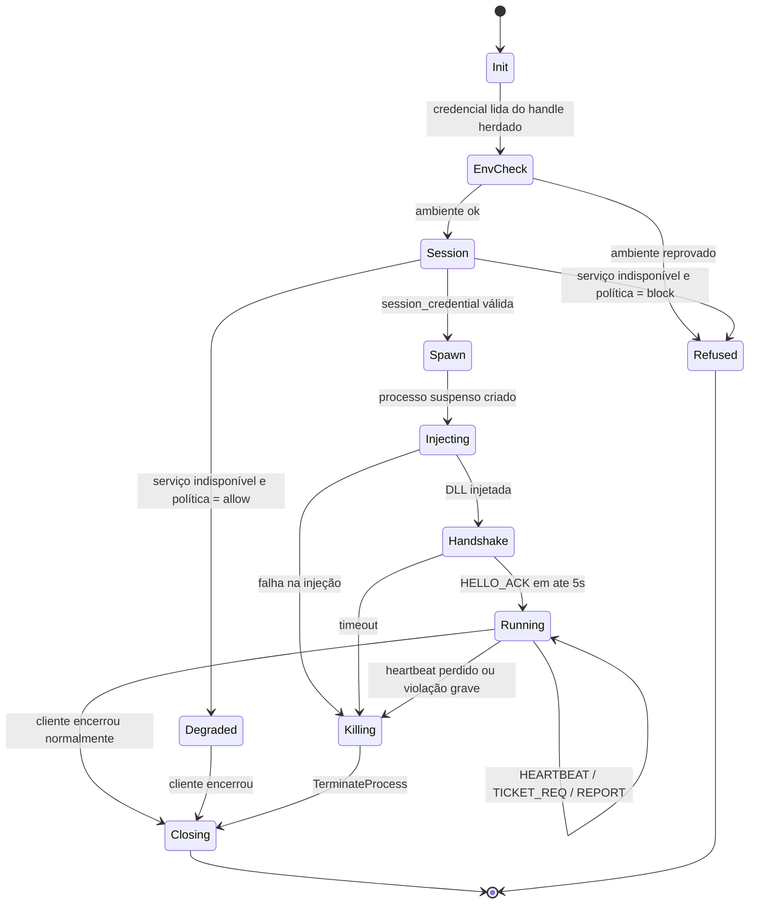
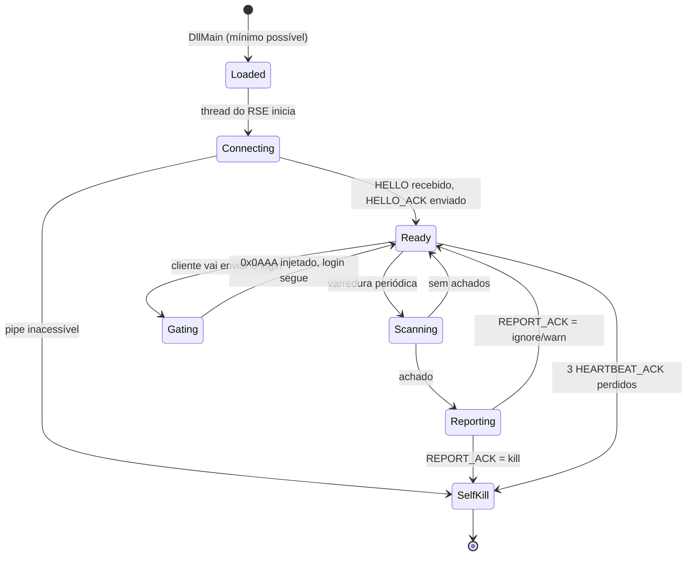

# RagnaShield Engine — Especificação Técnica

**`RSE_PROTOCOL = 1`**
**Versão do documento:** 1.1 — 21/08/2026
**Status:** normativa. O `rse-protocol` da Fase 2 implementa esta especificação; os
trechos sobre Loader, DLL e Auth Service ainda são projeto.

As palavras **DEVE**, **NÃO DEVE**, **PODE** e **RECOMENDADO** têm o sentido do RFC 2119.

---

## 1. Escopo

Esta especificação define:

- o **RSE Ticket** — credencial assinada pelo servidor que o login-server valida;
- o **canal Loader ↔ DLL** — frames autenticados sobre named pipe local;
- a **API do RSE Auth Service**;
- as **máquinas de estado** do Loader e da DLL;
- as **regras de versionamento** do protocolo.

Não define: implementação das detecções (Fase 5/6), UI, nem operação do serviço.

## 2. Modelo de ameaça

O que o RSE **se propõe** a impedir:

| # | Ataque | Defesa |
|---|---|---|
| A1 | Abrir o Ragexe direto, sem launcher | Login-server recusa sem ticket (§4.6) |
| A2 | Substituir o launcher por um próprio | Só o servidor assina tickets; a chave nunca sai do servidor (§3.2) |
| A3 | Reusar um ticket capturado | TTL de 30 s + cache de replay por nonce (§4.6) |
| A4 | Cliente modificado / GRF adulterada | `client_hash` no ticket + manifesto de integridade (§7) |
| A5 | Matar a DLL e seguir jogando | Heartbeat bidirecional; Loader encerra o cliente (§5.6) |
| A6 | Matar o Loader e seguir jogando | DLL encerra o próprio cliente ao perder o Loader (§5.6) |
| A7 | Falar com o pipe fingindo ser a DLL | AEAD com chave efêmera por lançamento (§5.2) |

O que o RSE **não** se propõe a impedir, e é importante estar escrito:

- adversário com **kernel/driver** ou máquina virtual dedicada;
- **bot externo** que só lê a tela e move o mouse (nada roda dentro do processo);
- engenharia reversa da DLL — ela roda na máquina do adversário; ofuscação atrasa,
  não impede.

O objetivo realista é **elevar o custo** e **detectar a maioria**, não a invulnerabilidade.
Qualquer documento de anti-cheat que prometa mais que isso está vendendo alguma coisa.

## 3. Criptografia

### 3.1 Primitivas

| Uso | Algoritmo | Observação |
|---|---|---|
| Assinatura do ticket | **HMAC-SHA256** | Simétrica de propósito: o login-server precisa validar sem round-trip e ambos os lados são nossos |
| Canal Loader ↔ DLL | **AES-256-GCM** | AEAD; tag de 16 bytes |
| Derivação de chave | **HKDF-SHA256** | RFC 5869 |
| Hashes de integridade | **SHA-256** (forte) + **CRC-32** (triagem rápida) | CRC só para varredura barata; decisão sempre no SHA-256 |
| Aleatoriedade | CSPRNG do SO | `BCryptGenRandom` no Windows |

Comparação de HMAC **DEVE** ser em tempo constante. Chaves em memória **DEVEM** ser
zeradas (`zeroize`) ao sair de escopo.

### 3.2 Chaves

| Chave | Tam. | Quem tem | Tempo de vida |
|---|---|---|---|
| `K_ticket` | 32 B | **RSE Auth Service + login-server, e mais ninguém** | rotação trimestral |
| `K_session` (`K_s`) | 32 B | Loader e DLL de **um** lançamento | vida do processo |
| `K_l2d` | 32 B | derivada de `K_s` | idem |
| `K_d2l` | 32 B | derivada de `K_s` | idem |

```
K_l2d = HKDF-SHA256(ikm = K_s, salt = session_id, info = "RSE1 loader->dll")[0..32]
K_d2l = HKDF-SHA256(ikm = K_s, salt = session_id, info = "RSE1 dll->loader")[0..32]
```

> **Regra inegociável:** `K_ticket` **NÃO DEVE** existir no launcher, no Loader, na DLL,
> em nenhum arquivo distribuído, nem em nenhum repositório. Se estiver no cliente,
> alguém extrai — e aí o RSE inteiro vira teatro. É esta regra, e não o formato do
> pacote, que impede a troca do launcher (ADR-005 em `ARCHITECTURE.md`).

Rotação: o campo `key_id` do ticket permite ao login-server manter duas chaves ativas
durante a janela de troca. Sem `key_id`, girar chave exige derrubar o servidor.

---

## 4. RSE Ticket v1

### 4.1 Layout binário — 148 bytes, big-endian

| Offset | Tam. | Campo | Descrição |
|---:|---:|---|---|
| 0 | 4 | `magic` | ASCII `"RSE1"` (0x52 0x53 0x45 0x31) |
| 4 | 1 | `version` | `RSE_PROTOCOL` = `0x01` |
| 5 | 1 | `flags` | bit0 `strict` · bit1 `vip` · bit2 `staff` · bits 3–7 reservados (=0) |
| 6 | 1 | `key_id` | qual `K_ticket` assinou (rotação) |
| 7 | 1 | `reserved` | =0; receptor **DEVE** aceitar qualquer valor |
| 8 | 8 | `issued_at` | Unix **milissegundos**, UTC |
| 16 | 4 | `ttl_ms` | validade; padrão `30000` |
| 20 | 16 | `nonce` | CSPRNG — chave do cache de replay |
| 36 | 16 | `session_id` | UUIDv4 da sessão do Loader |
| 52 | 32 | `machine_fp` | impressão de máquina (§8) |
| 84 | 32 | `client_hash` | SHA-256 do manifesto de integridade (§7) |
| **116** | **32** | `hmac` | `HMAC-SHA256(K_ticket, ticket[0..116])` |

**Total: 148 bytes.** Região assinada: `[0, 116)`.

### 4.2 Por que 30 segundos

O ticket é pedido pela DLL **no instante em que o jogador aperta *Conectar***, não na
abertura do launcher. Entre o `TICKET_REQ` e a chegada no login-server passam
milissegundos. 30 s cobre latência ruim, relógio torto e um retry — e deixa uma janela
curtíssima para captura e reuso. Um ticket emitido na abertura do launcher precisaria de
minutos de validade e seria muito mais fácil de roubar.

### 4.3 Encapsulamento — packet `0x0AAA`

```
offset  tam  campo
     0    2  0xAA 0x0A      header (little-endian na fita, como todo packet RO)
     2    2  packet_len     = 152
     4  148  ticket         RseTicket v1
```

Enviado **antes** do packet de login (`0x0064`/`0x0825`/…) na mesma conexão TCP com o
login-server. O packet de login segue **byte a byte inalterado**.

Justificativa da escolha de `0x0AAA` — e por que o `0x0825` não serve — está no ADR-007
de `ARCHITECTURE.md`: o rAthena limita o token do `0x0825` a 23 bytes.

### 4.4 Emissão

Só o **RSE Auth Service** emite. Sequência:

1. Loader autentica com `session_credential` (§6.2).
2. Serviço confere: credencial válida, sessão não revogada, `machine_fp` não banida,
   `client_hash` na lista de manifestos aceitos, `last_patch_index` ≥ mínimo.
3. Monta o ticket, assina com `K_ticket[key_id]`, devolve os 148 bytes.
4. Registra `(nonce, session_id, machine_fp, ip, issued_at)` para auditoria.

### 4.5 Validação no login-server — determinística e offline

```
1. len == 148                                          senão → INVALID_LENGTH
2. magic == "RSE1"                                     senão → BAD_MAGIC
3. version aceita (N ou N-1)                           senão → BAD_VERSION
4. key_id conhecida                                    senão → UNKNOWN_KEY
5. 0 < ttl_ms <= 120000                                senão → BAD_TTL
6. hmac_ct_eq(HMAC(K_ticket[key_id], t[0..116]),
              t[116..148])                             senão → BAD_SIGNATURE
7. now_ms <= issued_at + ttl_ms                        senão → EXPIRED
8. issued_at <= now_ms + 5000  (tolerância de relógio) senão → FUTURE
9. nonce ausente do cache de replay                    senão → REPLAY
   → e SÓ ENTÃO insere o nonce, com TTL = ttl_ms + 5000
```

Sem consulta a banco. Sem chamada de rede. **A ordem importa, e não é estilo:**

- o **teto de TTL** (passo 5) vem antes do HMAC porque é uma comparação de inteiro, e
  descarta ticket absurdo sem gastar SHA-256;
- o **nonce só entra no cache depois** de a assinatura passar (passo 9). Se entrasse
  antes, qualquer um encheria a memória do login-server mandando tickets forjados com
  nonce inventado. Há um teste dedicado a isso em `ticket.rs`
  (`assinatura_invalida_nao_suja_o_cache_de_replay`).

Os passos 7 e 8 usam `<=`: a borda exata **vale**. É o tipo de detalhe que duas
implementações do mesmo documento divergem em silêncio, e por isso está nos vetores.

Cache de replay RECOMENDADO: tabela hash com expiração, capacidade ≥ 4× o pico de
logins por minuto. Ocupação: 16 B por entrada.

### 4.6 Resposta a ticket ausente ou inválido

Conforme `login_config.rse_enforce`:

| Modo | Ticket ausente/inválido | Registro |
|---|---|---|
| `off` | ignora | nenhum |
| `log` | **deixa entrar** | `WARN` com conta, IP e código |
| `on` | `logclif_auth_failed(sd, 3)` — *Rejected from Server* | `WARN` |

**O modo `log` não é opcional na implantação.** É o que mostra o falso-positivo real
antes de ele virar fila de suporte.

---

## 5. Canal Loader ↔ DLL

### 5.1 Transporte

Named pipe local: `\\.\pipe\rse-<session_id em hex>`.
DACL restrita ao usuário que criou o processo. Modo mensagem, bloqueante.
Nome imprevisível de propósito — não adianta um terceiro adivinhar o pipe.

### 5.2 Frame

| Offset | Tam. | Campo |
|---:|---:|---|
| 0 | 2 | `magic` = `"RS"` |
| 2 | 1 | `version` = 1 |
| 3 | 1 | `opcode` |
| 4 | 4 | `seq` (u32 LE, monotônico **por direção**) |
| 8 | 2 | `payload_len` (u16 LE, ≤ 8192) |
| 10 | 2 | `flags` (reservado, =0) |
| 12 | 12 | `nonce` |
| 24 | N | `ciphertext` |
| 24+N | 16 | `tag` (GCM) |

- **AAD** = bytes `[0, 12)` (cabeçalho até `flags`).
- **Nonce** = `salt_direção(4 B) ‖ seq_estendida(8 B)`. Determinístico — nunca repete
  para a mesma chave, que é o requisito duro do GCM.
- **Anti-replay:** receptor **DEVE** recusar `seq ≤ último_seq_visto` daquela direção.

### 5.3 Opcodes

| Código | Nome | Direção | Payload |
|---|---|---|---|
| `0x01` | `HELLO` | L→D | build da DLL esperado, `session_id`, política |
| `0x02` | `HELLO_ACK` | D→L | versão da DLL, PID, TID, base carregada |
| `0x10` | `HEARTBEAT` | D→L | uptime, contador de varreduras, hash do estado |
| `0x11` | `HEARTBEAT_ACK` | L→D | `server_time_ms`, `policy_epoch` |
| `0x20` | `TICKET_REQ` | D→L | `client_hash` recém-calculado |
| `0x21` | `TICKET_RSP` | L→D | ticket de 148 B, ou código de erro |
| `0x30` | `REPORT` | D→L | violação: `{code, severity, detail[]}` |
| `0x31` | `REPORT_ACK` | L→D | ação: `ignore` / `warn` / `kill` |
| `0x40` | `POLICY` | L→D | política atualizada (listas, intervalos) |
| `0x7F` | `SHUTDOWN` | ambas | encerramento limpo, com motivo |

Opcode desconhecido: receptor **DEVE** ignorar o frame e registrar — **não** derrubar a
conexão. É o que permite adicionar opcode novo sem quebrar quem ainda não atualizou.

### 5.4 Heartbeat

- DLL envia `HEARTBEAT` **a cada 5 000 ms** (±500 ms de jitter, para não sincronizar
  todos os clientes do servidor no mesmo instante).
- Loader responde `HEARTBEAT_ACK` em até 2 000 ms.
- **Loader:** 3 heartbeats perdidos (≈15 s) + 2 s de tolerância → `TerminateProcess` no
  cliente, com código de violação `HEARTBEAT_LOST`.
- **DLL:** 3 `HEARTBEAT_ACK` perdidos → encerra o próprio processo do jogo.

A simetria é o ponto: matar qualquer um dos dois lados derruba a sessão. Não existe
"metade protegida".

### 5.5 Handshake

```
Loader                                     DLL
  │ cria pipe, gera K_s                     │
  │ CreateProcess(SUSPENDED) ──────────────▶│ (processo do jogo criado)
  │ injeta rse_watchdog.dll ───────────────▶│ DllMain: só registra, nada pesado
  │                                         │ thread do RSE: conecta ao pipe
  │ ◀────────────── conexão ────────────────│
  │ HELLO (seq=1) ─────────────────────────▶│
  │ ◀────────────────────── HELLO_ACK (1) ──│
  │ confere build/PID/base                  │
  │ ResumeThread ──────────────────────────▶│ cliente começa a rodar
```

Se o `HELLO_ACK` não vier em **5 000 ms**, o Loader **DEVE** encerrar o processo
suspenso e reportar `DLL_LOAD_TIMEOUT`. Nunca dar `ResumeThread` sem confirmação — um
cliente retomado sem DLL é um cliente desprotegido, que é exatamente o que se quer
evitar.

`K_s` e o nome do pipe chegam à DLL pela região de memória escrita no processo alvo
durante a injeção — **nunca** por argv nem por variável de ambiente (ADR-004).

### 5.6 Máquina de estados — Loader



### 5.7 Máquina de estados — DLL



---

## 6. RSE Auth Service — API

Base: `https://ragnalink.com.br/rse/v1`. TLS obrigatório. Corpo em JSON (Fase 3);
migração para CBOR opcional depois. Todas as respostas trazem `X-RSE-Protocol: 1`.

### 6.1 `POST /session` — chamado pelo **launcher**

```jsonc
// requisição
{
  "protocol": 1,
  "launcher_build": "a3f1c9e…",   // SHA-256 do próprio RagnaLinK.exe
  "machine_fp": "…",              // 64 hex — §8
  "last_patch_index": 42,         // do arquivo <nome>.dat
  "os": { "version": "10.0.19045", "arch": "x86" }
}
// resposta 200
{
  "session_id": "3f2b…",
  "session_credential": "…",      // opaca, TTL 300 s, renovável
  "expires_in": 300,
  "policy_epoch": 7
}
```

Erros: `403 LAUNCHER_UNKNOWN` (build fora da lista) · `403 MACHINE_BANNED` ·
`409 PATCH_OUTDATED` · `503 MAINTENANCE`.

### 6.2 `POST /ticket` — chamado pelo **Loader**

```jsonc
{ "protocol": 1, "session_credential": "…", "client_hash": "…" }
```
→ `200 { "ticket": "<148 bytes em base64>", "expires_in_ms": 30000 }`

Erros: `401 CREDENTIAL_EXPIRED` · `403 SESSION_REVOKED` · `409 CLIENT_HASH_UNKNOWN` ·
`429 RATE_LIMITED`.

Limite RECOMENDADO: 6 tickets por sessão por minuto. Cobre retry de rede honesto e
estanca automação.

### 6.3 `POST /report` — chamado pelo **Loader**

Violações agregadas. Resposta pode revogar a sessão na hora.

### 6.4 Kill-switch

`GET /policy` traz `{"enforce": "on"|"log"|"off"}`. O Loader consulta a cada 60 s. Isso
permite **desligar a exigência sem redistribuir nada** quando algo der errado às três
da manhã — e vai dar, uma hora.

---

## 7. Manifesto de integridade

Arquivo assinado, publicado junto com o patch, descrevendo o que o cliente legítimo
contém:

```jsonc
{
  "manifest_version": 1,
  "patch_index": 42,
  "generated_at": "2026-08-21T12:00:00Z",
  "files": [
    { "path": "RagnaLinK_ptBR5.exe", "size": 8123456,
      "crc32": "1a2b3c4d", "sha256": "…", "critical": true },
    { "path": "ragnalink.grf", "size": 1234567890,
      "crc32": "…", "sha256": "…", "critical": true, "mode": "header_only" },
    { "path": "data.ini", "size": 512,
      "crc32": "…", "sha256": "…", "critical": false }
  ],
  "signature": "…"
}
```

`client_hash` (bytes 84–116 do ticket) = **SHA-256 do manifesto canonicalizado**.

**Nota de desempenho que evita um bug previsível:** `ragnalink.grf` vai passar de vários
GB. Fazer SHA-256 do arquivo inteiro a cada lançamento adicionaria dezenas de segundos ao
*Jogar* — e o jogador vai achar que travou. Por isso `mode`:

| `mode` | O que é lido |
|---|---|
| `full` | arquivo inteiro (para arquivos pequenos e críticos, como o .exe) |
| `header_only` | cabeçalho + tabela de arquivos da GRF (detecta troca de conteúdo sem ler GB) |
| `sampled` | cabeçalho + N blocos em offsets determinísticos derivados do `session_id` |

`sampled` é o mais interessante para GRF grande: os offsets mudam a cada sessão, então
não dá para preparar um arquivo que só "conserta" os pedaços conferidos.

---

## 8. Impressão de máquina (`machine_fp`) e privacidade

```
machine_fp = SHA-256( pepper_do_servidor ‖ volume_serial ‖ machine_guid ‖ cpu_id )
```

Regras:

- O `pepper_do_servidor` fica **no servidor**. Sem ele, ninguém correlaciona a
  impressão com um hardware específico a partir de um vazamento do banco.
- **Nenhum identificador de hardware cru sai da máquina do jogador** — só o hash de 32
  bytes. Isso não é enfeite: é o que separa "identificador de instalação" de
  "coleta de dados de hardware", e é o tipo de coisa que a LGPD olha.
- **NÃO DEVE** incluir MAC de adaptador (muda com VPN, Wi-Fi × cabo, dock USB) nem
  nome de usuário do Windows.
- A política de retenção e o texto de aviso ao jogador **DEVEM** estar publicados antes
  do primeiro dia em modo `on`.

---

## 9. Códigos de violação

| Código | Nome | Severidade | Ação padrão |
|---:|---|---|---|
| 1000 | `INTEGRITY_EXE_MISMATCH` | crítica | kill |
| 1001 | `INTEGRITY_GRF_MISMATCH` | crítica | kill |
| 1002 | `INTEGRITY_MANIFEST_MISSING` | alta | kill |
| 2000 | `UNKNOWN_MODULE_LOADED` | média | warn + report |
| 2001 | `KNOWN_CHEAT_MODULE` | crítica | kill |
| 2002 | `IAT_HOOK_DETECTED` | alta | report |
| 2003 | `INLINE_HOOK_DETECTED` | alta | report |
| 3000 | `FORBIDDEN_PROCESS` | alta | warn + report |
| 3001 | `DEBUGGER_ATTACHED` | crítica | kill |
| 3002 | `REMOTE_MEMORY_WRITE` | crítica | kill |
| 4000 | `HEARTBEAT_LOST` | crítica | kill |
| 4001 | `PIPE_TAMPERED` | crítica | kill |
| 5000 | `ENV_VIRTUAL_MACHINE` | informativa | report |
| 5001 | `ENV_ELEVATED_MISMATCH` | média | report |

**Severidade não é ação.** A ação vem do `REPORT_ACK`, que o Loader decide a partir da
política do servidor. Assim dá para começar tudo em `report`, medir, e só depois promover
para `kill` — sem recompilar a DLL.

Faixas reservadas: 6000–6999 experimentais, 9000+ nunca em produção.

---

## 10. Versionamento

`RSE_PROTOCOL` é um inteiro único, presente em: ticket (byte 4), frame do pipe (byte 2)
e corpo das requisições HTTP.

**Regras:**

1. Mudança **compatível** (campo novo em `reserved`, opcode novo, campo JSON novo) →
   `RSE_PROTOCOL` **não** muda.
2. Mudança **incompatível** (layout do ticket, semântica de campo, primitiva
   criptográfica) → incrementa.
3. O login-server **DEVE** aceitar `N` e `N-1` durante a janela de migração
   (RECOMENDADO: 30 dias).
4. Receptor que vê versão desconhecida **DEVE** recusar com código específico, nunca
   tentar interpretar assim mesmo.
5. Toda versão **DEVE** ter vetores de teste congelados em
   `rse/protocol/tests/vectors/v<N>/`.

### Vetores de teste — **entregues** em `rse/protocol/tests/vectors/v1/vectors.txt`

Conteúdo congelado (16 casos de ticket, 5 frames):

- 3 tickets válidos com combinações de flags diferentes;
- 1 caso por código de erro de §4.5, mais 2 de assinatura (MAC alterado num bit; campo
  `flags` promovido a `staff` — o clássico);
- 4 casos de **borda** — `now == issued_at + ttl`, `+1`, tolerância de relógio exata,
  `+1` — que são justamente onde duas implementações do mesmo documento discordam;
- 5 frames AEAD com `K_s` fixo: payload vazio, 1 byte, 16 bytes, 148 bytes e 8192;
- 1 caso de `seq` fora de ordem.

**Formato: texto simples, não JSON.** Quem consome do outro lado é o login-server do
rAthena, em C++, e ele não tem parser JSON à mão — traria dependência nova só para ler
arquivo de teste. Uma linha por registro, `@tipo chave=valor`, bytes em hexadecimal:
resolve com `istringstream`. Detalhes em `rse/docs/PROTOCOL_V1.md` §5.

O critério que não mudou: os mesmos vetores precisam passar em **Rust** e em **C++**.
Se o `rse_verify.cpp` não bater byte a byte, a Fase 3 vira caça a fantasma.

---

## 11. Restrições de implementação

| Restrição | Motivo |
|---|---|
| `rse-protocol` **NÃO DEVE** depender de `winapi`, `tokio` ou I/O | Precisa rodar em teste de CI Linux e ser portável para o `rse_verify` |
| `rse-protocol` **NÃO DEVE** ter `unsafe` | É código de cripto; não há motivo |
| `rse-watchdog` **NÃO DEVE** usar `unwrap`/`expect` fora de teste | `panic = 'abort'` no workspace derruba o **jogo** |
| `DllMain` **DEVE** fazer o mínimo | Loader-lock do Windows; trabalho pesado vai para thread própria |
| Loader e DLL **DEVEM** ser `i686-pc-windows-msvc` | Ragexe é 32 bits |
| Toda cripto **DEVE** compilar na toolchain do workspace | Ver §1.9 de `ARCHITECTURE.md` — decidir a Fase 1.5 antes de escrever isto |

---

*Implementação de referência: `rse/protocol/`. Referência de bytes:
`rse/docs/PROTOCOL_V1.md`. Plano: `docs/ROADMAP.md`.*
